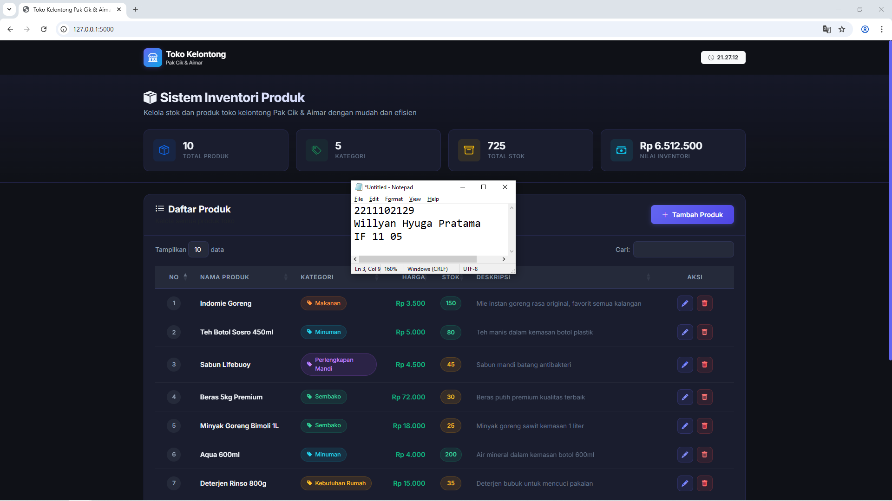
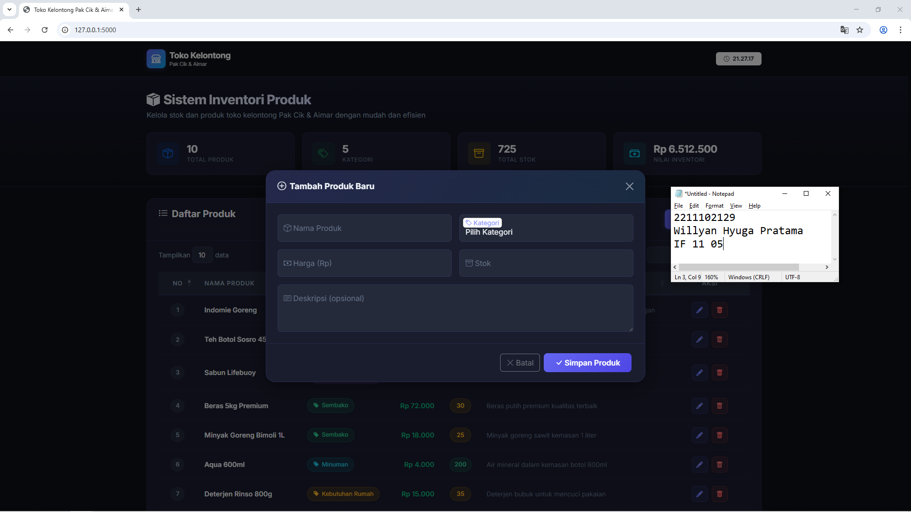

<div align="center">
  <br />
  <h1>LAPORAN PRAKTIKUM <br> APLIKASI BERBASIS PLATFORM </h1>
  <br />
  <h3>MODUL 6 <br> JAVASCRIPT & JQUERY </h3>
  <br />
  
  <br />
  <br />
  <br />
  <h3>Disusun Oleh :</h3>
  <p>
    <strong>Willyan Hyuga Pratama</strong>
    <br>
    <strong>2211102129</strong>
    <br>
    <strong>S1 IF-11-REG05</strong>
  </p>
  <br />
  <h3>Dosen Pengampu :</h3>
  <p>
    <strong>Dedi Agung Prabowo, S.Kom., M.Kom</strong>
  </p>
  <br />
  <br />
  <h4>Asisten Praktikum :</h4>
  <strong>Apri Pandu Wicaksono </strong>
  <br>
  <strong>Hamka Zaenul Ardi</strong>
  <br />
  <h3>LABORATORIUM HIGH PERFORMANCE <br>FAKULTAS INFORMATIKA <br>UNIVERSITAS TELKOM PURWOKERTO <br>2026 </h3>
</div>

<hr>

# Dasar Teori JavaScript dan jQuery

## 1. JavaScript (JS)

JavaScript adalah bahasa pemrograman *high-level*, *scripting*, *dynamically-typed*, dan *interpreted* yang dikembangkan pertama kali oleh **Brendan Eich** di Netscape pada tahun 1995. Saat ini, JavaScript telah menjadi salah satu bahasa pemrograman paling populer di dunia dan merupakan pilar utama dalam pengembangan web modern bersama HTML dan CSS. JavaScript memungkinkan pengembang untuk mengimplementasikan fitur-fitur kompleks pada halaman web, seperti pembaruan konten secara dinamis, validasi formulir, animasi, serta komunikasi asinkron dengan server.

JavaScript distandarisasi oleh **ECMA International** dengan nama resmi **ECMAScript (ES)**. Versi modern yang banyak digunakan saat ini adalah **ES6 (ECMAScript 2015)** ke atas, yang memperkenalkan banyak fitur penting seperti `let`/`const`, *arrow function*, *template literals*, *destructuring*, *promise*, dan *async/await*.

### 1.1. Karakteristik Utama JavaScript

| Karakteristik | Penjelasan |
|---|---|
| **Client-Side Scripting** | Kode JavaScript dieksekusi langsung di browser pengguna (*client*), bukan di server. Hal ini mengurangi beban server dan memberikan respon interaksi yang lebih cepat kepada pengguna. |
| **Interpreted** | JavaScript tidak memerlukan proses kompilasi terpisah sebelum dijalankan. Browser memiliki *JavaScript Engine* (seperti V8 di Chrome, SpiderMonkey di Firefox) yang membaca dan mengeksekusi kode secara langsung. |
| **Dynamically Typed** | Tipe data variabel ditentukan secara otomatis saat program berjalan (*runtime*), bukan saat penulisan kode. Sebuah variabel dapat menyimpan tipe data yang berbeda-beda sepanjang eksekusi program. |
| **Event-Driven** | JavaScript dirancang untuk merespons berbagai kejadian (*event*) seperti klik mouse (`click`), input keyboard (`keydown`), pengiriman formulir (`submit`), atau perubahan nilai input (`change`). |
| **Object-Based** | JavaScript mendukung paradigma pemrograman berorientasi objek (*Object-Oriented Programming*) berbasis prototipe (*prototype-based*), bukan berbasis kelas seperti Java atau C++. |

### 1.2. Tipe Data dalam JavaScript

JavaScript memiliki beberapa tipe data dasar:
- **Primitive Types**: `String`, `Number`, `Boolean`, `Null`, `Undefined`, `Symbol`, dan `BigInt`.
- **Reference Types**: `Object`, `Array`, dan `Function`.

Contoh deklarasi variabel:
```js
let nama = "Willyan";          // String
const harga = 15000;           // Number
let tersedia = true;           // Boolean
let produk = {                 // Object
    nama: "Indomie",
    harga: 3500,
    stok: 100
};
let daftarProduk = ["Sabun", "Shampoo", "Pasta Gigi"]; // Array
```

### 1.3. Fungsi (Function)

Fungsi adalah blok kode yang dapat digunakan kembali (*reusable*) untuk melakukan tugas tertentu. Dalam JavaScript modern (ES6+), terdapat dua cara umum untuk mendefinisikan fungsi:

```js
// Function Declaration
function hitungTotal(harga, jumlah) {
    return harga * jumlah;
}

// Arrow Function (ES6+)
const formatRupiah = (angka) => {
    return new Intl.NumberFormat('id-ID', {
        style: 'currency',
        currency: 'IDR'
    }).format(angka);
};
```

### 1.4. DOM (Document Object Model)

**DOM** (*Document Object Model*) adalah representasi terstruktur dari dokumen HTML yang dibuat oleh browser dalam bentuk pohon objek (*tree structure*). Setiap elemen HTML direpresentasikan sebagai **node** di dalam pohon DOM, dan JavaScript dapat mengakses serta memanipulasi node-node tersebut secara dinamis.

Kemampuan manipulasi DOM meliputi:
- **Mengakses elemen**: menggunakan `document.getElementById()`, `document.querySelector()`, atau `document.querySelectorAll()`.
- **Mengubah konten**: menggunakan properti `.innerHTML`, `.textContent`, atau `.innerText`.
- **Mengubah atribut**: menggunakan metode `.setAttribute()` atau properti langsung seperti `.src`, `.href`.
- **Mengubah gaya**: menggunakan properti `.style` atau `.classList`.
- **Menambah/menghapus elemen**: menggunakan `.appendChild()`, `.removeChild()`, atau `.remove()`.

Contoh manipulasi DOM dengan JavaScript murni:
```js
// Mengambil elemen berdasarkan ID
let judul = document.getElementById('judul');
judul.textContent = 'Toko Kelontong Pak Cik & Aimar';

// Menambahkan class baru pada elemen
judul.classList.add('fw-bold', 'text-primary');

// Membuat elemen baru
let baris = document.createElement('tr');
baris.innerHTML = '<td>1</td><td>Indomie</td><td>Rp 3.500</td>';
document.getElementById('productTableBody').appendChild(baris);
```

---

## 2. jQuery

jQuery adalah *library* (*pustaka*) JavaScript yang dikembangkan oleh **John Resig** dan dirilis pertama kali pada tahun **2006**. jQuery dirancang untuk menyederhanakan penulisan kode JavaScript dengan moto utamanya: **"Write Less, Do More"** (Tulis Lebih Sedikit, Lakukan Lebih Banyak). Library ini menangani banyak operasi kompleks dalam JavaScript murni — seperti manipulasi DOM, penanganan event, animasi, dan komunikasi AJAX — dengan sintaks yang jauh lebih ringkas dan intuitif.

jQuery diakses melalui fungsi global `$()` atau `jQuery()`, yang merupakan *selector engine* untuk memilih elemen DOM menggunakan sintaks mirip CSS.

## 3. AJAX (Asynchronous JavaScript and XML)

**AJAX** (*Asynchronous JavaScript and XML*) adalah teknik pengembangan web yang memungkinkan halaman web untuk berkomunikasi dengan server di latar belakang secara **asinkron** — artinya proses pengiriman dan penerimaan data terjadi tanpa harus memuat ulang (*reload*) seluruh halaman. Teknik ini pertama kali dipopulerkan oleh **Jesse James Garrett** pada tahun 2005.

Meskipun namanya menyebutkan XML, dalam praktik modern AJAX lebih banyak menggunakan format **JSON** (*JavaScript Object Notation*) sebagai format pertukaran data karena lebih ringan dan mudah diproses oleh JavaScript.

### 3.1. Cara Kerja AJAX

Alur kerja AJAX dapat dijelaskan sebagai berikut:
1. **Event terjadi** di halaman web (misalnya, pengguna menekan tombol "Tambah Produk").
2. JavaScript membuat objek **XMLHttpRequest** (atau menggunakan **Fetch API** / **jQuery AJAX**).
3. Objek tersebut mengirimkan **HTTP Request** ke server secara asinkron.
4. Server memproses permintaan dan mengirimkan **HTTP Response** kembali (biasanya dalam format JSON).
5. JavaScript menerima data respons dan **memperbarui DOM** tanpa *reload* halaman.

### Source code 
```py
# app.py
from flask import Flask, render_template, request, jsonify
import json
import os
from datetime import datetime

app = Flask(__name__)

# Path ke file JSON untuk menyimpan data produk
DATA_FILE = os.path.join(os.path.dirname(os.path.abspath(__file__)), 'data', 'products.json')


def ensure_data_file():
    """Memastikan file JSON dan direktori data ada."""
    os.makedirs(os.path.dirname(DATA_FILE), exist_ok=True)
    if not os.path.exists(DATA_FILE):
        with open(DATA_FILE, 'w', encoding='utf-8') as f:
            json.dump([], f, indent=2, ensure_ascii=False)


def load_products():
    """Membaca data produk dari file JSON."""
    ensure_data_file()
    try:
        with open(DATA_FILE, 'r', encoding='utf-8') as f:
            return json.load(f)
    except (json.JSONDecodeError, FileNotFoundError):
        return []


def save_products(products):
    """Menyimpan data produk ke file JSON."""
    ensure_data_file()
    with open(DATA_FILE, 'w', encoding='utf-8') as f:
        json.dump(products, f, indent=2, ensure_ascii=False)


def generate_id(products):
    """Generate ID unik untuk produk baru."""
    if not products:
        return 1
    return max(p['id'] for p in products) + 1

# Selebihnya dapat cek pada file "app.py"
```
🔗 [Klik di sini untuk membuka file `app.py`](app.py)

```html
<!DOCTYPE html>
<html lang="id">
<head>
    <meta charset="UTF-8">
    <meta name="viewport" content="width=device-width, initial-scale=1.0">
    <meta name="description" content="Sistem Inventori Toko Kelontong Pak Cik dan Aimar - Kelola produk toko dengan mudah">
    <title>Toko Kelontong Pak Cik & Aimar - Sistem Inventori</title>

    <!-- Bootstrap 5 CSS -->
    <link href="https://cdn.jsdelivr.net/npm/bootstrap@5.3.3/dist/css/bootstrap.min.css" rel="stylesheet">
    <!-- DataTables CSS -->
    <link href="https://cdn.datatables.net/1.13.8/css/dataTables.bootstrap5.min.css" rel="stylesheet">
    <!-- Bootstrap Icons -->
    <link href="https://cdn.jsdelivr.net/npm/bootstrap-icons@1.11.3/font/bootstrap-icons.min.css" rel="stylesheet">
    <!-- Google Fonts -->
    <link href="https://fonts.googleapis.com/css2?family=Inter:wght@300;400;500;600;700;800&display=swap" rel="stylesheet">
    <!-- Custom CSS -->
    <link href="{{ url_for('static', filename='css/style.css') }}" rel="stylesheet">
</head>
<body>

    <!-- ============ NAVBAR ============ -->
    <nav class="navbar navbar-expand-lg navbar-dark sticky-top" id="mainNavbar">
        <div class="container">
            <a class="navbar-brand d-flex align-items-center" href="/">
                <div class="brand-icon me-2">
                    <i class="bi bi-shop"></i>
                </div>
                <div>
                    <span class="fw-bold">Toko Kelontong</span>
                    <small class="d-block text-light opacity-75" style="font-size: 0.7rem; margin-top: -3px;">Pak Cik & Aimar</small>
                </div>
            </a>
            <div class="d-flex align-items-center">
                <span class="badge bg-light text-dark px-3 py-2">
                    <i class="bi bi-clock me-1"></i>
                    <span id="currentTime"></span>
                </span>
            </div>
        </div>
    </nav>

    <!-- Selebihnya dapat cek pada file "templates/index.html" -->
```
🔗 [Klik di sini untuk membuka file `index.html`](templates/index.html)


```js
// static/js/app.js
/** @type {string} Base URL untuk API endpoint */
const API_URL = '/api/products';

/** @type {object|null} Instance DataTable */
let dataTable = null;

/** @type {boolean} Flag untuk mode edit */
let isEditMode = false;


// ============================================================
// Document Ready - Inisialisasi Aplikasi
// ============================================================

$(document).ready(function () {
    // Inisialisasi jam real-time
    updateClock();
    setInterval(updateClock, 1000);

    // Muat data produk dan inisialisasi DataTable
    loadProducts();

    // ========================================
    // Event Handlers
    // ========================================

    /**
     * Event: Klik tombol Tambah Produk
     * Menampilkan modal form dalam mode CREATE
     */
    $('#btnAddProduct').on('click', function () {
        isEditMode = false;
        resetForm();
        $('#productModalLabel').html('<i class="bi bi-plus-circle me-2"></i>Tambah Produk Baru');
        $('#btnSaveProduct').html('<i class="bi bi-check-lg me-1"></i>Simpan Produk');
        $('#productModal').modal('show');
    });

    // Selebihnya dapat cek pada file "static/js/app.js"
```
🔗 [Klik di sini untuk membuka file `app.js`](static/js/app.js)

Output:




## Penjelasan
Website ini merupakan sistem inventaris berbasis web untuk Toko Kelontong Pak Cik & Aimar yang dibangun menggunakan Flask sebagai backend, dengan penyimpanan data produk dalam file JSON dan antarmuka CRUD (Create, Read, Update, Delete) yang interaktif. Seluruh operasi data dilakukan secara asinkron menggunakan jQuery AJAX sehingga halaman tidak perlu di-reload, sementara tampilan dibangun responsif dengan Bootstrap dan DataTables untuk pengalaman pengguna yang modern.