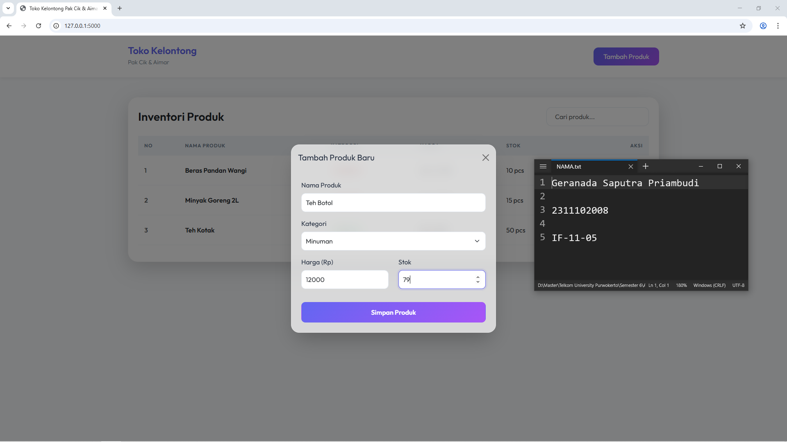
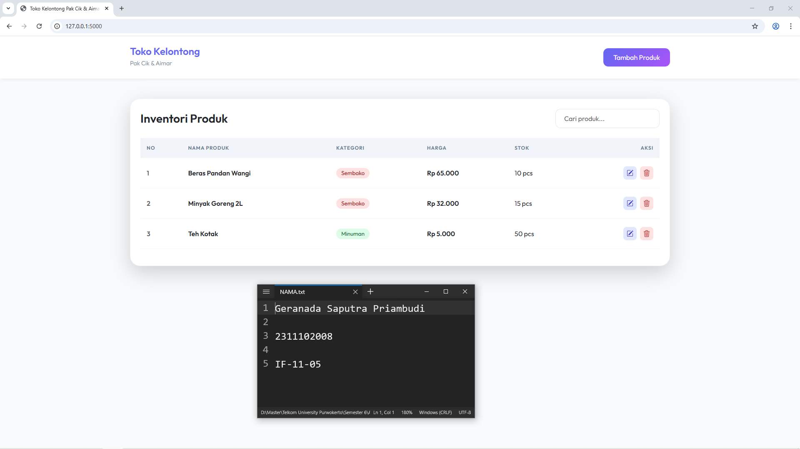

<div align="center">
  <br />
  <h1>LAPORAN PRAKTIKUM <br> APLIKASI BERBASIS PLATFORM </h1>
  <br />
  <h3>MODUL 6 <br> JAVASCRIPT & JQUERY </h3>
  <br />
  
  <br />
  <br />
  <br />
  <h3>Disusun Oleh :</h3>
  <p>
    <strong>Geranada Saputra Priambudi</strong>
    <br>
    <strong>2311102008</strong>
    <br>
    <strong>S1 IF-11-REG05</strong>
  </p>
  <br />
  <h3>Dosen Pengampu :</h3>
  <p>
    <strong>Dedi Agung Prabowo, S.Kom., M.Kom</strong>
  </p>
  <br />
  <br />
  <h4>Asisten Praktikum :</h4>
  <strong>Apri Pandu Wicaksono </strong>
  <br>
  <strong>Hamka Zaenul Ardi</strong>
  <br />
  <h3>LABORATORIUM HIGH PERFORMANCE <br>FAKULTAS INFORMATIKA <br>UNIVERSITAS TELKOM PURWOKERTO <br>2026 </h3>
</div>

<hr>

# Dasar Teori Javascript & JQUERY

1. JavaScript (JS)
JavaScript adalah bahasa pemrograman high-level, scripting, dan interpreted yang bersifat client-side. Artinya, kode dijalankan langsung di browser pengguna tanpa perlu diproses oleh server terlebih dahulu untuk interaksi UI.

Manipulasi DOM (Document Object Model): JavaScript memungkinkan pengembang untuk mengubah konten, struktur, dan gaya HTML secara dinamis.
Event Handling: JS dapat mendeteksi dan merespons tindakan pengguna seperti klik mouse, input keyboard, atau pemuatan halaman.
Asynchronous: Dengan fitur asinkron, JS dapat melakukan tugas di latar belakang tanpa menghentikan eksekusi kode lainnya.

2. jQuery
jQuery adalah pustaka (library) JavaScript lintas browser yang dirancang untuk menyederhanakan penulisan kode JavaScript. Motto utamanya adalah "Write Less, Do More".

Sintaks Ringkas: Mengganti operasi DOM yang panjang (seperti document.getElementById) dengan sintaks yang jauh lebih pendek (seperti $('#id')).
Cross-Browser Compatibility: Menangani perbedaan cara kerja JavaScript di berbagai browser (Chrome, Firefox, Safari, dll) secara otomatis.
Efek & Animasi: Menyediakan fungsi bawaan untuk membuat animasi transisi seperti fade, slide, dan toggle dengan mudah.

3. AJAX (Asynchronous JavaScript and XML)
AJAX bukanlah bahasa pemrograman, melainkan teknik yang menggabungkan JavaScript dan XML (atau sekarang lebih sering menggunakan JSON) untuk memperbarui bagian dari halaman web tanpa reload seluruh halaman.

User Experience (UX): Membuat aplikasi terasa lebih cepat dan responsif layaknya aplikasi desktop.
Data Transfer: Memungkinkan aplikasi untuk mengirim dan menerima data dari server di latar belakang.

4. JSON (JavaScript Object Notation)
JSON adalah format pertukaran data yang ringan, mudah dibaca manusia, dan mudah diproses oleh mesin. Walaupun berasal dari JavaScript, format ini didukung oleh hampir semua bahasa pemrograman modern (termasuk Python/Flask).

Struktur Data: Menggunakan format pasangan kunci dan nilai (key-value pairs) serta array.
Kegunaan: Sangat populer digunakan sebagai format database flat-file sederhana atau untuk pengiriman data melalui API.


### Source code 
```py
# app.py
from flask import Flask, render_template, request, jsonify
import json
import os

app = Flask(__name__)

# Data storage path
DATA_FILE = os.path.join('data', 'products.json')

def load_products():
    """Load products from JSON file."""
    if not os.path.exists(DATA_FILE):
        return []
    with open(DATA_FILE, 'r') as f:
        return json.load(f)

def save_products(products):
    """Save products to JSON file."""
    with open(DATA_FILE, 'w') as f:
        json.dump(products, f, indent=2)

@app.route('/')
def index():
    return render_template('index.html')

@app.route('/api/products', methods=['GET'])
def get_products():
    return jsonify(load_products())

@app.route('/api/products', methods=['POST'])
def add_product():
    products = load_products()
    new_product = request.json
    
    # Simple ID increment
    new_id = 1
    if products:
        new_id = max(p['id'] for p in products) + 1
    
    new_product['id'] = new_id
    products.append(new_product)
    save_products(products)
    return jsonify(new_product), 201

# Selebihnya dapat cek pada file "app.py"
```
🔗 [Klik di sini untuk membuka file `app.py`](app.py)

```html
<!DOCTYPE html>
<html lang="en">
<head>
    <meta charset="UTF-8">
    <meta name="viewport" content="width=device-width, initial-scale=1.0">
    <title>Toko Kelontong Pak Cik & Aimar</title>
    <!-- Bootstrap CSS -->
    <link href="https://cdn.jsdelivr.net/npm/bootstrap@5.3.0/dist/css/bootstrap.min.css" rel="stylesheet">
    <!-- Google Fonts: Outfit -->
    <link href="https://fonts.googleapis.com/css2?family=Outfit:wght@300;400;600&display=swap" rel="stylesheet">
    <!-- Custom CSS -->
    <link rel="stylesheet" href="{{ url_for('static', filename='css/style.css') }}">
</head>
<body>

    <nav class="navbar navbar-expand-lg">
        <div class="container">
            <a class="navbar-brand py-3" href="#">
                <span class="brand-text">Toko Kelontong</span>
                <span class="brand-subtext">Pak Cik & Aimar</span>
            </a>
            <div class="d-flex align-items-center">
                <button class="btn btn-add-product" data-bs-toggle="modal" data-bs-target="#modalProduct">
                    <i class="bi bi-plus-lg"></i> Tambah Produk
                </button>
            </div>
        </div>
    </nav>

    <main class="container mt-5">
        <div class="card card-inventory p-4 shadow-lg border-0">
            <div class="d-flex justify-content-between align-items-center mb-4">
                <h2 class="section-title">Inventori Produk</h2>
                <div class="search-box">
                    <input type="text" id="searchInput" class="form-control" placeholder="Cari produk...">
                </div>
            </div>
            
            <div class="table-responsive">
                <table class="table table-hover" id="productTable">
                    <thead>
                        <tr>
                            <th>No</th>
                            <th>Nama Produk</th>
                            <th>Kategori</th>
                            <th>Harga</th>
                            <th>Stok</th>
                            <th class="text-end">Aksi</th>
                        </tr>
                    </thead>
                    <tbody id="productTableBody">
                        <!-- Products will be loaded here via jQuery -->
                    </tbody>
                </table>
            </div>
        </div>
    </main>

    <!-- Selebihnya dapat cek pada file "templates/index.html" -->
```
🔗 [Klik di sini untuk membuka file `index.html`](templates/index.html)


```js
$(document).ready(function() {
    let currentDeleteId = null;

    // Load products on page load
    fetchProducts();

    /**
     * Fetch products from the backend and render the table
     */
    function fetchProducts() {
        $.ajax({
            url: '/api/products',
            method: 'GET',
            success: function(data) {
                renderTable(data);
            },
            error: function(err) {
                console.error("Error fetching products:", err);
            }
        });
    }

    /**
     * Render the product table rows
     * @param {Array} products 
     */
    function renderTable(products) {
        const tableBody = $('#productTableBody');
        tableBody.empty();

        if (products.length === 0) {
            tableBody.append('<tr><td colspan="6" class="text-center py-5">Belum ada produk.</td></tr>');
            return;
        }

        products.forEach((product, index) => {
            const categoryClass = getCategoryClass(product.category);
            const row = `
                <tr>
                    <td class="fw-semibold text-muted">${index + 1}</td>
                    <td><span class="fw-bold">${product.name}</span></td>
                    <td><span class="badge badge-category ${categoryClass}">${product.category}</span></td>
                    <td class="fw-semibold text-indigo">Rp ${formatNumber(product.price)}</td>
                    <td class="${product.stock < 5 ? 'text-danger fw-bold' : ''}">${product.stock} pcs</td>
                    <td class="text-end">
                        <button class="btn-action btn-edit" onclick="editProduct(${product.id})" data-bs-toggle="tooltip" title="Edit">
                            <svg xmlns="http://www.w3.org/2000/svg" width="16" height="16" fill="currentColor" class="bi bi-pencil-square" viewBox="0 0 16 16"><path d="M15.502 1.94a.5.5 0 0 1 0 .706L14.459 3.69l-2-2L13.502.646a.5.5 0 0 1 .707 0l1.293 1.293zm-1.75 2.456-2-2L4.939 9.21a.5.5 0 0 0-.121.196l-.805 2.414a.25.25 0 0 0 .316.316l2.414-.805a.5.5 0 0 0 .196-.121l8.145-8.145z"/><path fill-rule="evenodd" d="M1 13.5A1.5 1.5 0 0 0 2.5 15h11a1.5 1.5 0 0 0 1.5-1.5v-6a.5.5 0 0 0-1 0v6a.5.5 0 0 1-.5.5h-11a.5.5 0 0 1-.5-.5v-11a.5.5 0 0 1 .5-.5H9a.5.5 0 0 0 0-1H2.5A1.5 1.5 0 0 0 1 2.5v11z"/></svg>
                        </button>
                        <button class="btn-action btn-delete" onclick="prepareDelete(${product.id})" data-bs-toggle="tooltip" title="Hapus">
                            <svg xmlns="http://www.w3.org/2000/svg" width="16" height="16" fill="currentColor" class="bi bi-trash3" viewBox="0 0 16 16"><path d="M6.5 1h3a.5.5 0 0 1 .5.5v1H6v-1a.5.5 0 0 1 .5-.5ZM11 2.5v-1A1.5 1.5 0 0 0 9.5 0h-3A1.5 1.5 0 0 0 5 1.5v1H2.506a.58.58 0 0 0-.01 0H1.5a.5.5 0 0 0 0 1h.538l.853 10.66A2 2 0 0 0 4.885 16h6.23a2 2 0 0 0 1.994-1.84l.853-10.66h.538a.5.5 0 0 0 0-1h-.995a.59.59 0 0 0-.01 0H11Zm1.958 1-.846 10.58a1 1 0 0 1-.997.92h-6.23a1 1 0 0 1-.997-.92L3.042 3.5h9.916Zm-7.487 1a.5.5 0 0 1 .528.47l.5 8.5a.5.5 0 0 1-.998.06L5 5.03a.5.5 0 0 1 .47-.53Zm5.058 0a.5.5 0 0 1 .47.53l-.5 8.5a.5.5 0 1 1-.998-.06l.5-8.5a.5.5 0 0 1 .528-.47ZM8 4.5a.5.5 0 0 1 .5.5v8.5a.5.5 0 0 1-1 0V5a.5.5 0 0 1 .5-.5Z"/></svg>
                        </button>
                    </td>
                </tr>
            `;
            tableBody.append(row);
        });

        // Initialize tooltips
        const tooltipTriggerList = [].slice.call(document.querySelectorAll('[data-bs-toggle="tooltip"]'));
        tooltipTriggerList.map(function (tooltipTriggerEl) {
            return new bootstrap.Tooltip(tooltipTriggerEl);
        });
    }

    // Selebihnya dapat cek pada file "static/js/app.js"
```
🔗 [Klik di sini untuk membuka file `app.js`](static/js/app.js)

Output:




## Penjelasan
Website ini adalah sistem manajemen inventori modern untuk Toko Kelontong Pak Cik dan Aimar yang memungkinkan pengelolaan data produk seperti stok dan harga secara efisien. Dengan menggunakan Flask sebagai backend dan JSON untuk penyimpanan data, aplikasi ini menawarkan antarmuka responsif dengan fitur CRUD lengkap yang dioperasikan secara dinamis melalui jQuery dan Bootstrap.