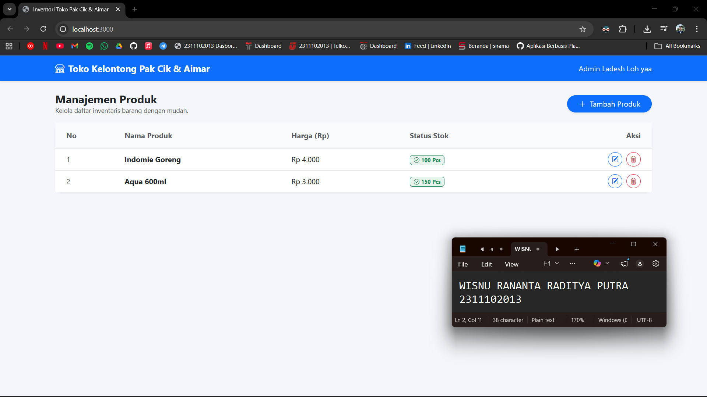
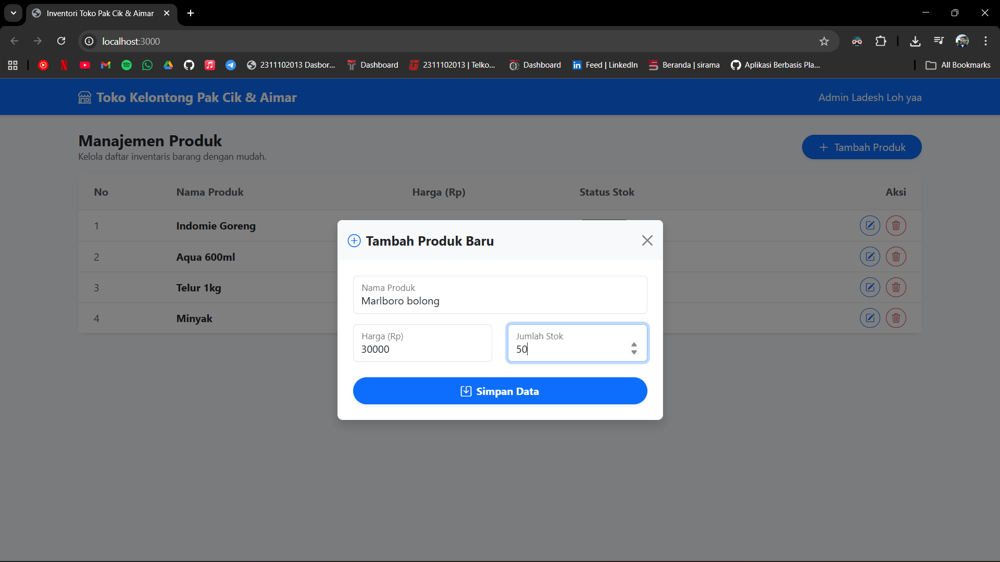
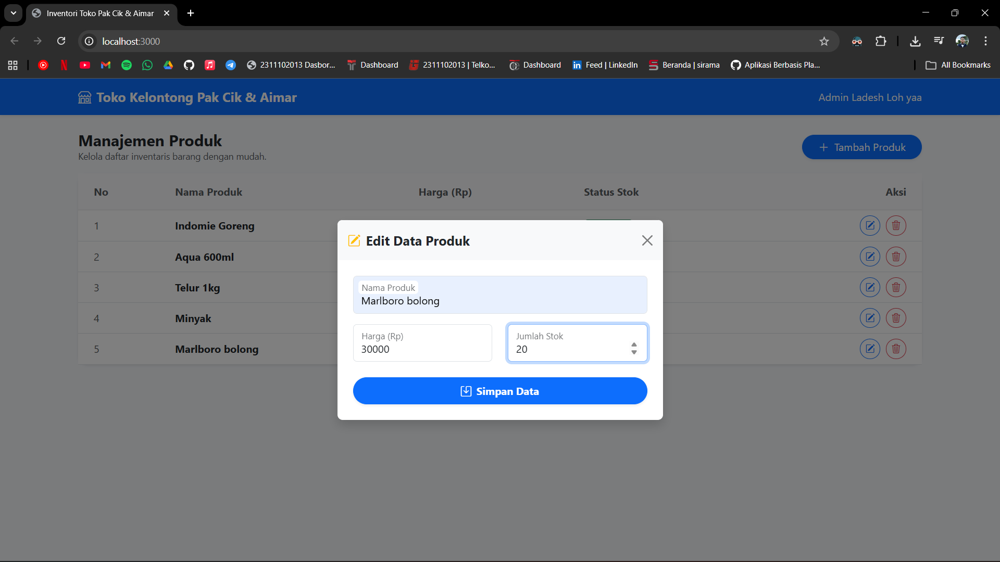
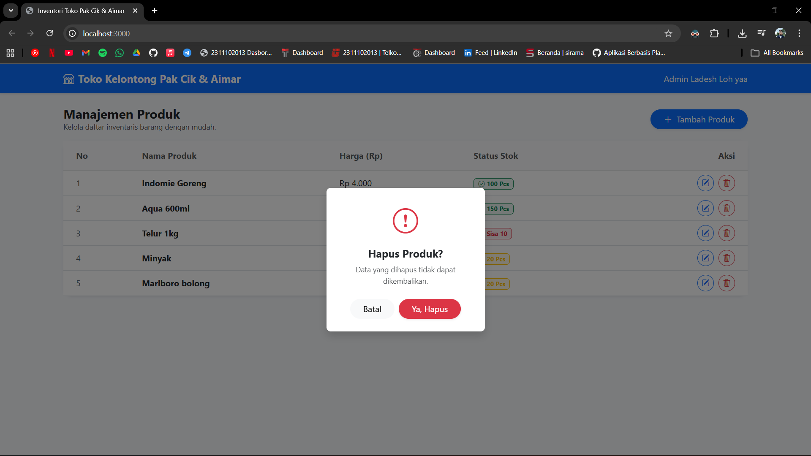

<div align="center">
  <br />
  <h1>LAPORAN PRAKTIKUM <br> APLIKASI BERBASIS PLATFORM </h1>
  <br />
  <h3>MODUL 5 <br> JAVASCRIPT & JQUERY </h3>
  <br />
  
  <br />
  <br />
  <br />
  <h3>Disusun Oleh :</h3>
  <p>
    <strong>Wisnu Rananta Raditya Putra</strong>
    <br>
    <strong>2311102013</strong>
    <br>
    <strong>S1 IF-11-REG05</strong>
  </p>
  <br />
  <h3>Dosen Pengampu :</h3>
  <p>
    <strong>Dedi Agung Prabowo, S.Kom., M.Kom</strong>
  </p>
  <br />
  <br />
  <h4>Asisten Praktikum :</h4>
  <strong>Apri Pandu Wicaksono </strong>
  <br>
  <strong>Hamka Zaenul Ardi</strong>
  <br />
  <h3>LABORATORIUM HIGH PERFORMANCE <br>FAKULTAS INFORMATIKA <br>UNIVERSITAS TELKOM PURWOKERTO <br>2026 </h3>
</div>

<hr>

# Dasar Teori

<p align="justify">
JavaScript adalah bahasa pemrograman yang digunakan untuk membuat halaman web menjadi interaktif dan dinamis. Dengan JavaScript, pengembang dapat memanipulasi elemen HTML dan CSS, menangani event seperti klik atau input pengguna, serta mengelola data secara langsung di sisi klien (client-side). Bahasa ini berjalan di browser dan menjadi salah satu teknologi utama dalam pengembangan web modern bersama HTML dan CSS. Selain itu, JavaScript juga mendukung berbagai konsep pemrograman seperti fungsi, objek, dan asynchronous programming yang memungkinkan pembuatan aplikasi web yang kompleks.
</p>

<p align="justify">
jQuery adalah library JavaScript yang dirancang untuk menyederhanakan penulisan kode JavaScript, terutama dalam manipulasi DOM, penanganan event, animasi, dan komunikasi AJAX. Dengan sintaks yang lebih singkat dan mudah dipahami, jQuery membantu pengembang mengurangi penulisan kode yang panjang dan rumit. Library ini juga kompatibel dengan berbagai browser, sehingga memudahkan pengembangan tanpa harus menangani perbedaan implementasi di setiap browser secara manual.
</p>


## Task 6: Toko Kelontong Pak Cik dan Aimar Loh yaa
### Souce code - server.js
```js
const express = require('express');
const fs = require('fs');
const path = require('path');
const app = express();
const PORT = 3000;

app.use(express.json());
app.use(express.urlencoded({ extended: true }));

app.use(express.static('public'));

const dataPath = path.join(__dirname, 'data.json');

// Helper function untuk membaca dan menulis JSON
const readData = () => JSON.parse(fs.readFileSync(dataPath, 'utf8'));
const writeData = (data) => fs.writeFileSync(dataPath, JSON.stringify(data, null, 2));

// API: Get All Products
app.get('/api/products', (req, res) => {
    res.json(readData());
});

// API: Create Product
app.post('/api/products', (req, res) => {
    const products = readData();
    const newProduct = {
        id: Date.now().toString(), // ID pake timestamp
        nama: req.body.nama,
        harga: req.body.harga,
        stok: req.body.stok
    };
    products.push(newProduct);
    writeData(products);
    res.json({ message: 'Produk berhasil ditambahkan!', data: newProduct });
});

// API: Update Product
app.put('/api/products/:id', (req, res) => {
    const products = readData();
    const index = products.findIndex(p => p.id === req.params.id);
    if (index !== -1) {
        products[index] = { ...products[index], ...req.body };
        writeData(products);
        res.json({ message: 'Produk berhasil diupdate!' });
    } else {
        res.status(404).json({ message: 'Produk tidak ditemukan' });
    }
});

// API: Delete Product
app.delete('/api/products/:id', (req, res) => {
    let products = readData();
    products = products.filter(p => p.id !== req.params.id);
    writeData(products);
    res.json({ message: 'Produk berhasil dihapus!' });
});

app.listen(PORT, () => {
    console.log(`Server berjalan di http://localhost:${PORT}`);
});
```

### Souce code - data.json
```json
[
  {
    "id": "1775565087736",
    "nama": "Indomie Goreng",
    "harga": "4000",
    "stok": "100"
  },
  {
    "id": "1775566434008",
    "nama": "Aqua 600ml",
    "harga": "3000",
    "stok": "150"
  }
]
```

### Souce code - index.html
```html
<!DOCTYPE html>
<html lang="id">
<head>
    <meta charset="UTF-8">
    <meta name="viewport" content="width=device-width, initial-scale=1.0">
    <title>Inventori Toko Pak Cik & Aimar</title>
    <link href="https://cdn.jsdelivr.net/npm/bootstrap@5.3.0/dist/css/bootstrap.min.css" rel="stylesheet">
    <link rel="stylesheet" href="https://cdn.jsdelivr.net/npm/bootstrap-icons@1.10.5/font/bootstrap-icons.css">
    <style>
        body { background-color: #f4f6f9; }
        .table-hover tbody tr:hover { background-color: #f8f9fa; transition: 0.2s; }
    </style>
</head>
<body>

<nav class="navbar navbar-expand-lg navbar-dark bg-primary shadow-sm mb-4">
    <div class="container">
        <a class="navbar-brand fw-bold" href="#">
            <i class="bi bi-shop me-2"></i>Toko Kelontong Pak Cik & Aimar
        </a>
        <span class="navbar-text text-light">
            Admin Ladesh Loh yaa
        </span>
    </div>
</nav>

<div class="container pb-5">
    <div class="d-flex justify-content-between align-items-center mb-3">
        <div>
            <h4 class="fw-bold mb-0 text-dark">Manajemen Produk</h4>
            <p class="text-muted small mb-0">Kelola daftar inventaris barang dengan mudah.</p>
        </div>
        <button class="btn btn-primary rounded-pill px-4 shadow-sm" id="btnTambahData">
            <i class="bi bi-plus-lg me-1"></i> Tambah Produk
        </button>
    </div>

    <div class="card border-0 shadow-sm rounded-4">
        <div class="card-body p-0">
            <div class="table-responsive">
                <table class="table table-hover align-middle mb-0">
                    <thead class="table-light">
                        <tr>
                            <th class="ps-4 py-3 text-muted">No</th>
                            <th class="py-3 text-muted">Nama Produk</th>
                            <th class="py-3 text-muted">Harga (Rp)</th>
                            <th class="py-3 text-muted">Status Stok</th>
                            <th class="pe-4 py-3 text-muted text-end">Aksi</th>
                        </tr>
                    </thead>
                    <tbody id="tabelProduk" class="border-top-0">
                        </tbody>
                </table>
            </div>
        </div>
    </div>
</div>

<div class="modal fade" id="modalForm" tabindex="-1">
  <div class="modal-dialog modal-dialog-centered">
    <div class="modal-content border-0 shadow">
      <div class="modal-header bg-light border-bottom-0">
        <h5 class="modal-title fw-bold" id="modalTitle"><i class="bi bi-box-seam me-2"></i>Tambah Produk</h5>
        <button type="button" class="btn-close" data-bs-dismiss="modal"></button>
      </div>
      <div class="modal-body p-4">
        <form id="formProduk">
            <input type="hidden" id="idProduk">
            <div class="form-floating mb-3">
                <input type="text" class="form-control" id="nama" placeholder="Nama Produk" required>
                <label for="nama">Nama Produk</label>
            </div>
            <div class="row">
                <div class="col-md-6">
                    <div class="form-floating mb-3">
                        <input type="number" class="form-control" id="harga" placeholder="Harga" required>
                        <label for="harga">Harga (Rp)</label>
                    </div>
                </div>
                <div class="col-md-6">
                    <div class="form-floating mb-4">
                        <input type="number" class="form-control" id="stok" placeholder="Stok" required>
                        <label for="stok">Jumlah Stok</label>
                    </div>
                </div>
            </div>
            <button type="submit" class="btn btn-primary w-100 rounded-pill py-2 fw-bold shadow-sm">
                <i class="bi bi-save me-2"></i>Simpan Data
            </button>
        </form>
      </div>
    </div>
  </div>
</div>

<div class="modal fade" id="modalDelete" tabindex="-1">
  <div class="modal-dialog modal-sm modal-dialog-centered">
    <div class="modal-content border-0 shadow">
      <div class="modal-body text-center p-4">
        <i class="bi bi-exclamation-circle text-danger" style="font-size: 3rem;"></i>
        <h5 class="mt-3 fw-bold">Hapus Produk?</h5>
        <p class="text-muted small">Data yang dihapus tidak dapat dikembalikan.</p>
        <div class="d-flex justify-content-center gap-2 mt-4">
            <button type="button" class="btn btn-light rounded-pill px-4" data-bs-dismiss="modal">Batal</button>
            <button type="button" class="btn btn-danger rounded-pill px-4 shadow-sm" id="btnConfirmDelete">Ya, Hapus</button>
        </div>
      </div>
    </div>
  </div>
</div>

<script src="https://code.jquery.com/jquery-3.7.0.min.js"></script>
<script src="https://cdn.jsdelivr.net/npm/bootstrap@5.3.0/dist/js/bootstrap.bundle.min.js"></script>

<script>
    let deleteId = null;

    // Fungsi Load Data
    function loadData() {
        $.get('/api/products', function(data) {
            let rows = '';
            if (data.length === 0) {
                rows = `<tr><td colspan="5" class="text-center py-4 text-muted"><i class="bi bi-inbox fs-4 d-block mb-2"></i>Belum ada produk.</td></tr>`;
            } else {
                $.each(data, function(index, item) {
                    // Logic Badge Stok
                    let stokBage = '';
                    if (item.stok <= 10) {
                        stokBage = `<span class="badge bg-danger bg-opacity-10 text-danger border border-danger px-2 py-1"><i class="bi bi-arrow-down-circle me-1"></i>Sisa ${item.stok}</span>`;
                    } else if (item.stok <= 30) {
                        stokBage = `<span class="badge bg-warning bg-opacity-10 text-warning border border-warning px-2 py-1"><i class="bi bi-exclamation-circle me-1"></i>${item.stok} Pcs</span>`;
                    } else {
                        stokBage = `<span class="badge bg-success bg-opacity-10 text-success border border-success px-2 py-1"><i class="bi bi-check-circle me-1"></i>${item.stok} Pcs</span>`;
                    }

                    rows += `
                        <tr>
                            <td class="ps-4 text-muted">${index + 1}</td>
                            <td class="fw-bold text-dark">${item.nama}</td>
                            <td>Rp ${parseInt(item.harga).toLocaleString('id-ID')}</td>
                            <td>${stokBage}</td>
                            <td class="pe-4 text-end">
                                <button class="btn btn-sm btn-outline-primary rounded-circle btnEdit me-1" title="Edit" data-id="${item.id}" data-nama="${item.nama}" data-harga="${item.harga}" data-stok="${item.stok}">
                                    <i class="bi bi-pencil-square"></i>
                                </button>
                                <button class="btn btn-sm btn-outline-danger rounded-circle btnDelete" title="Hapus" data-id="${item.id}">
                                    <i class="bi bi-trash3"></i>
                                </button>
                            </td>
                        </tr>
                    `;
                });
            }
            $('#tabelProduk').html(rows);
        });
    }

    $(document).ready(function() {
        loadData();

        // Buka Modal Tambah
        $('#btnTambahData').click(function() {
            $('#formProduk')[0].reset();
            $('#idProduk').val('');
            $('#modalTitle').html('<i class="bi bi-plus-circle me-2 text-primary"></i>Tambah Produk Baru');
            $('#modalForm').modal('show');
        });

        // Simpan Data
        $('#formProduk').submit(function(e) {
            e.preventDefault();
            let id = $('#idProduk').val();
            let payload = {
                nama: $('#nama').val(),
                harga: $('#harga').val(),
                stok: parseInt($('#stok').val())
            };

            let url = id ? '/api/products/' + id : '/api/products';
            let method = id ? 'PUT' : 'POST';

            $.ajax({
                url: url,
                type: method,
                data: payload,
                success: function(res) {
                    $('#modalForm').modal('hide');
                    loadData();
                }
            });
        });

        // Buka Modal Edit
        $(document).on('click', '.btnEdit', function() {
            $('#idProduk').val($(this).data('id'));
            $('#nama').val($(this).data('nama'));
            $('#harga').val($(this).data('harga'));
            $('#stok').val($(this).data('stok'));
            $('#modalTitle').html('<i class="bi bi-pencil-square me-2 text-warning"></i>Edit Data Produk');
            $('#modalForm').modal('show');
        });

        // Buka Modal Delete
        $(document).on('click', '.btnDelete', function() {
            deleteId = $(this).data('id');
            $('#modalDelete').modal('show');
        });

        // Konfirmasi Hapus
        $('#btnConfirmDelete').click(function() {
            if (deleteId) {
                $.ajax({
                    url: '/api/products/' + deleteId,
                    type: 'DELETE',
                    success: function(res) {
                        $('#modalDelete').modal('hide');
                        loadData();
                    }
                });
            }
        });
    });
</script>
</body>
</html>
```
### Screenshots Output





# Penjelasan
<p align="justify">
Aplikasi ini merupakan sistem pencatatan digital yang menggantikan metode manual dalam pengelolaan inventaris toko secara lebih efisien. Dengan UI yang modern dan responsif, pengguna dapat menambah, memperbarui, serta menghapus data barang secara real-time tanpa perlu memuat ulang halaman berkat teknologi pengiriman data otomatis.
</p>

<p align="justify">
Di sisi backend, aplikasi menggunakan Express.js untuk memproses dan menyimpan data secara persisten dalam format JSON sebagai alternatif basis data yang ringan. Selain itu, tersedia fitur konfirmasi pop-up untuk mencegah kesalahan penghapusan serta indikator visual berbasis warna yang menampilkan status ketersediaan stok secara jelas.
</p>