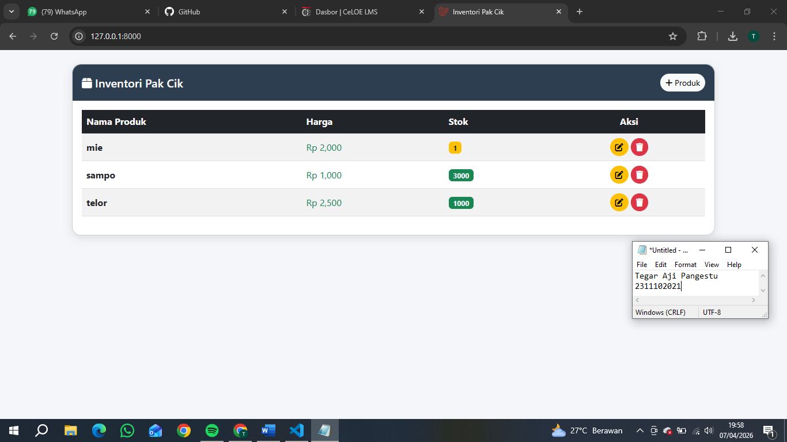

<div align="center">
  <br />
  <h1>LAPORAN PRAKTIKUM <br> APLIKASI BERBASIS PLATFORM </h1>
  <br />
  <h3>MODUL 6 <br> JAVASCRIPT & JQUERY </h3>
  <br />
  
  <br />
  <br />
  <br />
  <h3>Disusun Oleh :</h3>
  <p>
    <strong>Tegar Aji Pangestu</strong>
    <br>
    <strong>2311102021</strong>
    <br>
    <strong>S1 IF-11-REG05</strong>
  </p>
  <br />
  <h3>Dosen Pengampu :</h3>
  <p>
    <strong>Dedi Agung Prabowo, S.Kom., M.Kom</strong>
  </p>
  <br />
  <br />
  <h4>Asisten Praktikum :</h4>
  <strong>Apri Pandu Wicaksono </strong>
  <br>
  <strong>Hamka Zaenul Ardi</strong>
  <br />
  <h3>LABORATORIUM HIGH PERFORMANCE <br>FAKULTAS INFORMATIKA <br>UNIVERSITAS TELKOM PURWOKERTO <br>2026 </h3>
</div>

<hr>

# Dasar Teori

JavaScript adalah bahasa pemrograman yang digunakan untuk membuat halaman web menjadi interaktif dan dinamis. Dengan JavaScript, pengembang dapat memanipulasi elemen HTML dan CSS secara langsung melalui browser, seperti menampilkan animasi, memvalidasi form, hingga merespons aksi pengguna seperti klik atau input. JavaScript berjalan di sisi klien (client-side), sehingga prosesnya terjadi di perangkat pengguna tanpa harus selalu berkomunikasi dengan server, meskipun saat ini juga bisa digunakan di sisi server dengan teknologi seperti Node.js.

jQuery adalah sebuah library JavaScript yang dirancang untuk menyederhanakan penulisan kode JavaScript. Dengan jQuery, tugas-tugas seperti manipulasi DOM, penanganan event, animasi, dan AJAX menjadi lebih mudah dan ringkas dibandingkan menggunakan JavaScript murni. jQuery menggunakan sintaks yang sederhana dan mudah dipahami, sehingga sangat membantu terutama bagi pemula dalam mengembangkan website yang interaktif dengan lebih cepat dan efisien..
# Tugas 5 - Toko Kelontong Pak Cik
## Source code productcontroller
```<!-- 2311102021
Tegar Aji pangestu
S1IF-11-05 -->
<?php

namespace App\Http\Controllers;

use Illuminate\Http\Request;

class ProductController extends Controller
{
    private $file = 'products.json';

    private function getData()
    {
        $path = storage_path($this->file);

        if (!file_exists($path)) {
            file_put_contents($path, json_encode([]));
        }

        return json_decode(file_get_contents($path), true);
    }

    private function saveData($data)
    {
        file_put_contents(storage_path($this->file), json_encode($data, JSON_PRETTY_PRINT));
    }

    public function index()
    {
        $products = $this->getData();
        return view('index', compact('products'));
    }

    public function create()
    {
        return view('create');
    }

    public function store(Request $request)
    {
        $data = $this->getData();
        $id = count($data) + 1;

        $data[] = [
            'id' => $id,
            'name' => $request->name,
            'price' => $request->price,
            'stock' => $request->stock
        ];

        $this->saveData($data);
        return redirect('/');
    }

    public function edit($id)
    {
        $data = $this->getData();
        $product = collect($data)->firstWhere('id', $id);

        return view('edit', compact('product'));
    }

    public function update(Request $request, $id)
    {
        $data = $this->getData();

        foreach ($data as &$item) {
            if ($item['id'] == $id) {
                $item['name'] = $request->name;
                $item['price'] = $request->price;
                $item['stock'] = $request->stock;
            }
        }

        $this->saveData($data);
        return redirect('/');
    }

    public function destroy($id)
    {
        $data = $this->getData();

        $data = array_filter($data, function ($item) use ($id) {
            return $item['id'] != $id;
        });

        $this->saveData(array_values($data));

        return redirect('/');
    }
}
```
## Source code create
```<!-- 2311102021
Tegar Aji pangestu
S1IF-11-05 -->

<!DOCTYPE html>
<html>
<head>
    <title>Tambah Produk</title>
    <link rel="stylesheet" href="https://cdn.jsdelivr.net/npm/bootstrap@5.3.0/dist/css/bootstrap.min.css">
</head>
<body class="p-4">

<div class="container">
    <h2>Tambah Produk</h2>
    <form method="POST" action="/store">
        <?php echo csrf_field(); ?>
        <input class="form-control mb-2" name="name" placeholder="Nama">
        <input class="form-control mb-2" name="price" placeholder="Harga">
        <input class="form-control mb-2" name="stock" placeholder="Stok">
        <button class="btn btn-success">Simpan</button>
    </form>
</div>

</body>
</html>


<?php
```

## Source code edit
```<!-- 2311102021
Tegar Aji pangestu
S1IF-11-05 -->

?>

<!DOCTYPE html>
<html>
<head>
    <title>Edit Produk</title>
    <link rel="stylesheet" href="https://cdn.jsdelivr.net/npm/bootstrap@5.3.0/dist/css/bootstrap.min.css">
</head>
<body class="p-4">

<div class="container">
    <h2>Edit Produk</h2>
    <form method="POST" action="/update/<?= $product['id'] ?>">
        <?php echo csrf_field(); ?>
        <input class="form-control mb-2" name="name" value="<?= $product['name'] ?>">
        <input class="form-control mb-2" name="price" value="<?= $product['price'] ?>">
        <input class="form-control mb-2" name="stock" value="<?= $product['stock'] ?>">
        <button class="btn btn-primary">Update</button>
    </form>
</div>

</body>
</html>
```


Output:


# Penjelasan
Aplikasi web inventory Pak Cik ini adalah sistem sederhana berbasis Laravel yang digunakan untuk mengelola data produk (CRUD: create, read, update, delete) dengan penyimpanan data menggunakan file JSON, bukan database. Alur kerjanya dimulai dari user yang mengakses halaman utama untuk melihat daftar produk yang ditampilkan dalam tabel menggunakan Bootstrap, kemudian user dapat menambah produk melalui form create, mengedit data melalui form edit, dan menghapus data dengan konfirmasi modal yang dikontrol menggunakan jQuery. Semua proses pengolahan data ditangani oleh controller yang berfungsi membaca dan menyimpan data ke file storage/products.json, sehingga setiap perubahan langsung tersimpan dan ditampilkan kembali ke tampilan. Aplikasi ini menerapkan konsep dasar MVC (Model-View-Controller) dan cocok digunakan sebagai pembelajaran karena sederhana, meskipun kurang optimal untuk penggunaan skala besar.
