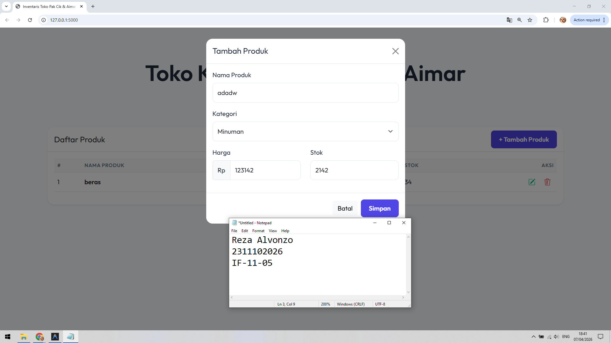
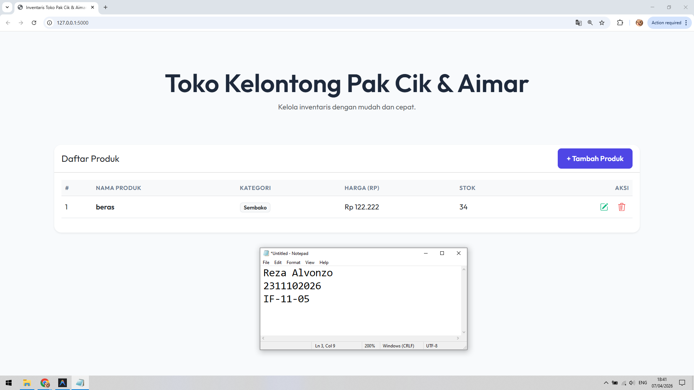

<div align="center">
  <br />
  <h1>LAPORAN PRAKTIKUM <br> APLIKASI BERBASIS PLATFORM </h1>
  <br />
  <h3>MODUL 6 <br> COTS </h3>
  <br />
  
  <br />
  <br />
  <br />
  <h3>Disusun Oleh :</h3>
  <p>
    <strong>Reza Alvonzo</strong>
    <br>
    <strong>2311102026</strong>
    <br>
    <strong>S1 IF-11-REG05</strong>
  </p>
  <br />
  <h3>Dosen Pengampu :</h3>
  <p>
    <strong>Dedi Agung Prabowo, S.Kom., M.Kom</strong>
  </p>
  <br />
  <br />
  <h4>Asisten Praktikum :</h4>
  <strong>Apri Pandu Wicaksono </strong>
  <br>
  <strong>Hamka Zaenul Ardi</strong>
  <br />
  <h3>LABORATORIUM HIGH PERFORMANCE <br>FAKULTAS INFORMATIKA <br>UNIVERSITAS TELKOM PURWOKERTO <br>2026 </h3>
</div>

<hr>

## Dasar Teori COTS

Commercial Off-The-Shelf (COTS) merupakan pendekatan dalam pengembangan sistem yang memanfaatkan perangkat lunak atau komponen yang sudah tersedia secara komersial dan dapat langsung digunakan tanpa perlu membangun dari awal. Produk COTS biasanya dikembangkan oleh vendor tertentu dan dirancang untuk memenuhi kebutuhan umum berbagai pengguna, sehingga dapat diimplementasikan dengan cepat dalam suatu sistem. Contoh penerapan COTS dalam pengembangan aplikasi meliputi penggunaan framework seperti Bootstrap, library seperti jQuery, serta layanan pihak ketiga seperti sistem autentikasi atau database berbasis cloud.

Penggunaan COTS memberikan berbagai keuntungan, terutama dalam hal efisiensi waktu dan biaya pengembangan. Karena sistem tidak perlu dibuat dari nol, tim pengembang dapat lebih fokus pada pengembangan fitur inti (core business logic). Selain itu, produk COTS umumnya telah melalui proses pengujian yang matang sehingga lebih stabil dan memiliki dokumentasi yang lengkap. Namun demikian, penggunaan COTS juga memiliki keterbatasan, seperti kurangnya fleksibilitas dalam kustomisasi dan adanya ketergantungan terhadap vendor, terutama terkait pembaruan sistem dan lisensi penggunaan.

Dalam praktik pengembangan aplikasi modern, COTS sering digunakan dalam kombinasi dengan pengembangan kustom (custom development) untuk menghasilkan sistem yang optimal. Pendekatan ini memungkinkan pengembang memanfaatkan keunggulan COTS untuk fitur umum, sementara tetap mengembangkan bagian yang spesifik sesuai kebutuhan sistem. Oleh karena itu, pemilihan dan integrasi COTS harus dilakukan secara cermat agar dapat mendukung skalabilitas, keamanan, serta keberlanjutan sistem yang dibangun.

### Source code 
```py
# app.py
from flask import Flask, render_template, request, jsonify
import json
import os

app = Flask(__name__)
DATA_FILE = 'data.json'

def load_data():
    if not os.path.exists(DATA_FILE):
        return []
    with open(DATA_FILE, 'r') as f:
        try:
            return json.load(f)
        except json.JSONDecodeError:
            return []

def save_data(data):
    with open(DATA_FILE, 'w') as f:
        json.dump(data, f, indent=4)

@app.route('/')
def index():
    return render_template('index.html')

# Selebihnya dapat cek pada file "app.py"
```
🔗 [Klik di sini untuk membuka file `app.py`](app.py)

```html
<!DOCTYPE html>
<html lang="id">
<head>
    <meta charset="UTF-8">
    <meta name="viewport" content="width=device-width, initial-scale=1.0">
    <title>Inventaris Toko Pak Cik & Aimar</title>
    <!-- Bootstrap CSS -->
    <link href="https://cdn.jsdelivr.net/npm/bootstrap@5.3.0/dist/css/bootstrap.min.css" rel="stylesheet">
    <!-- Google Fonts -->
    <link href="https://fonts.googleapis.com/css2?family=Outfit:wght@300;400;600&display=swap" rel="stylesheet">
    <link rel="stylesheet" href="{{ url_for('static', filename='css/style.css') }}">
</head>
<body>
    <div class="container mt-5">
        <div class="header-section mb-4 text-center">
            <h1 class="display-4 fw-bold">Toko Kelontong Pak Cik & Aimar</h1>
            <p class="text-muted">Kelola inventaris dengan mudah dan cepat.</p>
        </div>

        <div class="card shadow-sm border-0 mb-4">
            <div class="card-header bg-white d-flex justify-content-between align-items-center">
                <h5 class="mb-0">Daftar Produk</h5>
                <button class="btn btn-primary" data-bs-toggle="modal" data-bs-target="#productModal" onclick="clearModal()">
                    + Tambah Produk
                </button>
            </div>
            <div class="card-body">
                <div class="table-responsive">
                    <table class="table table-hover align-middle">
                        <thead class="table-light">
                            <tr>
                                <th>#</th>
                                <th>Nama Produk</th>
                                <th>Kategori</th>
                                <th>Harga (Rp)</th>
                                <th>Stok</th>
                                <th class="text-end">Aksi</th>
                            </tr>
                        </thead>
                        <tbody id="productTableBody">
                            <!-- Data will be populated here by jQuery -->
                        </tbody>
                    </table>
                </div>
            </div>
        </div>
    </div>
    <!-- Selebihnya dapat cek pada file "templates/index.html" -->
```
🔗 [Klik di sini untuk membuka file `index.html`](templates/index.html)


```js
$(document).ready(function() {
    // Initial load
    loadProducts();

    // Form submission (Create/Edit)
    $('#productForm').on('submit', function(e) {
        e.preventDefault();
        
        const productId = $('#productId').val();
        const productData = {
            name: $('#productName').val(),
            category: $('#productCategory').val(),
            price: parseFloat($('#productPrice').val()),
            stock: parseInt($('#productStock').val())
        };

        // Selebihnya dapat cek pada file "static/js/app.js"
```
🔗 [Klik di sini untuk membuka file `app.js`](static/js/app.js)

Output:




## Penjelasan
Project ini menggunakan Flask sebagai backend untuk mengelola data produk melalui API, serta frontend JavaScript untuk menampilkan dan memanipulasi data secara dinamis. Sistem terhubung dengan database JSON sehingga data produk dapat disimpan, ditampilkan, dan dihapus secara real-time.
