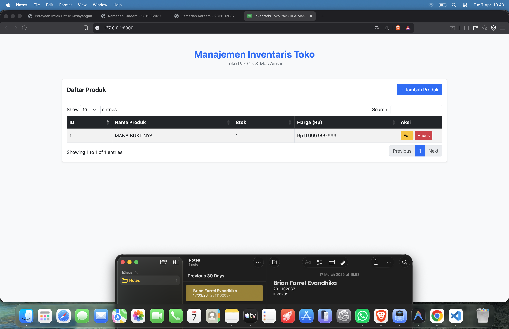
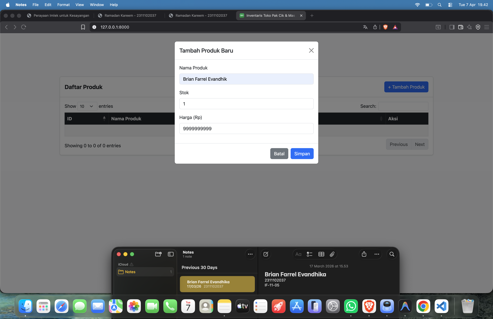
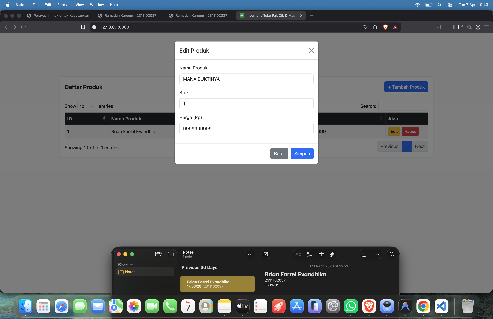
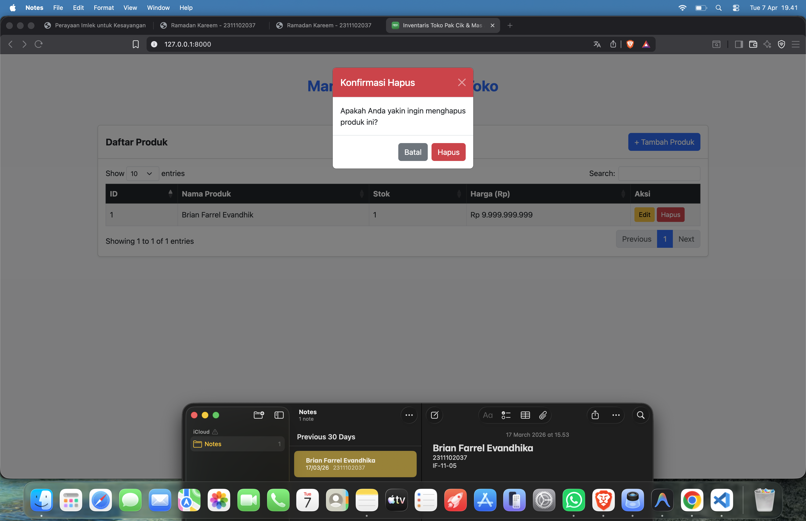

<div align="center">
  <br />
  <h1>LAPORAN PRAKTIKUM <br> APLIKASI BERBASIS PLATFORM </h1>
  <br />
  <h3>MODUL 6<br> BOOTSTRAP </h3>
  <br />
  
  <br />
  <br />
  <br />
  <h3>Disusun Oleh :</h3>
  <p>
    <strong>Brian Farrel Evandhika</strong>
    <br>
    <strong>2311102037</strong>
    <br>
    <strong>S1 IF-11-REG05</strong>
  </p>
  <br />
  <h3>Dosen Pengampu :</h3>
  <p>
    <strong>Dedi Agung Prabowo, S.Kom., M.Kom</strong>
  </p>
  <br />
  <br />
  <h4>Asisten Praktikum :</h4>
  <strong>Apri Pandu Wicaksono </strong>
  <br>
  <strong>Hamka Zaenul Ardi</strong>
  <br />
  <h3>LABORATORIUM HIGH PERFORMANCE <br>FAKULTAS INFORMATIKA <br>UNIVERSITAS TELKOM PURWOKERTO <br>2026 </h3>
</div>

<hr>

# Inventaris Toko Pak Cik & Mas Aimar (Modul 6)

## Dasar Teori

**1. Bootstrap**
Bootstrap adalah kerangka kerja (*framework*) front-end open-source yang sangat populer digunakan untuk merancang antarmuka web dan aplikasi yang responsif secara efisien. Bootstrap memfasilitasi pembuatan antarmuka pengguna yang adaptif terhadap berbagai ukuran layar (*mobile-first*) menggunakan komponen-komponen UI yang sudah disediakan seperti *Modals*, *Buttons*, *Forms*, *Cards*, hingga *Grid System*. Dalam modul ini, penggunaan Bootstrap mempermudah styling dan interaktivitas antar elemen secara asinkron tanpa harus menyusun CSS secara mandiri.

**2. Asynchronous JavaScript and XML (AJAX) via jQuery**
AJAX adalah sekumpulan teknik pengembangan web yang memungkinkan aplikasi web melakukan pertukaran data dengan server di bagian latar belakang (*background*), yang berarti isi halaman dapat diperbarui secara dinamis tanpa melakukan rendering atau *refresh* keseluruhan (*asynchronous*). Pada proyek ini, operasi CRUD dikirim tanpa melibatkan *reload* rute menggunakan permintaan asinkron (fetch / POST / GET) dari jQuery.

**3. DataTables**
DataTables merupakan plug-in dari *library* jQuery yang menghadirkan kemampuan pemrosesan dan representasi tingkat lanjut pada tabel HTML statis. Dengan implementasinya, tabel secara otomatis memiliki integrasi fitur pencarian lanjutan (*search*), pengurutan data interaktif (*sorting*), serta formasi halaman untuk kumpulan data dalam jumlah banyak (*pagination*).

## Dokumentasi Aplikasi

Berikut ini log visual pengoperasian program:

### 1. Halaman Utama Data Produk (`View`)


### 2. Form Tambah Produk Baru (`Create`)


### 3. Edit Data Produk Barang (`Update`)


### 4. Alert / Konfirmasi Penghapusan (`Delete`)


## Deskripsi Proyek
Proyek ini adalah sebuah sistem manajemen inventaris barang sederhana (Toko Pak Cik & Mas Aimar) yang dibangun menggunakan kerangka kerja **Laravel**. Aplikasi ini menggunakan **JSON File (`storage/app/inventory.json`)** sebagai penyimpanan data, sehingga tidak memerlukan database relasional (MySQL/PostgreSQL).

Sistem ini memiliki fitur **CRUD (Create, Read, Update, Delete)** asinkron yang diimplementasikan menggunakan **jQuery AJAX** dan antarmuka tabel menggunakan **DataTables**. Styling tampilan menggunakan kerangka kerja **Bootstrap 5**.

## Fitur Aplikasi
- **Create**: Menambah produk baru melalui modal interaktif.
- **Read**: Menampilkan daftar produk dengan menggunakan tabel pintar (DataTables) yang mendukung *sorting*, *pagination*, dan *searching*.
- **Update**: Memperbarui informasi produk (Nama, Stok, Harga) menggunakan modal AJAX tanpa perlu melakukan *reload* halaman.
- **Delete**: Menghapus produk dengan konfirmasi (SweetAlert/Modal Bootstrap) untuk mencegah penghapusan data secara tidak disengaja.

## Teknologi yang Digunakan
- **Backend:** Laravel 11 / PHP
- **Frontend / UI:** Bootstrap 5 (CSS)
- **DOM Manipulation & State Management:** jQuery & AJAX
- **Tabel:** DataTables (via jQuery plug-in)
- **Penyimpanan:** File JSON

## Cara Instalasi dan Menjalankan Proyek

1. **Jalankan Terminal/Command Prompt**
   Buka terminal di dalam direktori root poyek ini.

2. **Jalankan Composer Install (Opsional, jika vendor belum ada)**
   ```bash
   composer install
   ```

3. **Duplikat file Environment**
   Salin `.env.example` ke `.env`:
   ```bash
   cp .env.example .env
   ```

4. **Generate Application Key**
   ```bash
   php artisan key:generate
   ```

5. **Jalankan Laravel Development Server**
   ```bash
   php artisan serve
   ```

6. **Akses Aplikasi**
   Buka peramban lokal di: [http://localhost:8000](http://localhost:8000)

## API Endpoints (Garis Besar)

Proyek ini mengekpos beberapa endpoint internal yang diakses via jQuery AJAX:

| Metode | URI | Keterangan |
| --- | --- | --- |
| `GET` | `/` | Memuat halaman utama (UI) produk. |
| `GET` | `/products/data` | Menyediakan data JSON untuk DataTables. |
| `POST` | `/products` | Menyimpan payload form tambah produk baru yang tervalidasi. |
| `GET` | `/products/{id}/edit` | Mengambil data satu produk berdasarkan ID (untuk mengisi value modal). |
| `PUT` | `/products/{id}` | Memperbarui data produk pada ID yang tertera. |
| `DELETE` | `/products/{id}` | Menghapus sebuah produk dari file JSON. |

## Struktur Berkas Spesifik

Kontrol utama dan file spesifik yang dicustom dalam proyek ini berada di:
- `app/Http/Controllers/ProductController.php` - Kontroller yang memanipulasi File JSON dan mengembalikan response JSON.
- `routes/web.php` - Konfigurasi endpoint AJAX dan View.
- `resources/views/welcome.blade.php` - Dokumen HTML tunggal yang berfungsi sebagai antarmuka utama (View). **Di sinilah seluruh implementasi instalasi dan logika jQuery berada.** Pemuatan library jQuery via CDN serta *script* AJAX (untuk CRUD asinkron), DataTables, dan manipulasi DOM ditempatkan pada blok `<script>` di bagian bawah berkas ini.
- `storage/app/inventory.json` - Folder dan file yang menampung data produk array berformat JSON.

---
**Dikerjakan Oleh**: Brian Farrel Evandhika (2311102037)
