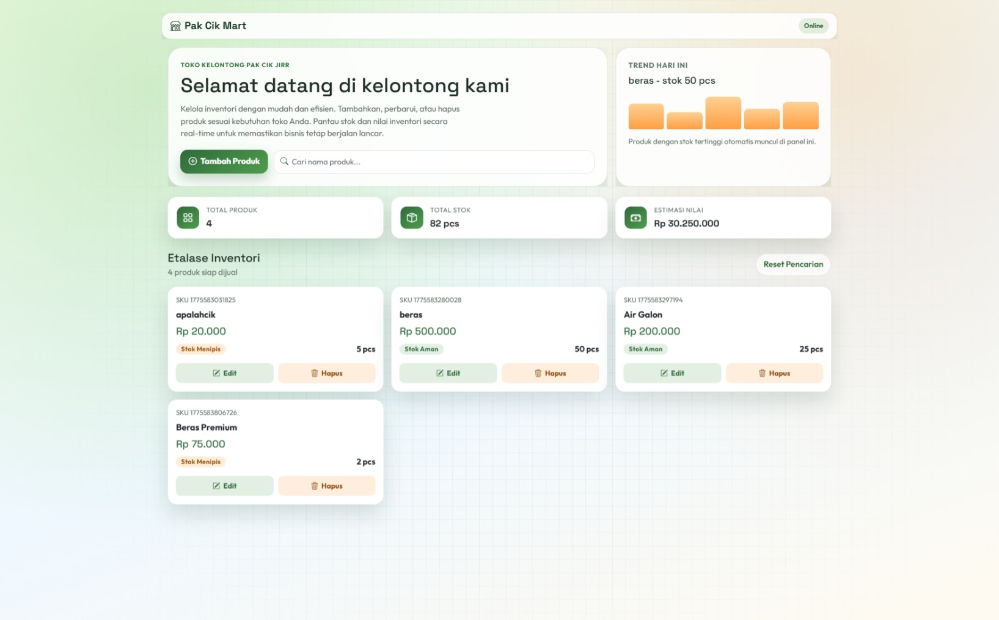
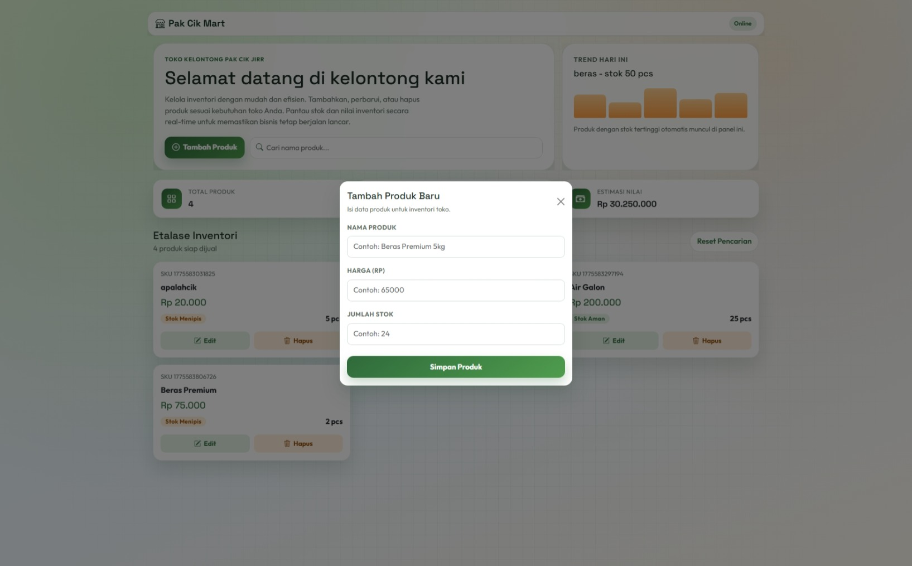
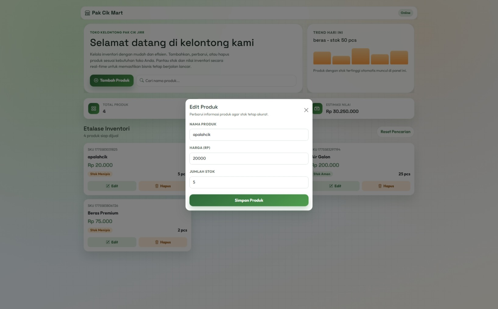
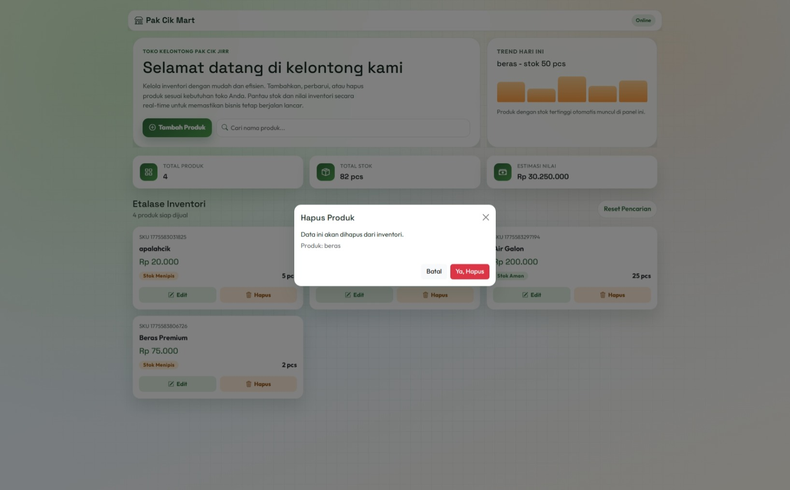

<div align="center">
  <br />
  <h1>LAPORAN PRAKTIKUM <br> APLIKASI BERBASIS PLATFORM </h1>
  <br />
  <h3>MODUL COTS <br> Coding On The Spot </h3>
  <br />
  
  <br />
  <br />
  <br />
  <h3>Disusun Oleh :</h3>
  <p>
    <strong>Muhammad Aulia Muzzaki Nugraha</strong>
    <br>
    <strong>2311102051</strong>
    <br>
    <strong>S1 IF-11-REG05</strong>
  </p>
  <br />
  <h3>Dosen Pengampu :</h3>
  <p>
    <strong>Dedi Agung Prabowo, S.Kom., M.Kom</strong>
  </p>
  <br />
  <br />
  <h4>Asisten Praktikum :</h4>
  <strong>Apri Pandu Wicaksono </strong>
  <br>
  <strong>Hamka Zaenul Ardi</strong>
  <br />
  <h3>LABORATORIUM HIGH PERFORMANCE <br>FAKULTAS INFORMATIKA <br>UNIVERSITAS TELKOM PURWOKERTO <br>2026 </h3>
</div>

<hr>

# Dasar Teori

Pada modul COTS (Coding On The Spot), aplikasi dibangun menggunakan kombinasi backend dan frontend berbasis JavaScript. Materi yang digunakan mencakup konsep bahasa pemrograman, framework, library, serta tools pendukung pengembangan web.

## 1) JavaScript
JavaScript adalah bahasa pemrograman utama pada proyek ini. Di sisi backend, JavaScript dijalankan menggunakan Node.js. Di sisi frontend, JavaScript digunakan untuk mengatur interaksi pengguna, manipulasi tampilan, dan komunikasi data dengan server.

## 2) Node.js
Node.js adalah runtime JavaScript di luar browser yang digunakan untuk menjalankan server aplikasi. Dengan Node.js, satu bahasa yang sama (JavaScript) dapat dipakai di backend dan frontend sehingga alur pengembangan lebih konsisten.

## 3) Express.js
Express.js adalah framework backend berbasis Node.js yang memudahkan pembuatan routing dan API. Pada modul ini, Express digunakan untuk:
1. Menyediakan route halaman utama.
2. Menyediakan endpoint API CRUD (GET, POST, PUT, DELETE).
3. Mengelola middleware untuk parsing request body dan file statis.

## 4) EJS (Embedded JavaScript)
EJS adalah template engine untuk menghasilkan tampilan HTML secara dinamis dari server. EJS memudahkan pemisahan struktur halaman dan logika render, sehingga data dari backend dapat ditampilkan ke antarmuka pengguna dengan rapi.

## 5) HTML, CSS, dan Bootstrap
1. HTML dipakai untuk struktur konten halaman.
2. CSS dipakai untuk styling dan identitas visual.
3. Bootstrap dipakai untuk komponen UI siap pakai dan sistem grid responsif agar tampilan tetap baik di desktop maupun mobile.

## 6) jQuery
jQuery adalah library JavaScript yang menyederhanakan manipulasi DOM, event handling, dan AJAX. Dalam modul ini, jQuery membantu mempercepat proses:
1. Mengambil data produk dari API.
2. Menangani aksi tombol tambah, edit, hapus.
3. Memperbarui tampilan secara dinamis tanpa reload halaman penuh.

## 7) JSON dan File System (fs)
Data produk disimpan dalam file JSON sebagai penyimpanan sederhana. Modul bawaan Node.js, yaitu `fs`, digunakan untuk membaca dan menulis data ke file `products.json`. Pendekatan ini cocok untuk skala praktikum karena mudah dipahami dan diimplementasikan.

## 8) REST API dan Konsep CRUD
Konsep CRUD (Create, Read, Update, Delete) diimplementasikan melalui REST API:
1. GET untuk membaca data.
2. POST untuk menambah data.
3. PUT untuk memperbarui data.
4. DELETE untuk menghapus data.

## 9) npm dan package.json
npm (Node Package Manager) digunakan untuk mengelola dependency seperti `express` dan `ejs`. Informasi paket proyek, script, dan versi dependency dicatat pada `package.json` agar lingkungan pengembangan konsisten.

## 10) Arsitektur Client-Server
Modul COTS menerapkan pola client-server:
1. Client (browser) menampilkan UI dan mengirim request.
2. Server (Express) memproses request dan mengelola data.
3. Respons JSON dikirim kembali untuk ditampilkan secara dinamis di halaman.

Dengan materi di atas, modul COTS melatih kemampuan full-stack dasar: membangun backend API, mengelola data, serta membuat antarmuka web interaktif dalam satu proyek terpadu.


## Task 6: Toko Kelontong Pak Cik dan Aimar

### Source Code index.ejs
```ejs
<!DOCTYPE html>
<html lang="id">
<head>
    <meta charset="UTF-8">
    <meta name="viewport" content="width=device-width, initial-scale=1.0">
    <title>Toko Pak Cik & Aimar</title>
    <link rel="preconnect" href="https://fonts.googleapis.com">
    <link rel="preconnect" href="https://fonts.gstatic.com" crossorigin>
    <link href="https://fonts.googleapis.com/css2?family=Outfit:wght@400;500;600;700;800&family=Space+Grotesk:wght@500;700&display=swap" rel="stylesheet">
    <link href="https://cdn.jsdelivr.net/npm/bootstrap@5.3.3/dist/css/bootstrap.min.css" rel="stylesheet">
    <link href="https://cdn.jsdelivr.net/npm/bootstrap-icons@1.11.3/font/bootstrap-icons.min.css" rel="stylesheet">
    <script src="https://code.jquery.com/jquery-3.7.1.min.js"></script>
    <style>
        :root {
            --fresh-900: #173625;
            --fresh-700: #2f6a3b;
            --fresh-500: #4f9d4e;
            --fresh-300: #8ccf80;
            --accent-500: #ff9f43;
            --accent-300: #ffd092;
            --text-main: #1d2d25;
            --text-soft: #5d6d64;
            --surface: rgba(255, 255, 255, 0.86);
            --surface-solid: #ffffff;
            --border-soft: rgba(43, 96, 55, 0.14);
            --shadow-soft: 0 20px 40px rgba(23, 54, 37, 0.14);
        }

        * {
            box-sizing: border-box;
        }

        body {
            margin: 0;
            font-family: "Outfit", sans-serif;
            color: var(--text-main);
            background:
                radial-gradient(circle at 15% 15%, rgba(140, 207, 128, 0.35), transparent 45%),
                radial-gradient(circle at 85% 12%, rgba(255, 159, 67, 0.20), transparent 40%),
                linear-gradient(160deg, #f4fdea 0%, #eff8ff 55%, #fffaf0 100%);
            min-height: 100vh;
            position: relative;
        }

        body::before {
            content: "";
            position: fixed;
            inset: 0;
            pointer-events: none;
            background-image:
                linear-gradient(rgba(47, 106, 59, 0.06) 1px, transparent 1px),
                linear-gradient(90deg, rgba(47, 106, 59, 0.06) 1px, transparent 1px);
            background-size: 26px 26px;
            mask-image: radial-gradient(circle at center, black 35%, transparent 85%);
            z-index: 0;
        }
```
🔗 [Klik di sini untuk membuka file `index.ejs`](./index.ejs)


### Source Code app.js
```js
const express = require('express');
const fs = require('fs');
const path = require('path');
const app = express();
const PORT = 3000;

// Setting View Engine & Middleware
app.set('view engine', 'ejs');
app.use(express.json());
app.use(express.urlencoded({ extended: true }));
app.use(express.static('public'));

const DATA_PATH = path.join(__dirname, 'data', 'products.json');

// Fungsi pembantu baca/tulis JSON
const readData = () => {
    const data = fs.readFileSync(DATA_PATH, 'utf-8');
    return JSON.parse(data || '[]');
};
const writeData = (data) => fs.writeFileSync(DATA_PATH, JSON.stringify(data, null, 2));

// --- ROUTES ---

// Halaman Utama
app.get('/', (req, res) => {
    res.render('index');
});

// API Get All Products
app.get('/api/products', (req, res) => {
    res.json(readData());
});

// API Create
app.post('/api/products', (req, res) => {
    const products = readData();
    const newProduct = { 
        id: Date.now(), 
        name: req.body.name, 
        price: req.body.price, 
        stock: req.body.stock 
    };
    products.push(newProduct);
    writeData(products);
    res.json({ success: true });
});

// API Update
app.put('/api/products/:id', (req, res) => {
    let products = readData();
    const index = products.findIndex(p => p.id == req.params.id);
    if (index !== -1) {
        products[index] = { ...products[index], ...req.body };
        writeData(products);
    }
    res.json({ success: true });
});

// API Delete
app.delete('/api/products/:id', (req, res) => {
    let products = readData();
    products = products.filter(p => p.id != req.params.id);
    writeData(products);
    res.json({ success: true });
});

app.listen(PORT, () => {
    console.log(`Server Pak Cik & Aimar sudah jalan di: http://localhost:${PORT}`);
});
```

### Source Code package.json
```json
{
  "name": "2311102051_muhammadauliamuzzakinugraha",
  "version": "1.0.0",
  "description": "",
  "main": "index.js",
  "scripts": {
    "test": "echo \"Error: no test specified\" && exit 1"
  },
  "keywords": [],
  "author": "",
  "license": "ISC",
  "type": "commonjs",
  "dependencies": {
    "ejs": "^5.0.1",
    "express": "^5.2.1"
  }
}
```

### Source Code products.json
```json
[
  {
    "id": 1775583031825,
    "name": "apalahcik",
    "price": "20000",
    "stock": "5"
  },
  {
    "id": 1775583280028,
    "name": "beras",
    "price": 500000,
    "stock": 50
  },
  {
    "id": 1775583297194,
    "name": "Air Galon",
    "price": 200000,
    "stock": 25
  },
  {
    "id": 1775583806726,
    "name": "Beras Premium",
    "price": 75000,
    "stock": 2
  }
]
```
### Screenshot Output




### Penjelasan

Project ini adalah aplikasi CRUD inventori toko kelontong berbasis **Node.js + Express** untuk backend, dan **EJS + Bootstrap + jQuery** untuk frontend. Data produk disimpan di file lokal `products.json`.

#### 1) Arsitektur Singkat

1. **Backend (`app.js`)** menangani route halaman dan API CRUD.
2. **Frontend (`views/index.ejs`)** menampilkan dashboard modern, statistik, pencarian, dan modal form.
3. **Data (`data/products.json`)** menjadi penyimpanan sederhana berbasis file JSON.

#### 2) Penjelasan Backend (`app.js`)

Backend menggunakan Express dengan middleware berikut:

1. `express.json()` untuk menerima body JSON dari AJAX.
2. `express.urlencoded({ extended: true })` untuk form URL-encoded.
3. `express.static('public')` untuk file statis.
4. `app.set('view engine', 'ejs')` untuk render halaman EJS.

Fungsi helper data:

1. **`readData()`**
  - Membaca file `products.json`.
  - Parse isi file menjadi array JavaScript.
2. **`writeData(data)`**
  - Menulis ulang seluruh data produk ke `products.json`.
  - Menggunakan format JSON rapi (`indent 2 spasi`).

Endpoint utama:

| Method | Endpoint | Fungsi |
|---|---|---|
| GET | `/` | Render halaman dashboard (`index.ejs`) |
| GET | `/api/products` | Ambil semua produk |
| POST | `/api/products` | Tambah produk baru |
| PUT | `/api/products/:id` | Update produk berdasarkan ID |
| DELETE | `/api/products/:id` | Hapus produk berdasarkan ID |

Alur pada route CRUD:

1. **Create (`POST`)**: baca data lama -> buat object produk baru (`id: Date.now()`) -> push -> simpan.
2. **Update (`PUT`)**: cari index berdasarkan ID -> merge data lama dengan body baru -> simpan.
3. **Delete (`DELETE`)**: filter semua produk selain ID target -> simpan.

#### 3) Penjelasan Frontend (`views/index.ejs`)

Frontend terdiri dari dua bagian utama:

1. **Layout UI**
  - Navbar, hero section, statistik, grid produk, modal tambah/edit, modal hapus, dan toast notifikasi.
  - Menggunakan Bootstrap (grid, card, badge, modal, toast, tombol).
2. **Logic JavaScript (jQuery + Bootstrap JS)**
  - Mengambil data API, render card produk, menangani pencarian, create, update, delete.

State aplikasi:

1. `appState.products`: menyimpan data produk hasil API.
2. `appState.deleteTargetId`: menyimpan ID produk yang akan dihapus.

Fungsi utilitas:

1. `toNumber(value)`: konversi aman ke number.
2. `formatCurrency(value)`: format rupiah (`id-ID`).
3. `escapeHtml(text)`: mencegah injeksi HTML saat render nama produk.
4. `showToast(message, type)`: menampilkan notifikasi sukses/gagal.

Fungsi render:

1. `renderStats(products)`: hitung total produk, total stok, total nilai inventori.
2. `renderHighlight(products)`: tampilkan produk dengan stok tertinggi.
3. `renderMeta(totalFiltered, keyword)`: tampilkan jumlah hasil sesuai filter pencarian.
4. `renderProducts(products)`: render daftar produk dalam card Bootstrap.
5. `renderDashboard()`: fungsi orkestrasi untuk memanggil semua render di atas.

Fungsi data dan event:

1. `loadData()`: GET `/api/products`, simpan ke state, lalu render dashboard.
2. `openModal()`: reset form untuk tambah produk.
3. `fillModalByProduct(product)`: isi form untuk edit produk.
4. Submit `#productForm`: kirim `POST`/`PUT` sesuai mode.
5. Klik `.js-edit`: buka modal edit.
6. Klik `.js-delete`: buka modal konfirmasi hapus.
7. Klik `#confirmDeleteBtn`: kirim `DELETE` ke API.
8. Input `#searchInput`: filter produk real-time.
9. Klik `#clearSearchBtn`: reset pencarian.

#### 4) Struktur Data Produk (`products.json`)

Setiap data produk memiliki properti:

1. `id`: ID unik berbasis timestamp.
2. `name`: nama barang.
3. `price`: harga barang.
4. `stock`: jumlah stok.

Contoh:

```json
{
  "id": 1775583806726,
  "name": "Beras Premium",
  "price": 75000,
  "stock": 2
}
```

#### 5) Alur Kerja Aplikasi

1. User membuka halaman `/` -> server merender `index.ejs`.
2. Saat halaman siap, frontend memanggil `loadData()`.
3. Data dari API dirender menjadi statistik + kartu produk.
4. User dapat melakukan tambah, edit, hapus, dan pencarian.
5. Setelah aksi CRUD berhasil, frontend memanggil `loadData()` lagi agar tampilan selalu sinkron dengan data JSON.


Untuk dokumentasi fungsi yang lebih rinci per fungsi (parameter, return, dan alur), lihat file `DOKUMENTASI_FUNGSI.md`.
