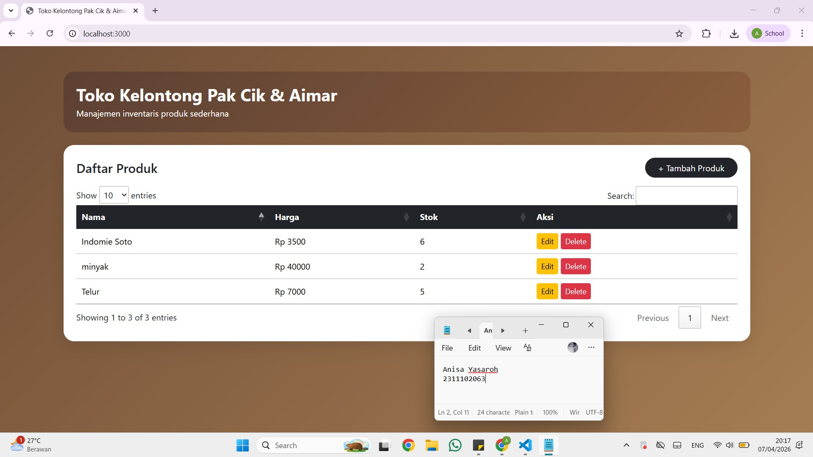
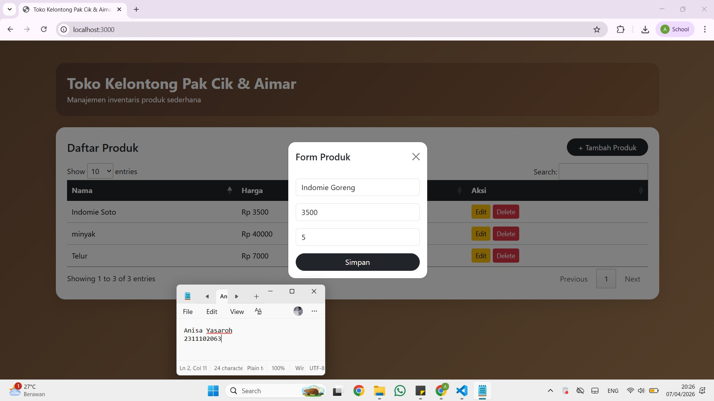
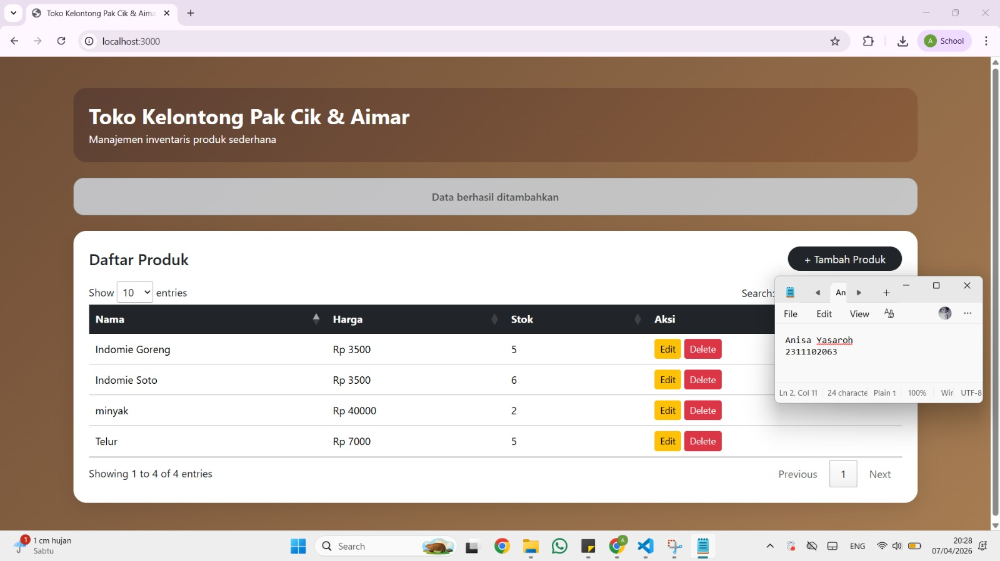
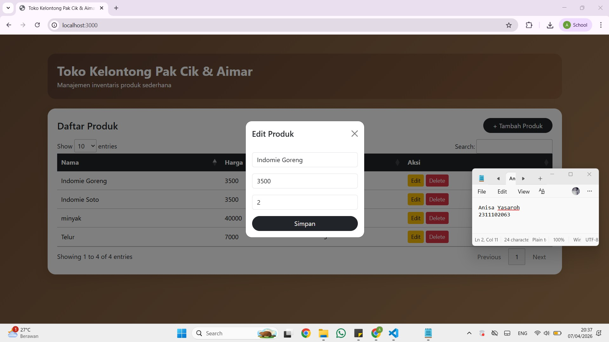
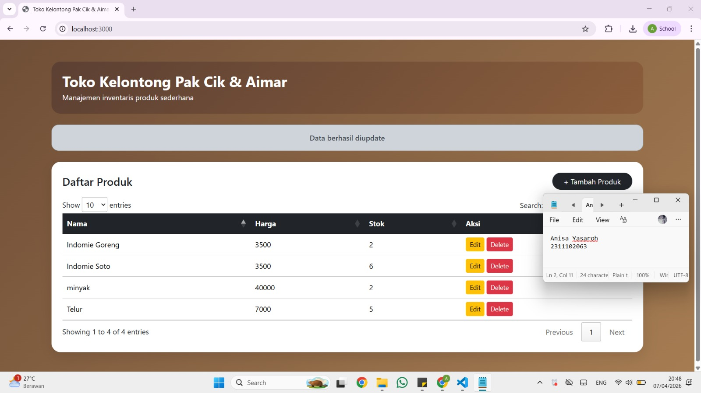
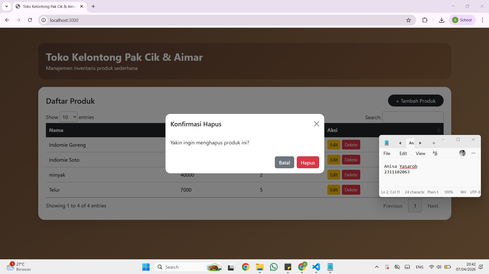
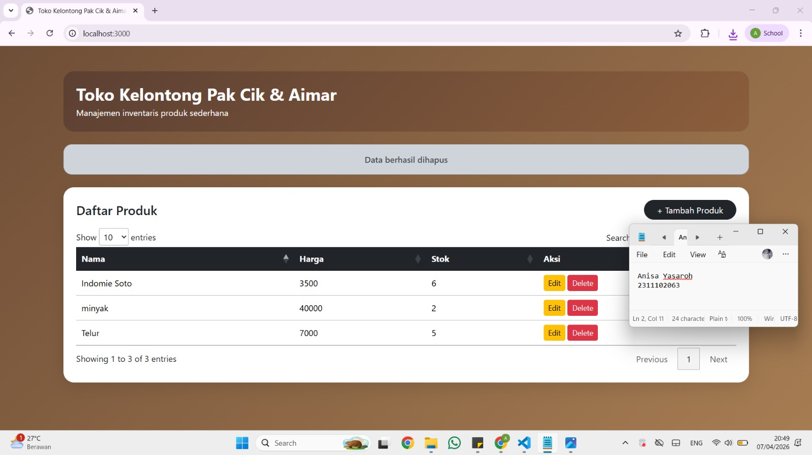

<div align="center">
  <br />
  <h1>LAPORAN PRAKTIKUM <br> APLIKASI BERBASIS PLATFORM </h1>
  <br />
  <h3>MODUL 6 <br> COTS </h3>
  <br />
  
  <br />
  <br />
  <br />
  <h3>Disusun Oleh :</h3>
  <p>
    <strong>Anisa Yasaroh</strong>
    <br>
    <strong>2311102063</strong>
    <br>
    <strong>S1 IF-11-REG05</strong>
  </p>
  <br />
  <h3>Dosen Pengampu :</h3>
  <p>
    <strong>Dedi Agung Prabowo, S.Kom., M.Kom</strong>
  </p>
  <br />
  <br />
  <h4>Asisten Praktikum :</h4>
  <strong>Apri Pandu Wicaksono </strong>
  <br>
  <strong>Hamka Zaenul Ardi</strong>
  <br />
  <h3>LABORATORIUM HIGH PERFORMANCE <br>FAKULTAS INFORMATIKA <br>UNIVERSITAS TELKOM PURWOKERTO <br>2026 </h3>
</div>

<hr>

## Dasar Teori

Coding On The Spot (COTS) adalah metode pengembangan aplikasi di mana kode ditulis dan diuji secara langsung sehingga setiap perubahan dapat segera dilihat dan diperiksa. Pendekatan ini memungkinkan programmer untuk bereksperimen dengan logika aplikasi dan menyesuaikan interaksi secara cepat. Pada implementasi COTS untuk aplikasi Toko Kelontong, JavaScript digunakan untuk mengatur logika interaktif di sisi client, termasuk menampilkan data, menambah, mengubah, dan menghapus informasi produk. Sementara itu, jQuery mempermudah manipulasi elemen HTML, pengaturan event pada tombol dan form, serta pembaruan konten halaman secara langsung sehingga tampilan aplikasi selalu responsif terhadap tindakan pengguna.

Di sisi server, Node.js dan Express berfungsi untuk mengelola data produk yang disimpan dalam file JSON, menyediakan layanan yang memungkinkan client mengambil dan memperbarui informasi produk. Penggunaan DataTables meningkatkan interaktivitas tabel dengan fitur pencarian, pengurutan, dan pagination sehingga manajemen data lebih efisien. Dengan kombinasi JavaScript, jQuery, dan server berbasis Node.js, metode COTS memungkinkan pembuatan aplikasi yang interaktif dan responsif serta memudahkan pengembangan dan pengujian secara real-time.

## Penjelasan Kode COTS

JavaScript dan jQuery digunakan sebagai sisi client untuk menangani interaksi dengan halaman web, sedangkan server menggunakan ExpressJS untuk mengelola data melalui REST API. Data produk ditampilkan secara dinamis ke tabel HTML, dan setiap proses tambah, edit, atau hapus data dikirim ke server dengan metode HTTP, lalu langsung diperbarui pada tampilan. Penggunaan DataTables menambah fitur pencarian, pengurutan, dan pagination untuk mempermudah pengelolaan data.

## Task 6: Toko Kelontong Pak Cik dan Aimar

### Source Code index.html

```html
<!-- 2311102063
Anisa Yasaroh
IF-11-REG05 -->

<!DOCTYPE html>
<html lang="id">

<head>
  <meta charset="UTF-8">
  <meta name="viewport" content="width=device-width, initial-scale=1.0">
  <title>Toko Kelontong Pak Cik & Aimar</title>

  <link href="https://cdn.jsdelivr.net/npm/bootstrap@5.3.2/dist/css/bootstrap.min.css" rel="stylesheet">
  <link href="https://cdn.datatables.net/1.13.6/css/jquery.dataTables.min.css" rel="stylesheet">

  <script src="https://code.jquery.com/jquery-3.7.1.min.js"></script>
  <script src="https://cdn.datatables.net/1.13.6/js/jquery.dataTables.min.js"></script>
  <script src="https://cdn.jsdelivr.net/npm/bootstrap@5.3.2/dist/js/bootstrap.bundle.min.js"></script>

  <style>
    body {
      background: linear-gradient(135deg, #6f4e37, #a67c52);
      min-height: 100vh;
    }

    .main-card {
      border: none;
      border-radius: 20px;
      box-shadow: 0 10px 30px rgba(0, 0, 0, 0.1);
    }

    .header-box {
      background: linear-gradient(135deg, #5c4033, #8b5e3c);
      color: white;
      border-radius: 20px;
      padding: 24px;
    }

    #alertBox {
      font-weight: 500;
    }
  </style>
</head>

<body>

  <div class="container py-5">

    <div class="header-box mb-4">
      <h2 class="fw-bold mb-1">Toko Kelontong Pak Cik & Aimar</h2>
      <p class="mb-0">Manajemen inventaris produk sederhana</p>
    </div>

    <div id="alertBox" class="alert alert-dark text-center d-none rounded-4 mb-4"></div>

    <div class="card main-card p-4">

      <div class="d-flex justify-content-between align-items-center mb-3">
        <h4 class="fw-semibold mb-0">Daftar Produk</h4>

        <button id="btnTambah" class="btn btn-dark rounded-pill px-4" data-bs-toggle="modal"
          data-bs-target="#productModal">
          + Tambah Produk
        </button>
      </div>

      <table id="productTable" class="table table-hover align-middle">
        <thead class="table-dark">
          <tr>
            <th>Nama</th>
            <th>Harga</th>
            <th>Stok</th>
            <th>Aksi</th>
          </tr>
        </thead>
        <tbody></tbody>
      </table>

    </div>
  </div>

  <div class="modal fade" id="productModal">
    <div class="modal-dialog modal-dialog-centered modal-sm">
      <div class="modal-content rounded-4">

        <div class="modal-header border-0">
          <h5 class="modal-title" id="modalTitle">Tambah Produk</h5>
          <button class="btn-close" data-bs-dismiss="modal"></button>
        </div>

        <div class="modal-body">
          <form id="productForm">

            <input type="hidden" id="editIndex">

            <input type="text" id="nama" class="form-control mb-3" placeholder="Nama Produk" required>
            <input type="number" id="harga" class="form-control mb-3" placeholder="Harga" required>
            <input type="number" id="stok" class="form-control mb-3" placeholder="Stok" required>

            <button id="submitBtn" class="btn btn-dark w-100 rounded-pill">Simpan</button>

          </form>
        </div>

      </div>
    </div>
  </div>

  <div class="modal fade" id="deleteModal">
    <div class="modal-dialog modal-dialog-centered">
      <div class="modal-content rounded-4">

        <div class="modal-header border-0">
          <h5 class="modal-title">Konfirmasi Hapus</h5>
          <button class="btn-close" data-bs-dismiss="modal"></button>
        </div>

        <div class="modal-body">
          Yakin ingin menghapus produk ini?
        </div>

        <div class="modal-footer border-0">
          <button class="btn btn-secondary" data-bs-dismiss="modal">Batal</button>
          <button id="confirmDelete" class="btn btn-danger">Hapus</button>
        </div>

      </div>
    </div>
  </div>

  <script src="script.js"></script>

</body>

</html>
```

### Source Code script.js
```js
let deleteIndex = null;

function showAlert(message) {
  $("#alertBox")
    .removeClass("d-none")
    .text(message);

  setTimeout(() => {
    $("#alertBox").addClass("d-none");
  }, 2000);
}

function loadProducts() {
  $.get("/products", function (data) {

    if ($.fn.DataTable.isDataTable('#productTable')) {
      $('#productTable').DataTable().destroy();
    }

    let table = $("#productTable tbody");
    table.html("");

    data.forEach((p, i) => {
      table.append(`
        <tr>
          <td>${p.nama}</td>
          <td>${p.harga}</td>
          <td>${p.stok}</td>
          <td>
            <button class="btn btn-warning btn-sm editBtn" data-id="${i}">Edit</button>
            <button class="btn btn-danger btn-sm deleteBtn" data-id="${i}">Delete</button>
          </td>
        </tr>
      `);
    });

    $('#productTable').DataTable({
      destroy: true
    });

  });
}

$(document).ready(function () {

  loadProducts();

  $("#btnTambah").click(function () {
    $("#productForm")[0].reset();
    $("#editIndex").val("");
    $("#modalTitle").text("Tambah Produk");
    $("#submitBtn").text("Simpan");
  });

  $("#productForm").submit(function (e) {
    e.preventDefault();

    const product = {
      nama: $("#nama").val(),
      harga: $("#harga").val(),
      stok: $("#stok").val()
    };

    const id = $("#editIndex").val();

    if (id === "") {
      $.ajax({
        url: "/products",
        method: "POST",
        contentType: "application/json",
        data: JSON.stringify(product),
        success: function () {
          loadProducts();
          $("#productForm")[0].reset();
          bootstrap.Modal.getInstance(document.getElementById('productModal')).hide();
          showAlert("Data berhasil ditambahkan");
        }
      });
    } else {
      $.ajax({
        url: "/products/" + id,
        method: "PUT",
        contentType: "application/json",
        data: JSON.stringify(product),
        success: function () {
          loadProducts();
          $("#productForm")[0].reset();
          $("#editIndex").val("");
          bootstrap.Modal.getInstance(document.getElementById('productModal')).hide();
          showAlert("Data berhasil diupdate");
        }
      });
    }
  });

  $(document).on("click", ".editBtn", function () {
    const id = $(this).data("id");

    $.get("/products", function (data) {
      $("#nama").val(data[id].nama);
      $("#harga").val(data[id].harga);
      $("#stok").val(data[id].stok);
      $("#editIndex").val(id);

      $("#modalTitle").text("Edit Produk");
      $("#submitBtn").text("Update");

      new bootstrap.Modal(document.getElementById('productModal')).show();
    });
  });

  $(document).on("click", ".deleteBtn", function () {
    deleteIndex = $(this).data("id");
    new bootstrap.Modal(document.getElementById('deleteModal')).show();
  });

  $("#confirmDelete").click(function () {
    $.ajax({
      url: "/products/" + deleteIndex,
      method: "DELETE",
      success: function () {
        loadProducts();
        bootstrap.Modal.getInstance(document.getElementById('deleteModal')).hide();
        showAlert("Data berhasil dihapus");
      }
    });
  });

});
```
## Source Code style.css
```css
body {
  font-family: Arial;
}

.card {
  border-radius: 12px;
}
```

### Source Code package.json
```json
{
  "name": "toko-kelontong",
  "version": "1.0.0",
  "main": "server.js",
  "dependencies": {
    "express": "^4.18.2"
  }
}
```

### Source Code products.json
```json
[
  {
    "nama": "minyak",
    "harga": "40000",
    "stok": "2"
  },
  {
    "nama": "Telur",
    "harga": "7000",
    "stok": "5"
  },
  {
    "nama": "Indomie Soto",
    "harga": "3500",
    "stok": "6"
  }
]
```

### Source Code server.js
```js
const express = require("express");
const fs = require("fs");

const app = express();
const PORT = 3000;

app.use(express.json());
app.use(express.urlencoded({ extended: true }));
app.use(express.static("public"));

function readProducts() {
  try {
    const data = fs.readFileSync("products.json", "utf8");
    return JSON.parse(data || "[]");
  } catch {
    return [];
  }
}

function saveProducts(data) {
  fs.writeFileSync("products.json", JSON.stringify(data, null, 2));
}

app.get("/", (req, res) => {
  res.sendFile(__dirname + "/public/index.html");
});

app.get("/products", (req, res) => {
  res.json(readProducts());
});

app.post("/products", (req, res) => {
  let products = readProducts();

  const newProduct = {
    nama: req.body.nama,
    harga: req.body.harga,
    stok: req.body.stok
  };

  products.push(newProduct);
  saveProducts(products);

  res.json({ message: "Produk berhasil ditambahkan" });
});

app.put("/products/:id", (req, res) => {
  let products = readProducts();

  products[req.params.id] = req.body;

  saveProducts(products);

  res.json({ message: "Produk diupdate" });
});

app.delete("/products/:id", (req, res) => {
  let products = readProducts();

  products.splice(req.params.id, 1);

  saveProducts(products);

  res.json({ message: "Produk dihapus" });
});

app.listen(PORT, () => {
  console.log(`Server jalan di http://localhost:${PORT}`);
});
```

### Screenshot Output








### Penjelasan Code

Kode JavaScript dan jQuery pada aplikasi ini berfungsi untuk mengatur interaksi pengguna di sisi client. Fungsi `loadProducts()` menampilkan data produk ke dalam tabel HTML secara dinamis, sementara `showAlert()` memberikan notifikasi setelah data ditambahkan, diperbarui, atau dihapus. Event handler pada tombol tambah, edit, dan hapus memungkinkan pengguna mengelola data produk langsung dari halaman, sedangkan DataTables menambahkan fitur pencarian, pengurutan, dan pagination agar tabel tetap interaktif dan mudah digunakan.

Di sisi server, Node.js dan Express mengelola data produk yang disimpan di file JSON. Fungsi `readProducts()` membaca data dari file, sedangkan `saveProducts()` menyimpan perubahan data. Endpoint server untuk menambah, memperbarui, atau menghapus produk memastikan semua perubahan langsung tercermin pada tampilan. Dengan mekanisme ini, setiap proses CRUD dapat dilakukan secara terstruktur, dan data produk selalu diperbarui sesuai aksi pengguna.