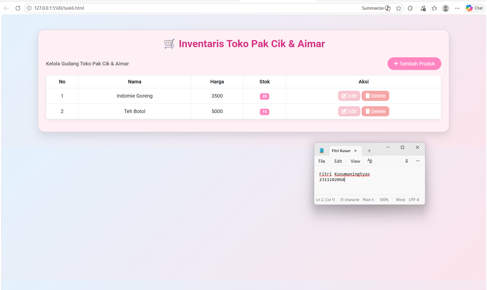
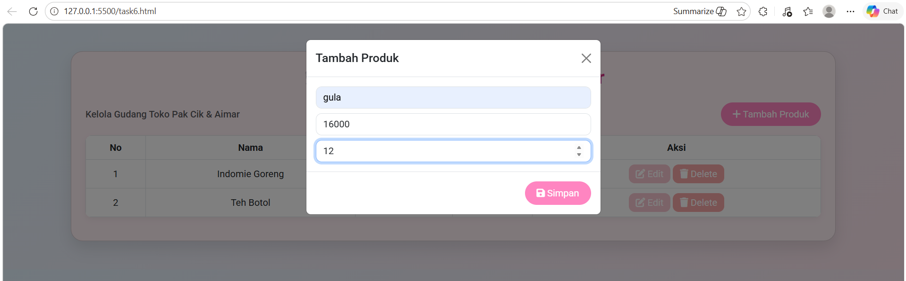
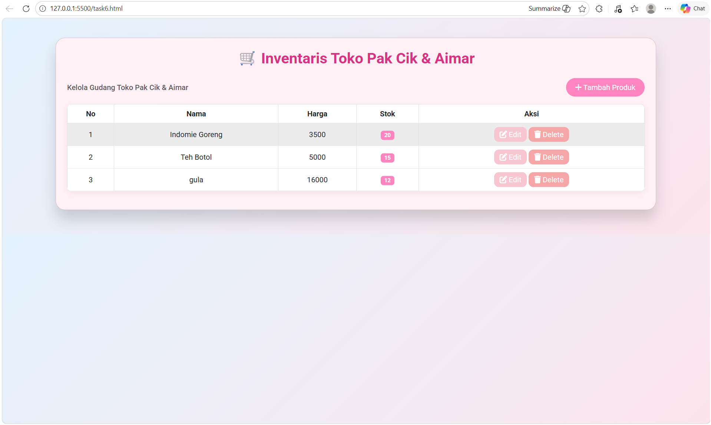
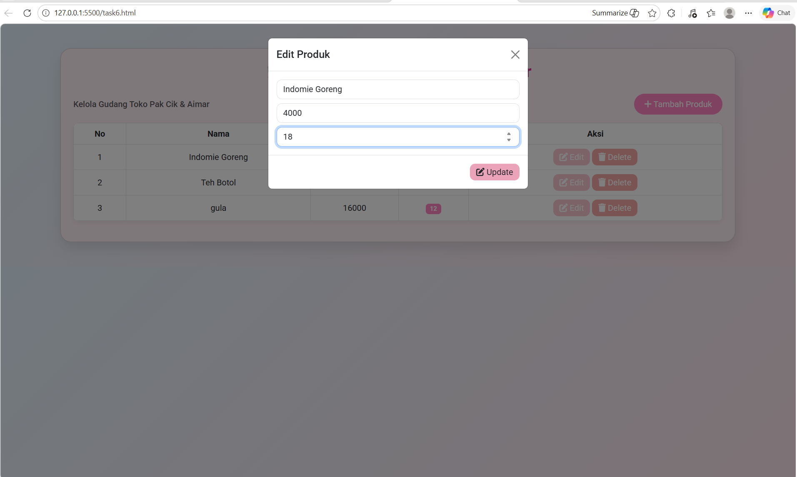
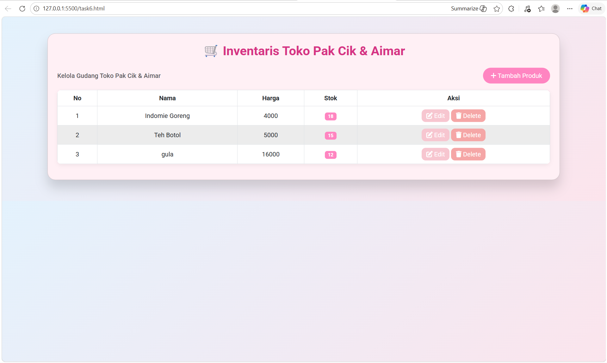
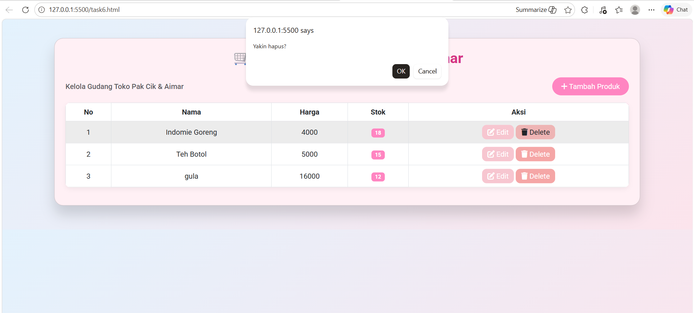
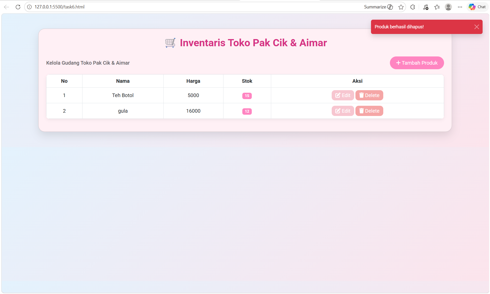

<div align="center">
  <br />
  <h1>LAPORAN PRAKTIKUM <br> APLIKASI BERBASIS PLATFORM </h1>
  <br />
  <h3>MODUL 6 <br> COTS </h3>
  <br />
  
  <br />
  <br />
  <br />
  <h3>Disusun Oleh :</h3>
  <p>
    <strong>Fitri Kusumaningtyas</strong>
    <br>
    <strong>2311102068</strong>
    <br>
    <strong>S1 IF-11-REG05</strong>
  </p>
  <br />
  <h3>Dosen Pengampu :</h3>
  <p>
    <strong>Dedi Agung Prabowo, S.Kom., M.Kom</strong>
  </p>
  <br />
  <br />
  <h4>Asisten Praktikum :</h4>
  <strong>Apri Pandu Wicaksono </strong>
  <br>
  <strong>Hamka Zaenul Ardi</strong>
  <br />
  <h3>LABORATORIUM HIGH PERFORMANCE <br>FAKULTAS INFORMATIKA <br>UNIVERSITAS TELKOM PURWOKERTO <br>2026 </h3>
</div>

<hr>

## 1. Dasar Teori
Coding On The Spot (COTS) merujuk pada metode pengembangan perangkat lunak yang dilakukan secara langsung di tempat tanpa perencanaan yang terlalu panjang atau tanpa menggunakan komponen yang sudah jadi. Dalam pendekatan ini, pengembang menulis kode secara langsung sesuai kebutuhan yang muncul saat itu juga, biasanya untuk menyelesaikan masalah dengan cepat atau membuat prototipe sederhana. Coding on the spot sering digunakan pada proyek kecil, tugas praktikum, atau pengembangan awal karena lebih fleksibel dan tidak memerlukan proses desain yang kompleks. Namun, metode ini memiliki kelemahan seperti struktur kode yang kurang rapi, dokumentasi yang minim, serta potensi kesalahan yang lebih tinggi jika tidak diikuti dengan pengujian yang baik. Oleh karena itu, meskipun coding on the spot dapat mempercepat proses pengembangan, pendekatan ini sebaiknya tetap diimbangi dengan perencanaan dan standar penulisan kode agar sistem yang dihasilkan tetap terstruktur dan mudah dikembangkan kembali di masa depan

## 2. Source Code
### Source Code HTML
``` html
<!DOCTYPE html>
<!--Fitri Kusumaningtyas 2311102068-->
<html lang="id">
<head>
<meta charset="UTF-8">
<meta name="viewport" content="width=device-width, initial-scale=1.0">
<title>Toko Kelontong</title>
<link href="https://cdn.jsdelivr.net/npm/bootstrap@5.3.0/dist/css/bootstrap.min.css" rel="stylesheet">
<link href="https://fonts.googleapis.com/css2?family=Roboto:wght@400;500;700&display=swap" rel="stylesheet">
<link rel="stylesheet" href="https://cdnjs.cloudflare.com/ajax/libs/font-awesome/6.5.0/css/all.min.css">
<link rel="stylesheet" href="style.css">
</head>
<body>

<div class="container py-5">
  <div class="card card-custom p-4">
    <h2 class="text-center mb-4 title">🛒 Inventaris Toko Pak Cik & Aimar</h2>
    <div class="d-flex justify-content-between align-items-center mb-3">
      <span class="text-muted fw-medium">Kelola Gudang Toko Pak Cik & Aimar</span>
      <button class="btn btn-primary" data-bs-toggle="modal" data-bs-target="#modalTambah">
        <i class="fa fa-plus"></i> Tambah Produk
      </button>
    </div>
    <table class="table table-bordered table-hover text-center align-middle">
      <thead>
        <tr>
          <th>No</th>
          <th>Nama</th>
          <th>Harga</th>
          <th>Stok</th>
          <th>Aksi</th>
        </tr>
      </thead>
      <tbody id="tableProduk">
      </tbody>
    </table>
  </div>
</div>

<div class="modal fade" id="modalTambah">
  <div class="modal-dialog">
    <div class="modal-content">
      <div class="modal-header">
        <h5 class="modal-title">Tambah Produk</h5>
        <button class="btn-close" data-bs-dismiss="modal"></button>
      </div>
      <div class="modal-body">
        <input type="text" id="nama" class="form-control mb-2" placeholder="Nama Produk">
        <input type="number" id="harga" class="form-control mb-2" placeholder="Harga">
        <input type="number" id="stok" class="form-control" placeholder="Stok">
      </div>
      <div class="modal-footer">
        <button class="btn btn-primary" id="simpan"><i class="fa fa-save"></i> Simpan</button>
      </div>
    </div>
  </div>
</div>

<div class="modal fade" id="modalEdit">
  <div class="modal-dialog">
    <div class="modal-content">
      <div class="modal-header">
        <h5 class="modal-title">Edit Produk</h5>
        <button class="btn-close" data-bs-dismiss="modal"></button>
      </div>
      <div class="modal-body">
        <input type="hidden" id="editId">
        <input type="text" id="editNama" class="form-control mb-2">
        <input type="number" id="editHarga" class="form-control mb-2">
        <input type="number" id="editStok" class="form-control">
      </div>
      <div class="modal-footer">
        <button class="btn btn-edit" id="update"><i class="fa fa-edit"></i> Update</button>
      </div>
    </div>
  </div>
</div>

<div class="toast-container">
  <div class="toast align-items-center text-bg-danger border-0" id="toastDelete" role="alert" aria-live="assertive" aria-atomic="true">
    <div class="d-flex">
      <div class="toast-body">
        Produk berhasil dihapus!
      </div>
      <button type="button" class="btn-close btn-close-white me-2 m-auto" data-bs-dismiss="toast" aria-label="Close"></button>
    </div>
  </div>
</div>

<script src="https://cdn.jsdelivr.net/npm/bootstrap@5.3.0/dist/js/bootstrap.bundle.min.js"></script>
<script src="https://code.jquery.com/jquery-3.7.1.min.js"></script>
<script src="script.js"></script>
</body>
</html>
```

### Source Code JS
```js
let produkList = [];

// Fitri Kusumaningtyas 2311102068
$.getJSON('data.json', function(data){
    produkList = data;
    renderTable();
});

function renderTable(){
    let tbody = $("#tableProduk");
    tbody.empty();
    produkList.forEach((p,index)=>{
        let stokClass = p.stok>0?'badge-ada':'badge-habis';
        tbody.append(`
            <tr data-id="${p.id}">
                <td>${index+1}</td>
                <td>${p.nama}</td>
                <td>${p.harga}</td>
                <td><span class="badge ${stokClass}">${p.stok}</span></td>
                <td>
                    <button class="btn btn-edit btnEdit"><i class="fa fa-edit"></i> Edit</button>
                    <button class="btn btn-delete btnDelete"><i class="fa fa-trash"></i> Delete</button>
                </td>
            </tr>
        `);
    });
}

$("#simpan").click(function(){
    let nama = $("#nama").val();
    let harga = parseInt($("#harga").val());
    let stok = parseInt($("#stok").val());
    if(nama && !isNaN(harga) && !isNaN(stok)){
        let newId = produkList.length? produkList[produkList.length-1].id+1 :1;
        produkList.push({id:newId, nama:nama, harga:harga, stok:stok});
        renderTable();
        $("#modalTambah").modal('hide');
        $("#nama,#harga,#stok").val('');
    }
});

$(document).on('click','.btnEdit',function(){
    let tr = $(this).closest('tr');
    let id = tr.data('id');
    let produk = produkList.find(p=>p.id==id);
    if(produk){
        $("#editId").val(produk.id);
        $("#editNama").val(produk.nama);
        $("#editHarga").val(produk.harga);
        $("#editStok").val(produk.stok);
        $("#modalEdit").modal('show');
    }
});

$("#update").click(function(){
    let id = parseInt($("#editId").val());
    let produk = produkList.find(p=>p.id==id);
    if(produk){
        produk.nama = $("#editNama").val();
        produk.harga = parseInt($("#editHarga").val());
        produk.stok = parseInt($("#editStok").val());
        renderTable();
        $("#modalEdit").modal('hide');
    }
});

$(document).on('click','.btnDelete',function(){
    if(confirm("Yakin hapus?")){
        let tr = $(this).closest('tr');
        let id = tr.data('id');
        produkList = produkList.filter(p=>p.id!=id);
        renderTable();
        var toastEl = document.getElementById('toastDelete');
        var toast = new bootstrap.Toast(toastEl);
        toast.show();
    }
});

```
### Source Code CSS
```css
body {
    background: linear-gradient(135deg,#e3f2fd,#fce4ec);
    font-family: 'Roboto', sans-serif;
}
 /*Fitri Kusumaningtyas 2311102068*/
.card-custom{
    border-radius:20px;
    box-shadow:0 12px 25px rgba(0,0,0,0.1);
    transition: all 0.3s ease;
    background: #fff0f5; 
}
.card-custom:hover{
    transform: translateY(-5px);
    box-shadow:0 20px 30px rgba(0,0,0,0.15);
}

.title{
    font-weight:700;
    color:#d63384; 
}

.btn-primary{
    border-radius:50px;
    padding:8px 20px;
    background: #ff85c1; 
    border:none;
    transition:0.3s;
}
.btn-primary:hover{
    background: #e754a4;
}

.table thead{
    background:linear-gradient(45deg,#ff85c1,#d63384); 
    color:white;
}

.table{
    border-radius:10px;
    overflow:hidden;
    background:white;
    box-shadow:0 4px 10px rgba(0,0,0,0.05);
}

.table tbody tr:hover{
    background: #ffe6f0;
}

input.form-control{
    border-radius:10px;
}

.btn-edit{
    background:#f7c6d0;
    color:white;
    border:none;
    border-radius:10px;
    padding:4px 12px;
    transition:0.3s;
}
.btn-edit:hover{
    background:#eaa3b8;
}

.btn-delete{
    background:#f5a6a6;
    color:white;
    border:none;
    border-radius:10px;
    padding:4px 12px;
    transition:0.3s;
}
.btn-delete:hover{
    background:#f08383;
}

.badge-stok {
    padding:5px 10px;
    border-radius:15px;
    font-size:0.9rem;
    color:white;
}

.badge-habis{
    background:#ff6f91;
}

.badge-ada{
    background:#ff85c1;
}

.toast-container {
    position: fixed;
    top: 20px;
    right: 20px;
    z-index: 9999;
}
```
### Source Code Json 
``` Json
[
  {"id":1,"nama":"Indomie Goreng","harga":3500,"stok":20},
  {"id":2,"nama":"Teh Botol","harga":5000,"stok":15}
]

```
### Screenshot output








## Penjelasan Code

Kode aplikasi Inventaris Toko Kelontong memanfaatkan beberapa library dan fitur utama untuk menciptakan antarmuka yang interaktif dan responsif. Bootstrap 5 digunakan untuk mempermudah pembuatan layout responsif, modal, tombol, tabel, dan toast notification, sehingga tampilan lebih konsisten dan modern. jQuery dipakai untuk manipulasi DOM, seperti merender tabel produk dari file JSON, menambah produk baru, mengedit data yang ada, dan menghapus produk secara dinamis tanpa perlu reload halaman. File data.json berfungsi sebagai sumber data produk yang terpisah, sehingga memudahkan pemeliharaan dan pembaruan data. Font Awesome digunakan untuk memberikan ikon pada tombol aksi, seperti edit, delete, dan simpan, sehingga interaksi lebih jelas bagi pengguna. CSS custom menambahkan efek visual tambahan, termasuk card dengan shadow, badge stok berwarna, efek hover pada tombol dan tabel, serta styling toast notification. Seluruh interaksi dijalankan di client-side, sehingga proses validasi input, update tabel, dan notifikasi dapat dilakukan langsung di browser pengguna, meningkatkan pengalaman pengguna (user experience) dengan respon yang cepat dan tampilan yang dinamis.