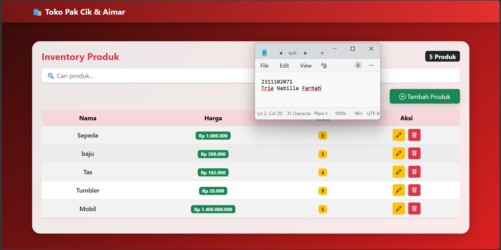
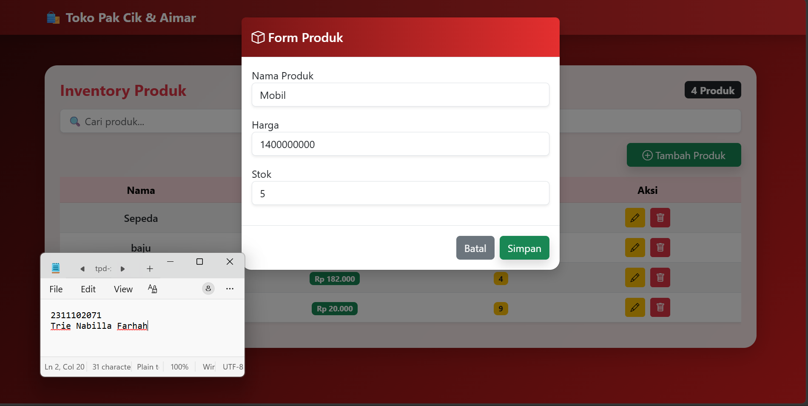
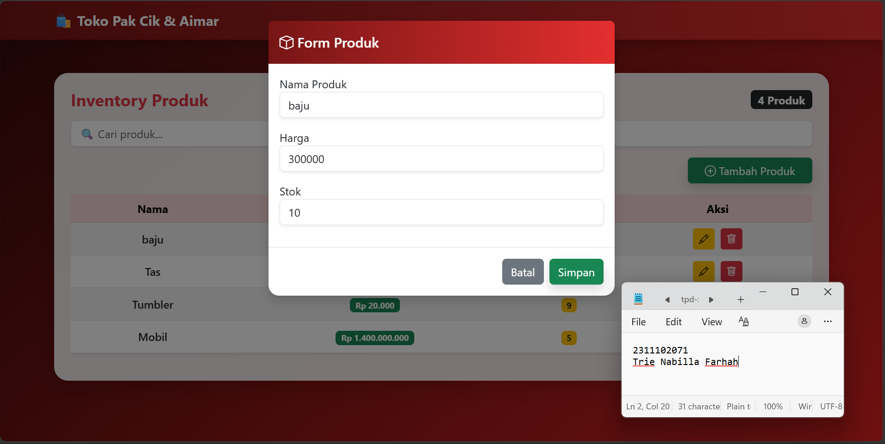
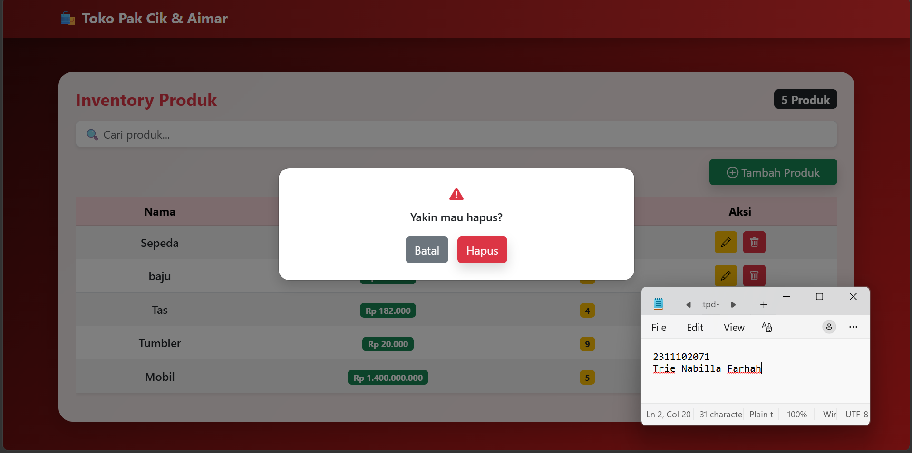
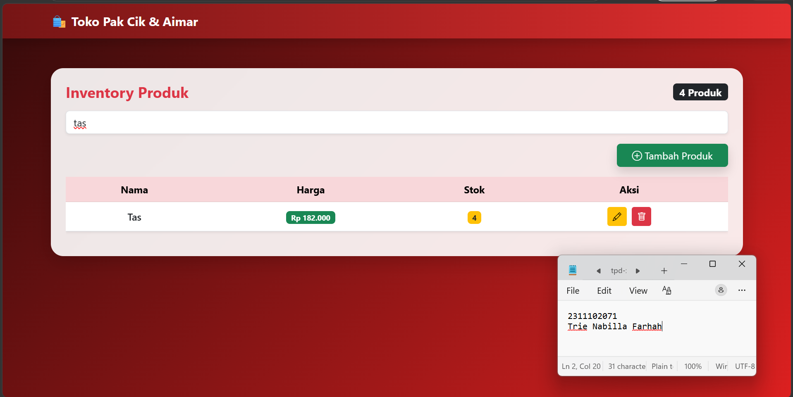

<div align="center">
  <br />
  <h1>LAPORAN PRAKTIKUM <br> APLIKASI BERBASIS PLATFORM </h1>
  <br />
  <h3>MODUL 6 <br> COTS </h3>
  <br />
  
  <br />
  <br />
  <br />
  <h3>Disusun Oleh :</h3>
  <p>
    <strong>Trie Nabilla Farhah</strong>
    <br>
    <strong>2311102071</strong>
    <br>
    <strong>S1 IF-11-REG05</strong>
  </p>
  <br />
  <h3>Dosen Pengampu :</h3>
  <p>
    <strong>Dedi Agung Prabowo, S.Kom., M.Kom</strong>
  </p>
  <br />
  <br />
  <h4>Asisten Praktikum :</h4>
  <strong>Apri Pandu Wicaksono </strong>
  <br>
  <strong>Hamka Zaenul Ardi</strong>
  <br />
  <h3>LABORATORIUM HIGH PERFORMANCE <br>FAKULTAS INFORMATIKA <br>UNIVERSITAS TELKOM PURWOKERTO <br>2026</h3>
</div>

<hr>

### Dasar Teori

Coding on the Spot (COTS) merupakan metode dalam pengembangan perangkat lunak di mana proses penulisan kode dilakukan secara langsung dan spontan tanpa perencanaan yang terlalu mendalam sebelumnya. Pendekatan ini biasanya digunakan dalam situasi seperti kompetisi pemrograman, live coding, wawancara teknis, atau ketika developer perlu menyelesaikan masalah secara cepat. COTS menuntut kemampuan berpikir logis, pemahaman konsep dasar pemrograman, serta keterampilan problem solving yang baik karena solusi harus dibuat secara real-time.

Secara teoritis, COTS menekankan pada kecepatan, ketepatan, dan efisiensi dalam menghasilkan solusi, dengan memanfaatkan pengetahuan yang sudah dimiliki tanpa bergantung pada dokumentasi atau referensi yang panjang. Meskipun efektif untuk menyelesaikan masalah sederhana atau mendesak, pendekatan ini memiliki keterbatasan seperti kurangnya perencanaan struktur kode, potensi kesalahan lebih tinggi, dan sulitnya maintainability. Oleh karena itu, COTS lebih cocok digunakan sebagai metode latihan atau pengujian kemampuan, bukan sebagai pendekatan utama dalam pengembangan sistem berskala besar.

### Tugas 6 - Toko Kelontong Pak Cik dan Aimar

#### Source Code - index.html

```
<!DOCTYPE html>
<html>

<head>
    <title>Toko Pak Cik</title>
    <meta name="viewport" content="width=device-width, initial-scale=1">

    <!-- Bootstrap -->
    <link href="https://cdn.jsdelivr.net/npm/bootstrap@5.3.0/dist/css/bootstrap.min.css" rel="stylesheet">

    <!-- Icons -->
    <link href="https://cdn.jsdelivr.net/npm/bootstrap-icons/font/bootstrap-icons.css" rel="stylesheet">

    <style>
        body {
            background: linear-gradient(135deg, #340a0a, #dd2020);
            min-height: 100vh;
        }

        .glass-card {
            background: rgba(255, 255, 255, 0.9);
            backdrop-filter: blur(10px);
            border-radius: 20px;
            box-shadow: 0 8px 32px rgba(0, 0, 0, 0.2);
        }

        .navbar {
            background: linear-gradient(90deg, #761515, #e42f2f);
        }

        .btn {
            transition: 0.3s;
        }

        .btn:hover {
            transform: scale(1.05);
        }
    </style>
</head>

<body>

    <!-- NAVBAR -->
    <nav class="navbar navbar-dark shadow">
        <div class="container">
            <span class="navbar-brand fw-bold">
                🛍️ Toko Pak Cik & Aimar
            </span>
        </div>
    </nav>

    <div class="container mt-5">

        <div class="glass-card p-4">

            <!-- HEADER -->
            <div class="d-flex justify-content-between align-items-center mb-3">
                <h4 class="fw-bold text-danger m-0">Inventory Produk</h4>
                <span class="badge bg-dark fs-6" id="totalData">0 Produk</span>
            </div>

            <!-- SEARCH -->
            <input type="text" id="search" class="form-control mb-3 shadow-sm" placeholder="🔍 Cari produk...">

            <!-- BUTTON -->
            <div class="text-end mb-3">
                <button class="btn btn-success shadow px-4" id="add">
                    <i class="bi bi-plus-circle"></i> Tambah Produk
                </button>
            </div>

            <!-- TABLE -->
            <div class="table-responsive">
                <table class="table table-hover table-striped align-middle text-center shadow-sm">
                    <thead class="table-danger">
                        <tr>
                            <th>Nama</th>
                            <th>Harga</th>
                            <th>Stok</th>
                            <th>Aksi</th>
                        </tr>
                    </thead>
                    <tbody id="data"></tbody>
                </table>
            </div>

            <!-- EMPTY -->
            <div id="emptyState" class="text-center text-muted mt-4 d-none">
                <h5>📭 Belum ada produk</h5>
                <p>Tambahkan produk pertama kamu</p>
            </div>

        </div>
    </div>

    <!-- MODAL FORM -->
    <div class="modal fade" id="modal">
        <div class="modal-dialog">
            <div class="modal-content rounded-4 shadow">

                <div class="modal-header text-white" style="background: linear-gradient(90deg, #761515, #e42f2f);">
                    <h5 class="modal-title"><i class="bi bi-box"></i> Form Produk</h5>
                </div>

                <div class="modal-body">
                    <input type="hidden" id="id">

                    <label>Nama Produk</label>
                    <input class="form-control mb-3 shadow-sm" id="nama">

                    <label>Harga</label>
                    <input class="form-control mb-3 shadow-sm" id="harga">

                    <label>Stok</label>
                    <input class="form-control mb-3 shadow-sm" id="stok">
                </div>

                <div class="modal-footer">
                    <button class="btn btn-secondary" data-bs-dismiss="modal">Batal</button>
                    <button class="btn btn-success shadow" id="save">Simpan</button>
                </div>

            </div>
        </div>
    </div>

    <!-- MODAL DELETE -->
    <div class="modal fade" id="delModal">
        <div class="modal-dialog modal-dialog-centered">
            <div class="modal-content text-center p-4 rounded-4 shadow">

                <h5 class="text-danger">
                    <i class="bi bi-exclamation-triangle-fill"></i>
                </h5>

                <p class="fw-semibold">Yakin mau hapus?</p>

                <div>
                    <button class="btn btn-secondary me-2" data-bs-dismiss="modal">Batal</button>
                    <button class="btn btn-danger shadow" id="yesDelete">Hapus</button>
                </div>

            </div>
        </div>
    </div>

    <script src="https://code.jquery.com/jquery-3.6.0.min.js"></script>
    <script src="https://cdn.jsdelivr.net/npm/bootstrap@5.3.0/dist/js/bootstrap.bundle.min.js"></script>
    <script src="app.js"></script>

</body>

</html>
```

#### Source Code - app.js

```
let deleteId = null;

// LOAD DATA
function load() {
    $.get('/products', function (res) {

        let html = '';

        // total data
        $('#totalData').text(res.length + ' Produk');

        // empty state
        if (res.length === 0) {
            $('#emptyState').removeClass('d-none');
        } else {
            $('#emptyState').addClass('d-none');
        }

        res.forEach(p => {
            html += `
        <tr>
          <td class="fw-semibold">${p.nama}</td>
          <td>
            <span class="badge bg-success">
              Rp ${parseInt(p.harga).toLocaleString('id-ID')}
            </span>
          </td>
          <td>
            <span class="badge bg-warning text-dark">
              ${p.stok}
            </span>
          </td>
          <td>
            <button class="btn btn-warning btn-sm me-1 edit" data-id="${p.id}">
              <i class="bi bi-pencil"></i>
            </button>
            <button class="btn btn-danger btn-sm del" data-id="${p.id}">
              <i class="bi bi-trash"></i>
            </button>
          </td>
        </tr>
      `;
        });

        $('#data').html(html);
    });
}

$(document).ready(function () {

    load();

    // SEARCH
    $('#search').on('keyup', function () {
        const value = $(this).val().toLowerCase();
        $('#data tr').filter(function () {
            $(this).toggle($(this).text().toLowerCase().indexOf(value) > -1);
        });
    });

    // ADD
    $('#add').click(() => {
        $('#id').val('');
        $('#nama,#harga,#stok').val('');
        new bootstrap.Modal('#modal').show();
    });

    // SAVE
    $('#save').click(() => {
        const id = $('#id').val();

        const data = {
            nama: $('#nama').val(),
            harga: $('#harga').val(),
            stok: $('#stok').val()
        };

        if (id) {
            $.ajax({
                url: '/products/' + id,
                method: 'PUT',
                contentType: 'application/json',
                data: JSON.stringify(data),
                success: load
            });
        } else {
            $.ajax({
                url: '/products',
                method: 'POST',
                contentType: 'application/json',
                data: JSON.stringify(data),
                success: load
            });
        }

        bootstrap.Modal.getInstance(document.getElementById('modal')).hide();
    });

    // EDIT
    $(document).on('click', '.edit', function () {
        const id = $(this).data('id');

        $.get('/products', function (res) {
            const p = res.find(x => x.id == id);

            $('#id').val(p.id);
            $('#nama').val(p.nama);
            $('#harga').val(p.harga);
            $('#stok').val(p.stok);

            new bootstrap.Modal('#modal').show();
        });
    });

    // DELETE
    $(document).on('click', '.del', function () {
        deleteId = $(this).data('id');
        new bootstrap.Modal('#delModal').show();
    });

    $('#yesDelete').click(() => {
        $.ajax({
            url: '/products/' + deleteId,
            method: 'DELETE',
            success: load
        });

        bootstrap.Modal.getInstance(document.getElementById('delModal')).hide();
    });

});

```

#### Source Code - product.json

```
sebelumnya hanya "[]"
let deleteId = null;

// LOAD DATA
function load() {
    $.get('/products', function (res) {

        let html = '';

        // total data
        $('#totalData').text(res.length + ' Produk');

        // empty state
        if (res.length === 0) {
            $('#emptyState').removeClass('d-none');
        } else {
            $('#emptyState').addClass('d-none');
        }

        res.forEach(p => {
            html += `
        <tr>
          <td class="fw-semibold">${p.nama}</td>
          <td>
            <span class="badge bg-success">
              Rp ${parseInt(p.harga).toLocaleString('id-ID')}
            </span>
          </td>
          <td>
            <span class="badge bg-warning text-dark">
              ${p.stok}
            </span>
          </td>
          <td>
            <button class="btn btn-warning btn-sm me-1 edit" data-id="${p.id}">
              <i class="bi bi-pencil"></i>
            </button>
            <button class="btn btn-danger btn-sm del" data-id="${p.id}">
              <i class="bi bi-trash"></i>
            </button>
          </td>
        </tr>
      `;
        });

        $('#data').html(html);
    });
}

$(document).ready(function () {

    load();

    // SEARCH
    $('#search').on('keyup', function () {
        const value = $(this).val().toLowerCase();
        $('#data tr').filter(function () {
            $(this).toggle($(this).text().toLowerCase().indexOf(value) > -1);
        });
    });

    // ADD
    $('#add').click(() => {
        $('#id').val('');
        $('#nama,#harga,#stok').val('');
        new bootstrap.Modal('#modal').show();
    });

    // SAVE
    $('#save').click(() => {
        const id = $('#id').val();

        const data = {
            nama: $('#nama').val(),
            harga: $('#harga').val(),
            stok: $('#stok').val()
        };

        if (id) {
            $.ajax({
                url: '/products/' + id,
                method: 'PUT',
                contentType: 'application/json',
                data: JSON.stringify(data),
                success: load
            });
        } else {
            $.ajax({
                url: '/products',
                method: 'POST',
                contentType: 'application/json',
                data: JSON.stringify(data),
                success: load
            });
        }

        bootstrap.Modal.getInstance(document.getElementById('modal')).hide();
    });

    // EDIT
    $(document).on('click', '.edit', function () {
        const id = $(this).data('id');

        $.get('/products', function (res) {
            const p = res.find(x => x.id == id);

            $('#id').val(p.id);
            $('#nama').val(p.nama);
            $('#harga').val(p.harga);
            $('#stok').val(p.stok);

            new bootstrap.Modal('#modal').show();
        });
    });

    // DELETE
    $(document).on('click', '.del', function () {
        deleteId = $(this).data('id');
        new bootstrap.Modal('#delModal').show();
    });

    $('#yesDelete').click(() => {
        $.ajax({
            url: '/products/' + deleteId,
            method: 'DELETE',
            success: load
        });

        bootstrap.Modal.getInstance(document.getElementById('delModal')).hide();
    });

});

```

#### Source Code - server.js

```
const express = require('express');
const fs = require('fs');
const app = express();

const file = './products.json';

// middleware (PENTING)
app.use(express.json());
app.use(express.urlencoded({ extended: true }));
app.use(express.static(__dirname));

// GET
app.get('/products', (req, res) => {
    const data = JSON.parse(fs.readFileSync(file));
    res.json(data);
});

// POST
app.post('/products', (req, res) => {
    const data = JSON.parse(fs.readFileSync(file));

    const newData = {
        id: Date.now(),
        nama: req.body.nama,
        harga: req.body.harga,
        stok: req.body.stok
    };

    data.push(newData);
    fs.writeFileSync(file, JSON.stringify(data, null, 2));

    res.json(newData);
});

// PUT
app.put('/products/:id', (req, res) => {
    let data = JSON.parse(fs.readFileSync(file));

    data = data.map(p =>
        p.id == req.params.id
            ? { ...p, ...req.body }
            : p
    );

    fs.writeFileSync(file, JSON.stringify(data, null, 2));
    res.json({ message: 'updated' });
});

// DELETE
app.delete('/products/:id', (req, res) => {
    let data = JSON.parse(fs.readFileSync(file));

    data = data.filter(p => p.id != req.params.id);

    fs.writeFileSync(file, JSON.stringify(data, null, 2));
    res.json({ message: 'deleted' });
});

app.listen(3000, () => {
    console.log('Server jalan di http://localhost:3000');
});
```

### Hasil Output

Sebelum Aktivitas

Penambahan

Pengeditan

Konfirmasi Penghapusan

Pencarian


### Penjelasan Code

Kode tersebut dapat dijelaskan secara teoritis sebagai implementasi dari arsitektur client-server dalam pengembangan aplikasi web. Pada sisi server (server.js), digunakan framework ExpressJS yang berperan sebagai web server sekaligus penyedia RESTful API. Dalam konsep Representational State Transfer (REST), setiap endpoint seperti GET, POST, PUT, dan DELETE merepresentasikan operasi dasar dalam manipulasi resource, yaitu data produk. Data disimpan dalam products.json, yang secara teori termasuk dalam bentuk file-based storage, yakni metode penyimpanan sederhana tanpa menggunakan Database Management System (DBMS). Middleware seperti express.json() dan express.urlencoded() merupakan implementasi dari proses parsing request body, yang memungkinkan server memahami data yang dikirim oleh client dalam berbagai format.

Dari sisi pengolahan data, penggunaan modul fs (file system) mencerminkan konsep persistent storage, yaitu data tetap disimpan meskipun aplikasi berhenti dijalankan. Setiap operasi CRUD dilakukan dengan membaca file JSON, memodifikasi struktur data dalam bentuk array of objects, lalu menuliskannya kembali ke file. Hal ini sejalan dengan konsep data manipulation dalam sistem informasi, meskipun dalam skala sederhana. Pemberian id menggunakan Date.now() merupakan bentuk implementasi unique identifier, yang penting dalam memastikan setiap entitas data dapat dibedakan secara unik, sesuai prinsip dasar dalam pengelolaan basis data.

Pada sisi client (index.html dan app.js), digunakan pendekatan asynchronous web programming melalui AJAX (Asynchronous JavaScript and XML) yang diimplementasikan dengan jQuery. Konsep ini memungkinkan komunikasi antara client dan server dilakukan tanpa harus me-refresh halaman, sehingga meningkatkan efisiensi dan user experience. Bootstrap digunakan sebagai framework CSS yang mengadopsi prinsip responsive web design, yaitu desain antarmuka yang mampu menyesuaikan tampilan dengan berbagai ukuran layar. Selain itu, manipulasi DOM (Document Object Model) menggunakan jQuery mencerminkan konsep dynamic user interface, di mana elemen HTML dapat diubah secara real-time berdasarkan data yang diterima dari server. Secara keseluruhan, aplikasi ini merupakan contoh penerapan integrasi antara konsep client-server, RESTful API, asynchronous communication, dan responsive design dalam pengembangan web modern. 