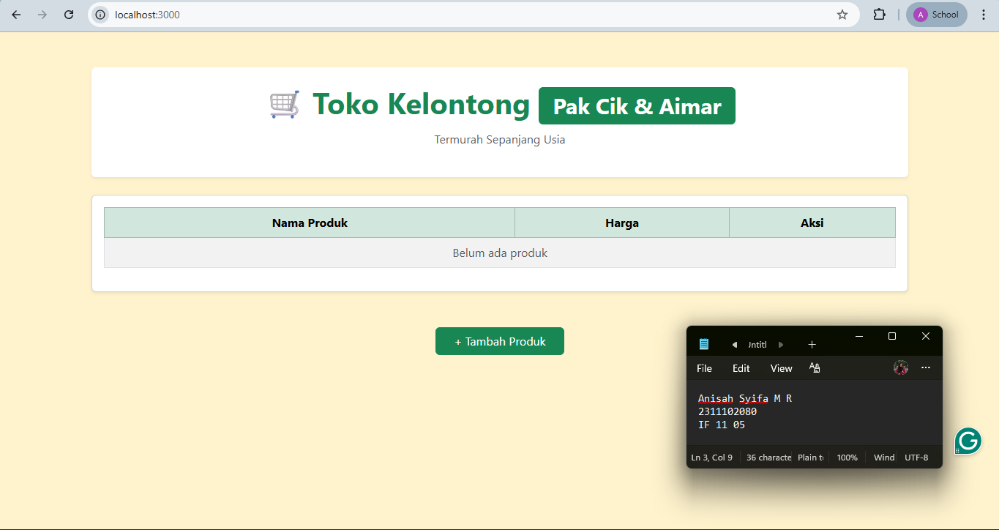
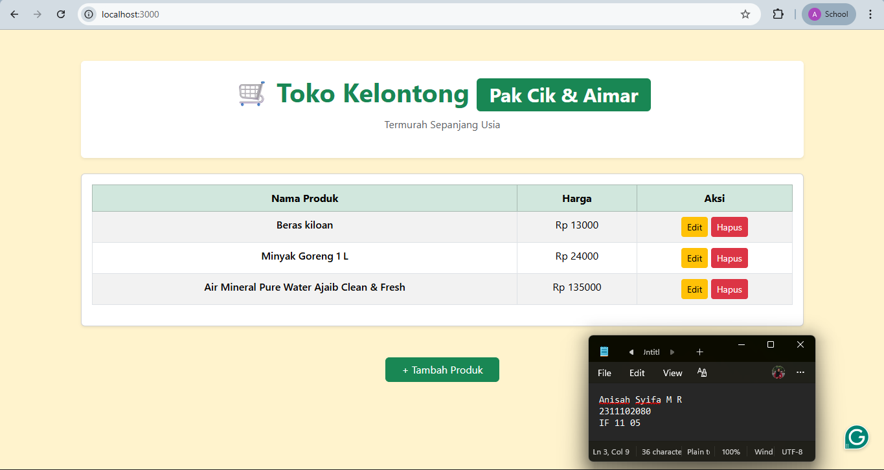
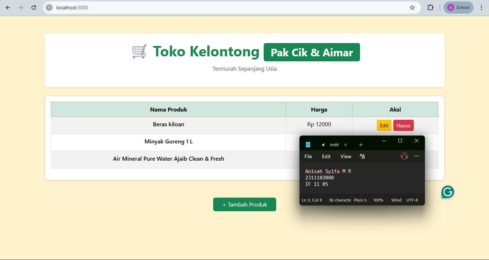
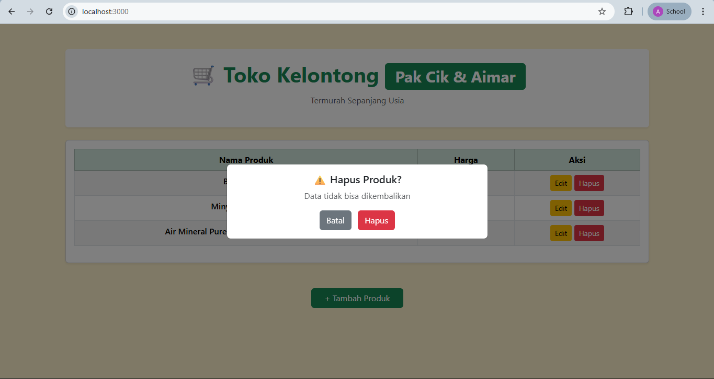
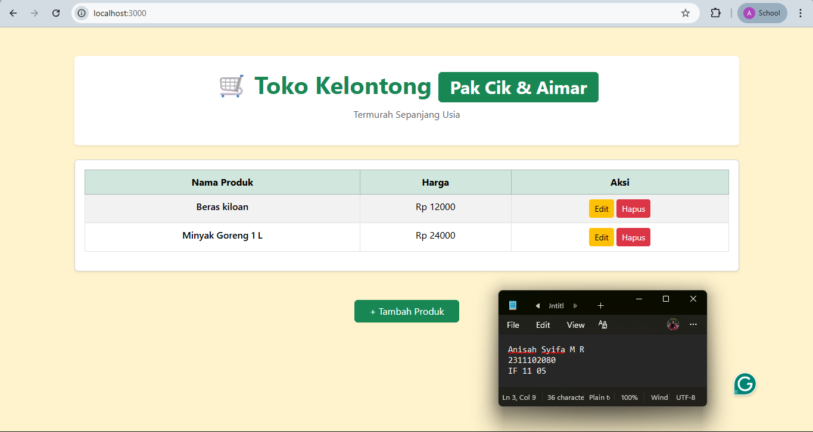

<div align="center">
  <br />
  <h1>LAPORAN PRAKTIKUM <br> APLIKASI BERBASIS PLATFORM </h1>
  <br />
  <h3>MODUL 6 <br> JAVASCRIPT & JQUERY </h3>
  <br />
  
  <br />
  <br />
  <br />
  <h3>Disusun Oleh :</h3>
  <p>
    <strong>Anisah Syifa Mustika Riyanto</strong>
    <br>
    <strong>2311102080</strong>
    <br>
    <strong>S1 IF-11-REG05</strong>
  </p>
  <br />
  <h3>Dosen Pengampu :</h3>
  <p>
    <strong>Dedi Agung Prabowo, S.Kom., M.Kom</strong>
  </p>
  <br />
  <br />
  <h4>Asisten Praktikum :</h4>
  <strong>Apri Pandu Wicaksono </strong>
  <br>
  <strong>Hamka Zaenul Ardi</strong>
  <br />
  <h3>LABORATORIUM HIGH PERFORMANCE <br>FAKULTAS INFORMATIKA <br>UNIVERSITAS TELKOM PURWOKERTO <br>2026</h3>
</div>

<hr>

### Dasar Teori

JavaScript merupakan bahasa pemrograman yang digunakan untuk membuat halaman web menjadi lebih dinamis dan interaktif. Jika HTML berfungsi sebagai struktur dan CSS sebagai pengatur tampilan, maka JavaScript berperan dalam mengatur perilaku atau aksi dari sebuah website. Dengan JavaScript, halaman web dapat merespons berbagai interaksi pengguna seperti klik tombol, input data, hingga perubahan konten secara langsung tanpa perlu memuat ulang halaman.

JavaScript berjalan di sisi client (browser), sehingga kode dapat langsung dieksekusi oleh browser pengguna seperti Chrome, Firefox, atau Edge. Selain itu, JavaScript juga dapat digunakan di sisi server dengan bantuan teknologi seperti Node.js, sehingga penggunaannya menjadi sangat luas dalam pengembangan aplikasi web modern.

Salah satu konsep penting dalam JavaScript adalah manipulasi DOM (Document Object Model). DOM merupakan representasi struktur halaman HTML dalam bentuk objek, yang memungkinkan JavaScript untuk mengakses dan mengubah isi, struktur, maupun tampilan halaman secara langsung. Dengan DOM, elemen HTML dapat ditambahkan, dihapus, atau diubah secara dinamis sesuai kebutuhan.

Selain itu, JavaScript juga mendukung berbagai fitur seperti variabel, fungsi, percabangan (if-else), perulangan (loop), serta event handling. Event handling memungkinkan program merespons kejadian tertentu, seperti klik mouse, penekanan tombol keyboard, atau pergerakan kursor.

JavaScript juga memiliki kemampuan untuk berkomunikasi dengan server melalui teknik seperti AJAX (Asynchronous JavaScript and XML) atau Fetch API, sehingga data dapat diambil atau dikirim tanpa harus melakukan reload halaman. Hal ini sangat penting dalam pembuatan aplikasi web modern seperti dashboard, media sosial, dan aplikasi berbasis web lainnya.

Dengan berbagai kemampuannya, JavaScript menjadi salah satu teknologi utama dalam pengembangan web karena mampu meningkatkan interaktivitas, efisiensi, dan pengalaman pengguna secara keseluruhan.

### Tugas 6 - Toko Kelontong Pak Cik dan Aimar

#### Source Code - index.html

```
<!doctype html>
<html lang="id">
  <head>
    <meta charset="UTF-8" />
    <title>Toko Kelontong Pak Cik & Aimar</title>

    <link
      href="https://cdn.jsdelivr.net/npm/bootstrap@5.3.3/dist/css/bootstrap.min.css"
      rel="stylesheet"
    />
  </head>

  <body class="bg-warning-subtle">
    <div class="container py-5">
      <!-- Header -->
      <div class="text-center mb-4 p-4 bg-white rounded shadow-sm">
        <h1 class="fw-bold text-success">
          🛒 Toko Kelontong
          <span class="badge bg-success fs-10">Pak Cik & Aimar</span>
        </h1>
        <p class="text-muted">Termurah Sepanjang Usia</p>
      </div>

      <!-- Table -->
      <div class="card shadow-sm">
        <div class="card-body">
          <table class="table table-bordered table-striped text-center">
            <thead class="table-success">
              <tr>
                <th>Nama Produk</th>
                <th>Harga</th>
                <th>Aksi</th>
              </tr>
            </thead>
            <tbody id="table"></tbody>
          </table>
        </div>
      </div>
    </div>
    <!-- Button -->
    <div class="text-center mb-3">
      <button
        class="btn btn-success px-4"
        data-bs-toggle="modal"
        data-bs-target="#formModal"
      >
        + Tambah Produk
      </button>
    </div>
    <!-- Modal Form -->
    <div class="modal fade" id="formModal">
      <div class="modal-dialog">
        <div class="modal-content">
          <div class="modal-header bg-success text-white">
            <h5 class="modal-title">Form Produk</h5>
            <button
              class="btn-close btn-close-white"
              data-bs-dismiss="modal"
            ></button>
          </div>

          <div class="modal-body">
            <input id="id" type="hidden" />
            <input
              id="name"
              class="form-control mb-3"
              placeholder="Nama Produk"
            />
            <input
              id="price"
              type="number"
              class="form-control"
              placeholder="Harga"
            />
          </div>

          <div class="modal-footer">
            <button class="btn btn-success w-100" onclick="save()">
              Simpan
            </button>
          </div>
        </div>
      </div>
    </div>

    <!-- Modal Delete -->
    <div class="modal fade" id="deleteModal">
      <div class="modal-dialog modal-dialog-centered">
        <div class="modal-content text-center p-3">
          <h5>⚠️ Hapus Produk?</h5>
          <p class="text-muted">Data tidak bisa dikembalikan</p>

          <div>
            <button class="btn btn-secondary me-2" data-bs-dismiss="modal">
              Batal
            </button>
            <button class="btn btn-danger" id="confirmDelete">Hapus</button>
          </div>
        </div>
      </div>
    </div>

    <script src="https://code.jquery.com/jquery-3.7.1.min.js"></script>
    <script src="script.js"></script>
    <script src="https://cdn.jsdelivr.net/npm/bootstrap@5.3.3/dist/js/bootstrap.bundle.min.js"></script>
  </body>
</html>

```

#### Source Code - script.js

```
let deleteId = null;

$(document).ready(function () {
  load();
});

function load() {
  $.get('/api/products', data => {
    let html = '';

    if (data.length === 0) {
      html = `
        <tr>
          <td colspan="3" class="text-muted">Belum ada produk</td>
        </tr>
      `;
    } else {
      data.forEach(d => {
        html += `
          <tr>
            <td class="fw-semibold">${d.name}</td>
            <td>Rp ${d.price}</td>
            <td>
              <button class="btn btn-warning btn-sm" onclick="edit(${d.id}, '${d.name}', ${d.price})">Edit</button>
              <button class="btn btn-danger btn-sm" onclick="showDelete(${d.id})">Hapus</button>
            </td>
          </tr>
        `;
      });
    }

    $('#table').html(html);
  });
}

function save() {
  const id = $('#id').val();
  const data = {
    name: $('#name').val(),
    price: $('#price').val()
  };

  if (!data.name || !data.price) {
    alert("Isi semua field!");
    return;
  }

  const method = id ? 'PUT' : 'POST';
  const url = id ? '/api/products/' + id : '/api/products';

  $.ajax({
    url: url,
    method: method,
    contentType: 'application/json',
    data: JSON.stringify(data),
    success: () => {
      load();
      $('.modal').modal('hide');
    }
  });
}

function edit(id, name, price) {
  $('#id').val(id);
  $('#name').val(name);
  $('#price').val(price);
  $('#formModal').modal('show');
}

function showDelete(id) {
  deleteId = id;
  $('#deleteModal').modal('show');
}

$('#confirmDelete').click(function () {
  $.ajax({
    url: '/api/products/' + deleteId,
    method: 'DELETE',
    success: () => {
      load();
      $('#deleteModal').modal('hide');
    }
  });
});

```

#### Source Code - product.json

```
sebelumnya hanya "[]"
sesudah run:
[
  {
    "id": 1775582025707,
    "name": "Beras kiloan",
    "price": "12000"
  },
  {
    "id": 1775582041294,
    "name": "Minyak Goreng 1 L",
    "price": "24000"
  }
]

```

#### Source Code - server.js

```
sebelumnya hanya "[]"
sesudah run:
const express = require('express');
const fs = require('fs');
const app = express();
const PORT = 3000;

app.use(express.json());
app.use(express.static('public'));

const DATA_FILE = 'products.json';

const readData = () => JSON.parse(fs.readFileSync(DATA_FILE));
const writeData = (data) => fs.writeFileSync(DATA_FILE, JSON.stringify(data, null, 2));

app.get('/api/products', (req, res) => {
  res.json(readData());
});

app.post('/api/products', (req, res) => {
  const data = readData();
  const newData = { id: Date.now(), ...req.body };
  data.push(newData);
  writeData(data);
  res.json(newData);
});

app.put('/api/products/:id', (req, res) => {
  let data = readData();
  const id = parseInt(req.params.id);
  data = data.map(d => d.id === id ? { ...d, ...req.body } : d);
  writeData(data);
  res.json({ message: 'updated' });
});

app.delete('/api/products/:id', (req, res) => {
  let data = readData();
  const id = parseInt(req.params.id);
  data = data.filter(d => d.id !== id);
  writeData(data);
  res.json({ message: 'deleted' });
});

app.listen(PORT, () => console.log(`http://localhost:${PORT}`));
```

### Hasil Output

Sebelum Aktivitas

Penambahan

Pengeditan

Konfirmasi Penghapusan

Penghapusan


### Deskripsi Kode

```
Project Toko Kelontong Pak Cik dan Aimar ini merupakan aplikasi web sederhana yang digunakan untuk mengelola data produk dengan fitur CRUD (Create, Read, Update, Delete). Aplikasi ini dibangun menggunakan ExpressJS sebagai backend, Bootstrap sebagai framework CSS untuk tampilan, serta jQuery untuk manipulasi DOM dan komunikasi dengan server menggunakan AJAX. Data produk tidak disimpan dalam database, melainkan menggunakan file JSON (products.json) sebagai media penyimpanan, sehingga implementasinya lebih sederhana dan ringan.

Pada bagian backend, file server.js berfungsi sebagai server yang menangani seluruh proses pengolahan data. ExpressJS digunakan untuk membuat endpoint API seperti GET untuk mengambil seluruh data produk, POST untuk menambahkan data baru, PUT untuk memperbarui data, serta DELETE untuk menghapus data. Server juga menggunakan middleware express.json() untuk membaca data dalam format JSON yang dikirim dari frontend, serta express.static() untuk menyajikan file frontend dari folder public. Modul fs digunakan untuk membaca dan menulis data ke dalam file products.json, sehingga setiap perubahan data akan langsung tersimpan secara permanen.

Pada bagian frontend, file index.html digunakan untuk membangun tampilan antarmuka dengan memanfaatkan class bawaan Bootstrap tanpa menggunakan CSS tambahan. Tampilan dibuat lebih menarik dengan penggunaan background berwarna cerah (bg-warning-subtle), serta penekanan pada nama toko “Pak Cik & Aimar” menggunakan komponen badge. Halaman utama menampilkan tombol untuk menambahkan produk, tabel untuk menampilkan data produk, serta modal form untuk input dan edit data. Selain itu, terdapat juga modal konfirmasi untuk proses penghapusan data agar lebih aman dan interaktif.

Interaksi pengguna diatur melalui file script.js menggunakan jQuery. Saat halaman pertama kali dimuat, fungsi akan mengambil data produk dari server menggunakan metode GET dan menampilkannya ke dalam tabel secara dinamis. Proses penambahan dan pengeditan data dilakukan melalui form yang dikirim ke server menggunakan metode POST atau PUT dalam format JSON, sedangkan proses penghapusan dilakukan menggunakan metode DELETE yang dipicu setelah konfirmasi pada modal. jQuery juga digunakan untuk memanipulasi elemen HTML seperti menampilkan data ke tabel, mengisi form saat edit, serta membuka dan menutup modal.
```
