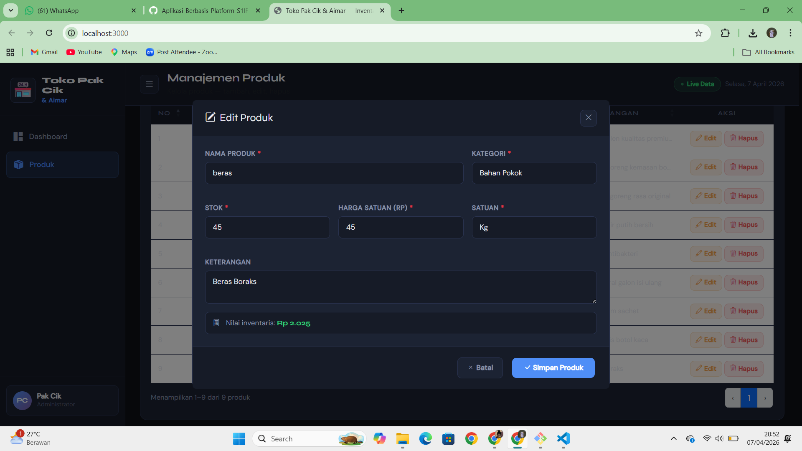

<div align="center">
  <br />
  <h1>LAPORAN PRAKTIKUM <br> APLIKASI BERBASIS PLATFORM </h1>
  <br />
  <h3>MODUL 6 <br> Web Inventari dengan ExpressJS, jQuery & Bootstrap </h3>
  <br />
  
  <br />
  <br />
  <br />
  <h3>Disusun Oleh :</h3>
  <p>
    <strong>Ahmad Tegar Kahfi Asyngarinanto</strong>
    <br>
    <strong>2311102083</strong>
    <br>
    <strong>S1 IF-11-REG05</strong>
  </p>
  <br />
  <h3>Dosen Pengampu :</h3>
  <p>
    <strong>Dedi Agung Prabowo, S.Kom., M.Kom</strong>
  </p>
  <br />
  <br />
  <h4>Asisten Praktikum :</h4>
  <strong>Apri Pandu Wicaksono</strong>
  <br>
  <strong>Hamka Zaenul Ardi</strong>
  <br />
  <h3>LABORATORIUM HIGH PERFORMANCE <br>FAKULTAS INFORMATIKA <br>UNIVERSITAS TELKOM PURWOKERTO <br>2026 </h3>
</div>

<hr>

## Deskripsi Project

**Toko Pak Cik & Aimar** adalah aplikasi web inventari berbasis **ExpressJS** untuk mengelola stok produk toko kelontong. Aplikasi ini mendukung operasi **CRUD** (Create, Read, Update, Delete) lengkap dengan tampilan **DataTable**, form produk, konfirmasi delete modal, dan dashboard ringkasan inventaris.

Data disimpan dalam file **JSON** (tanpa database), sehingga ringan dan mudah dijalankan.

---

## Struktur Project

```
toko-pak-cik/
├── server.js              # Server ExpressJS — REST API
├── package.json           # Konfigurasi & dependensi Node.js
├── data/
│   └── products.json      # Penyimpanan data produk (JSON)
├── public/
│   ├── index.html         # Halaman utama SPA
│   ├── css/
│   │   └── style.css      # Stylesheet kustom
│   └── js/
│       └── app.js         # Logika jQuery & AJAX
└── README.md
```

---

## Tech Stack

| Teknologi | Peran |
|-----------|-------|
| **Node.js + ExpressJS** | Backend server & REST API |
| **JSON File** | Penyimpanan data (pengganti database) |
| **jQuery 3.7** | DOM manipulation & AJAX request |
| **Bootstrap 5.3** | CSS framework & komponen UI |
| **DataTables 1.13** | Plugin tabel interaktif |
| **Bootstrap Icons** | Icon set |
| **UUID** | Generate ID unik untuk produk |

---

## Cara Menjalankan

### 1. Clone / Download project

```bash
git clone <repo-url>
cd toko-pak-cik
```

### 2. Install dependencies

```bash
npm install
```

### 3. Jalankan server

```bash
# Mode production
npm start

# Mode development (auto-restart dengan nodemon)
npm run dev
```

### 4. Buka di browser

```
http://localhost:3000
```

---

## REST API Endpoints

| Method | Endpoint | Deskripsi |
|--------|----------|-----------|
| `GET` | `/api/products` | Ambil semua produk (support query `?search=&kategori=`) |
| `GET` | `/api/products/:id` | Ambil satu produk by ID |
| `POST` | `/api/products` | Tambah produk baru |
| `PUT` | `/api/products/:id` | Update produk |
| `DELETE` | `/api/products/:id` | Hapus produk |
| `GET` | `/api/categories` | Ambil daftar kategori unik |
| `GET` | `/api/stats` | Ambil statistik ringkasan |

### Contoh Request Body (POST/PUT)

```json
{
  "nama": "Beras Premium 5kg",
  "kategori": "Bahan Pokok",
  "stok": 50,
  "harga": 75000,
  "satuan": "Karung",
  "keterangan": "Beras pulen kualitas premium"
}
```

### Contoh Response Sukses

```json
{
  "success": true,
  "message": "Produk \"Beras Premium 5kg\" berhasil ditambahkan",
  "data": {
    "id": "prod-a1b2c3d4",
    "nama": "Beras Premium 5kg",
    "kategori": "Bahan Pokok",
    "stok": 50,
    "harga": 75000,
    "satuan": "Karung",
    "keterangan": "Beras pulen kualitas premium",
    "createdAt": "2026-04-07T08:00:00.000Z"
  }
}
```

---

# Dasar Teori

## 1. ExpressJS

ExpressJS adalah framework Node.js yang minimalis dan fleksibel untuk membangun aplikasi web dan REST API. Express menyediakan lapisan abstraksi di atas Node.js HTTP module, sehingga lebih mudah mendefinisikan route, middleware, dan handler.

```js
const express = require('express');
const app = express();

app.get('/api/products', (req, res) => {
  res.json({ success: true, data: [] });
});

app.listen(3000, () => console.log('Server running!'));
```

### Middleware yang Digunakan

- `express.json()` — parsing body request berformat JSON
- `express.urlencoded()` — parsing body dari form HTML
- `express.static()` — serve file statis (HTML, CSS, JS)

---

## 2. REST API dan CRUD

REST (Representational State Transfer) adalah arsitektur desain API yang menggunakan HTTP method untuk merepresentasikan operasi:

| Operasi | HTTP Method | Contoh |
|---------|-------------|--------|
| Create  | `POST`      | Tambah produk baru |
| Read    | `GET`       | Ambil semua/satu produk |
| Update  | `PUT`       | Perbarui data produk |
| Delete  | `DELETE`    | Hapus produk |

---

## 3. Penyimpanan Data JSON

Data disimpan di file `data/products.json` menggunakan `fs` (File System) bawaan Node.js. Pendekatan ini cocok untuk aplikasi skala kecil atau prototyping karena tidak memerlukan database.

```js
const fs = require('fs');

// Baca data
function readProducts() {
  const raw = fs.readFileSync('data/products.json', 'utf-8');
  return JSON.parse(raw);
}

// Tulis data
function writeProducts(data) {
  fs.writeFileSync('data/products.json', JSON.stringify(data, null, 2));
}
```

---

## 4. jQuery AJAX

jQuery digunakan untuk melakukan DOM manipulation dan request HTTP ke backend secara asinkron (AJAX) tanpa perlu refresh halaman.

```js
// GET — Ambil semua produk
$.get('/api/products').done(function(res) {
  console.log(res.data);
});

// POST — Tambah produk baru
$.ajax({
  url: '/api/products',
  method: 'POST',
  contentType: 'application/json',
  data: JSON.stringify({ nama: 'Beras', stok: 10 })
}).done(function(res) {
  console.log(res.message);
});

// DELETE — Hapus produk
$.ajax({ url: `/api/products/${id}`, method: 'DELETE' })
  .done(res => console.log(res.message));
```

---

## 5. DataTables Plugin

DataTables adalah plugin jQuery yang mengubah tabel HTML biasa menjadi tabel interaktif dengan fitur pencarian, pengurutan kolom, dan paginasi.

```js
// Inisialisasi DataTable
const table = $('#tableProduk').DataTable({
  language: {
    search: 'Cari:',
    lengthMenu: 'Tampilkan _MENU_ data',
    info: 'Menampilkan _START_–_END_ dari _TOTAL_ produk',
  },
  order: [[0, 'asc']],
  pageLength: 10,
  columnDefs: [{ orderable: false, targets: 7 }] // Kolom aksi tidak bisa diurutkan
});

// Filter kolom tertentu
table.column(2).search('Minuman').draw();
```

### Alur Penggunaan DataTables di Project Ini

1. Ambil data dari API via `$.get('/api/products')`
2. Render baris `<tr>` ke `<tbody>` secara dinamis (jQuery)
3. Inisialisasi DataTables setelah tabel terisi
4. Destroy dan re-init setiap kali data diperbarui (setelah create/edit/delete)

---

## 6. Bootstrap Modal

Digunakan untuk 3 keperluan:
- **Modal Form Create** — form tambah produk baru
- **Modal Form Edit** — form yang sama, diisi otomatis data produk yang dipilih
- **Modal Konfirmasi Delete** — pop-up konfirmasi sebelum menghapus produk

```js
// Buka modal via JavaScript
new bootstrap.Modal($('#modalProduk')[0]).show();

// Tutup modal
bootstrap.Modal.getInstance($('#modalProduk')[0]).hide();
```

---

## Fitur Aplikasi

1. **Dashboard** — Statistik ringkasan (total produk, stok, nilai inventaris, stok kritis)
2. **DataTable Produk** — Tabel interaktif dengan search, sort, pagination
3. **Filter Kategori** — Dropdown filter berdasarkan kategori produk
4. **Form Create** — Tambah produk baru via modal Bootstrap
5. **Form Edit** — Edit produk yang ada, form diisi otomatis via AJAX GET
6. **Delete Confirmation** — Modal konfirmasi dengan info produk yang akan dihapus
7. **Preview Nilai** — Kalkulasi otomatis nilai inventaris (stok × harga) di form
8. **Toast Notifikasi** — Feedback operasi sukses/gagal
9. **Stok Indikator** — Badge warna: hijau (aman), oranye (rendah ≤20), merah kritis (≤10)
10. **Sidebar Navigation** — Navigasi responsif dengan toggle collapse

---

## Output / Screenshot

> Screenshot tersedia di folder `Assets/`


