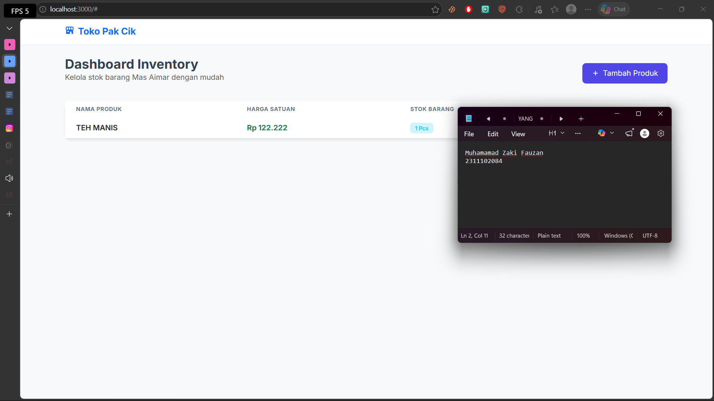
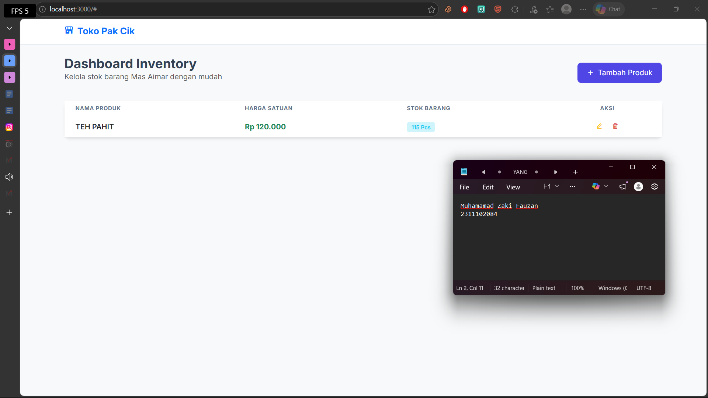
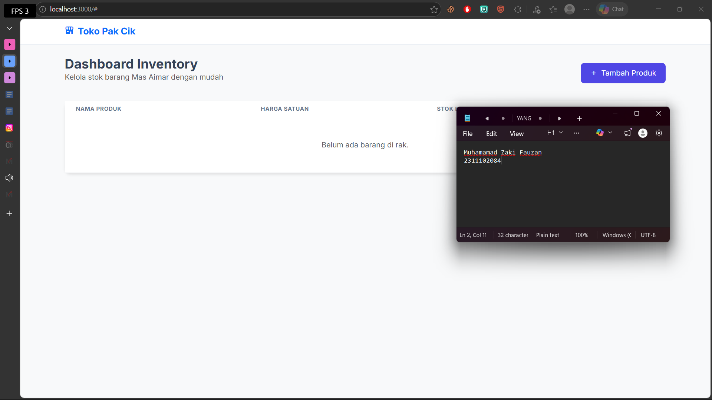

<div align="center">
  <br />
  <h1>LAPORAN PRAKTIKUM <br> APLIKASI BERBASIS PLATFORM </h1>
  <br />
  <h3>MODUL 6 <br> Coding on the Spot 1 </h3>
  <br />
  
  <br />
  <br />
  <br />
  <h3>Disusun Oleh :</h3>
  <p>
    <strong>Muhammad Zaki Fauzan</strong>
    <br>
    <strong>2311102084</strong>
    <br>
    <strong>S1 IF-11-REG05</strong>
  </p>
  <br />
  <h3>Dosen Pengampu :</h3>
  <p>
    <strong>Dedi Agung Prabowo, S.Kom., M.Kom</strong>
  </p>
  <br />
  <br />
  <h4>Asisten Praktikum :</h4>
  <strong>Apri Pandu Wicaksono </strong>
  <br>
  <strong>Hamka Zaenul Ardi</strong>
  <br />
  <h3>LABORATORIUM HIGH PERFORMANCE <br>FAKULTAS INFORMATIKA <br>UNIVERSITAS TELKOM PURWOKERTO <br>2026 </h3>
</div>

<hr>

# Dasar Teori Coding on the Spot 1

## Pengertian Javascript
JavaScript adalah bahasa pemrograman yang digunakan untuk membuat halaman web menjadi interaktif dan dinamis. JavaScript berjalan di sisi client (browser), sehingga dapat memanipulasi elemen HTML dan CSS secara langsung tanpa perlu reload halaman.

## 1. Di dalam server.js, menggunakan materi:

1. Node.js: Sebagai mesin yang menjalankan JavaScript di laptop (bukan di browser).

2. ExpressJS: Framework buat bikin jalur (Route). Contohnya: kalau ada orang minta data (GET /api/produk), Express yang ngasih.

3. FileSystem (fs): Materi tentang cara kodingan membaca dan menulis file ke dalam harddisk (mengolah produk.json).

4. REST API: Konsep pengiriman data menggunakan metode GET (ambil), POST (tambah), PUT (edit), dan DELETE (hapus).

## Di dalam index.html dan script.js, lu menggunakan materi:

1. Bootstrap 5: Materi tentang Layouting (Grid system) dan komponen UI (Card, Modal, Button) supaya tampilan rapi tanpa perlu ngetik ribuan baris CSS manual.

2. jQuery: Materi tentang manipulasi DOM (Document Object Model). Gunanya buat "nembak" data ke tabel tanpa refresh halaman.

3. AJAX: Teknik komunikasi antara Frontend dan Backend. Ini yang bikin aplikasi lu kerasa "enteng" karena data dikirim di balik layar.

4. JSON (JavaScript Object Notation): Materi tentang format pertukaran data. Bentuknya yang kayak daftar list itu standar internasional buat simpan data.
## Materi tentang bagaimana user berinteraksi dengan aplikasi:

1. Modal Dialog: Biar user nggak pindah-pindah halaman pas mau input data.

2. Form Validation: Memastikan inputan nama, harga, dan stok sudah terisi sebelum disimpan.

3. Konfirmasi Action: Adanya modal pop-up pas mau hapus data itu bagian dari materi Error Prevention (biar nggak salah klik).

### Source code 

```html
<!DOCTYPE html>
<html lang="id">
<head>
    <meta charset="UTF-8">
    <meta name="viewport" content="width=device-width, initial-scale=1.0">
    <title>Inventori Pak Cik & Aimar</title>
    <link href="https://fonts.googleapis.com/css2?family=Inter:wght@400;600;700&display=swap" rel="stylesheet">
    <link href="https://unpkg.com/boxicons@2.1.4/css/boxicons.min.css" rel="stylesheet">
    <link href="https://cdn.jsdelivr.net/npm/bootstrap@5.3.0/dist/css/bootstrap.min.css" rel="stylesheet">
    <link rel="stylesheet" href="/css/style.css">
</head>
<body>

<nav class="navbar navbar-expand-lg bg-white mb-4 shadow-sm">
    <div class="container">
        <a class="navbar-brand fw-bold text-primary" href="#">
            <i class='bx bxs-store-alt me-2'></i>Toko Pak Cik & Aimar
        </a>
    </div>
</nav>

<div class="container">
    <div class="row mb-4 align-items-center">
        <div class="col">
            <h4 class="fw-bold mb-0">Dashboard Stok Barang</h4>
            <p class="text-muted small">Kelola ketersediaan produk harian</p>
        </div>
        <div class="col-auto">
            <button class="btn btn-primary d-flex align-items-center" id="btnTambah" data-bs-toggle="modal" data-bs-target="#formModal">
                <i class='bx bx-plus me-2'></i> Tambah Produk
            </button>
        </div>
    </div>
<!-- Selebihnya dapat cek pada file "index.html" -->
```
🔗 [Klik di sini untuk membuka file `index.html`](views/index.html)

```js
l$(document).ready(function() {
    loadTabel();

    $('#btnTambah').click(function() {
        $('#modalTitle').text('Tambah Barang Baru');
        $('#idProduk').val('');
        $('#produkForm')[0].reset();
    });

    $('#produkForm').submit(function(e) {
        e.preventDefault();
        const id = $('#idProduk').val();
        const payload = {
            nama: $('#nama').val(),
            harga: $('#harga').val(),
            stok: $('#stok').val()
        };

        const method = id ? 'PUT' : 'POST';
        const url = id ? `/api/produk/${id}` : '/api/produk';

        $.ajax({
            url: url,
            type: method,
            contentType: 'application/json',
            data: JSON.stringify(payload),
            success: function() {
                $('#formModal').modal('hide');
                loadTabel();
            }
        });
    });
});

\
//Selebihnya dapat cek pada file "public/js/script.js"
```
🔗 [Klik di sini untuk membuka file `script.js`](public/js/script.js)

Output:






## Penjelasan
Tugas ini adalah aplikasi Inventory CRUD (Create, Read, Update, Delete) yang berjalan di atas Node.js. Saya tidak pakai database SQL, tapi pakai JSON File Persistence. Untuk interaksi user, saya pakai AJAX jQuery supaya pengelolaan stok barang Toko Pak Cik ini lebih responsif dan modern dengan styling Bootstrap 5