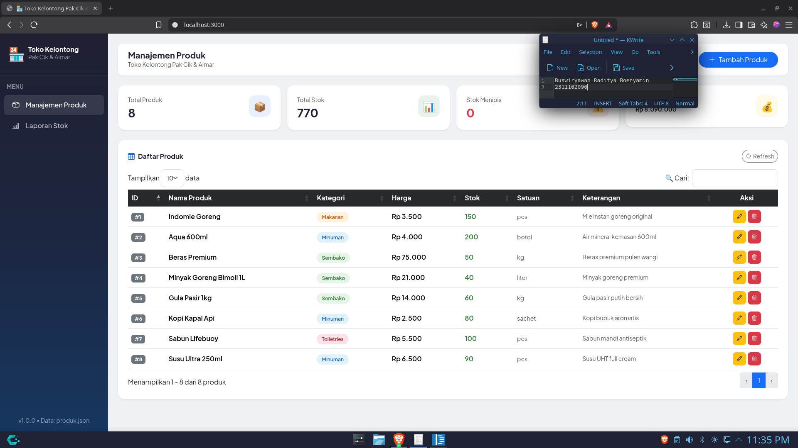
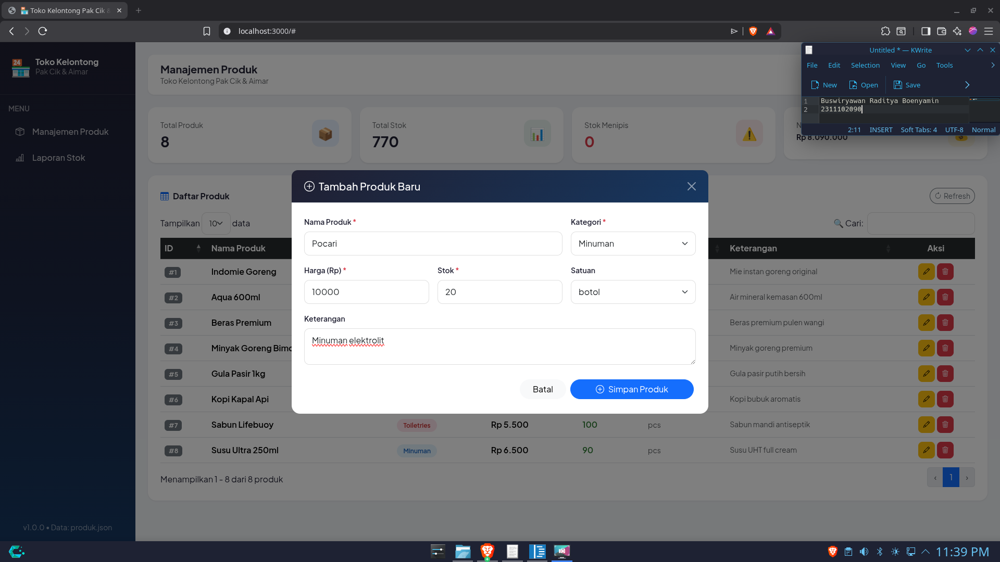
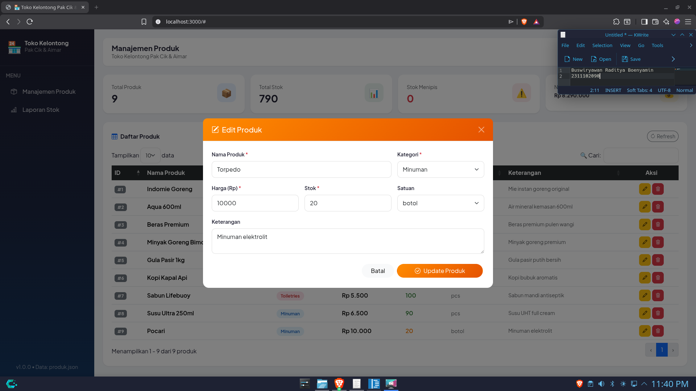
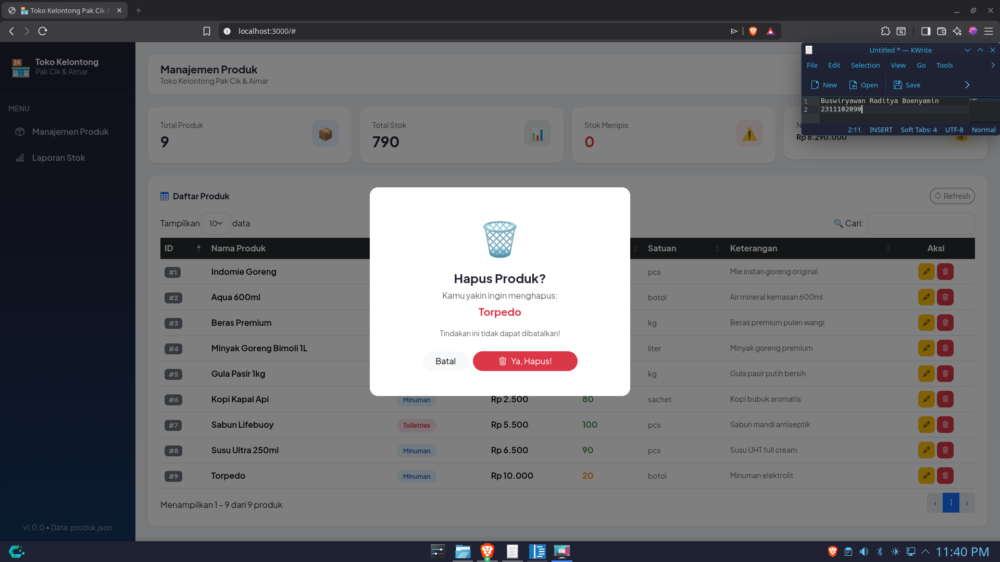

<div align="center">
  <br />
  <h1>LAPORAN PRAKTIKUM <br> APLIKASI BERBASIS PLATFORM </h1>
  <br />
  <h3>MODUL 6 <br> JAVASCRIPT & JQUERY </h3>
  <br />
  
  <br />
  <br />
  <br />
  <h3>Disusun Oleh :</h3>
  <p>
    <strong>Buswiryawan Raditya Boenyamin</strong>
    <br>
    <strong>2311102090</strong>
    <br>
    <strong>S1 IF-11-REG05</strong>
  </p>
  <br />
  <h3>Dosen Pengampu :</h3>
  <p>
    <strong>Dedi Agung Prabowo, S.Kom., M.Kom</strong>
  </p>
  <br />
  <br />
  <h4>Asisten Praktikum :</h4>
  <strong>Apri Pandu Wicaksono </strong>
  <br>
  <strong>Hamka Zaenul Ardi</strong>
  <br />
  <h3>LABORATORIUM HIGH PERFORMANCE <br>FAKULTAS INFORMATIKA <br>UNIVERSITAS TELKOM PURWOKERTO <br>2026 </h3>
</div>

<hr>

# Dasar Teori

## 1. Pengertian JavaScript
JavaScript adalah bahasa pemrograman scripting yang digunakan untuk membuat halaman web menjadi dinamis dan interaktif. Awalnya digunakan untuk mengontrol program berbasis Java, namun berkembang menjadi bahasa utama dalam pengembangan web di browser.

## 2. Prinsip Dasar JavaScript
- Mendukung paradigma:
  - Imperatif
  - Fungsional
  - Berorientasi objek
- Bersifat dinamis (tipe data dapat berubah)
- Program kompleks terdiri dari bagian kecil yang saling berinteraksi

## 3. Tipe Data JavaScript
- Number
- String
- Boolean
- Object
- Function
- Array
- Date
- RegExp
- Null
- Undefined

## 4. Variabel
Variabel digunakan untuk menyimpan data sementara dan dideklarasikan dengan `var`.  
JavaScript bersifat dinamis sehingga tipe data variabel dapat berubah.

## 5. Array
Array adalah struktur data untuk menyimpan banyak nilai:
- Ditulis dengan `[]`
- Indeks dimulai dari 0
- Bisa menyimpan berbagai tipe data
- Mendukung array multidimensi
- Memiliki method seperti `push()`, `pop()`, dan `length`

## 6. Struktur Kendali
JavaScript memiliki kontrol alur seperti:
- Percabangan: `if`, `else`
- Perulangan: `for`, `while`, `do-while`
- Operator perbandingan:
  - `==` (loose equality)
  - `===` (strict equality, direkomendasikan)

## 7. Object pada JavaScript
- Object adalah kumpulan properti (key-value)
- Dibuat dengan object literal `{}` 
- Dapat berisi nested object
- Akses properti:
  - Dot notation (`obj.prop`)
  - Bracket notation (`obj["prop"]`)

## 8. Prototype
JavaScript menggunakan konsep prototype untuk pewarisan objek tanpa class, misalnya dengan `Object.create()`.

## 9. Function
Fungsi adalah kumpulan perintah yang dapat digunakan kembali:
- Deklarasi fungsi (function declaration)
- Ekspresi fungsi (function expression / anonymous)
- Memiliki parameter dan return value
- Mendukung konsep modular dan reuse

## 10. jQuery
jQuery adalah library JavaScript yang mempermudah manipulasi HTML dan DOM.

### Fitur jQuery:
- DOM Manipulation
- Event Handling
- AJAX Support
- Animasi
- Lightweight

### Cara Penggunaan:
- Instalasi lokal
- CDN (Content Delivery Network)

## 11. Efek pada jQuery
- **Hide/Show**: Menyembunyikan dan menampilkan elemen
- **Animasi**: Mengubah properti elemen secara dinamis (misalnya toggle)


# Tugas 6: Toko Kelontong Pak Cik dan Aimar Loh yaa
Buat project bisa menggunakan (CodeIgniter, Laravel, ExpressJS, NestJS, DLL) dimana kalian diminta membuat web inventari toko punya pak cik sama mas aimar (yang ga paham suki) dimana terdapat sebuah crud untuk mengelola produk, dengan tampilan seperti datatable, form create, form edit, dan konfirmasi modal untuk delete. Dan untuk project wajib menggunakan jquery untuk DOM manipulation serta gunakan bootstrap untuk styling css nya, dan untuk data disimpan dalam bentuk json (bukan database). dan buat nilai plus tambahkan dokumentasi project nya (bawaan ai juga udah ada pasti)

## 📋 Deskripsi Proyek

Sistem manajemen inventaris berbasis web untuk **Toko Kelontong Pak Cik & Aimar**. Aplikasi ini memungkinkan pengelolaan produk secara lengkap (CRUD) dengan tampilan DataTable interaktif, penyimpanan data berbasis JSON, dan antarmuka modern menggunakan Bootstrap 5 + jQuery.

---

## 🛠️ Tech Stack

| Komponen      | Teknologi             |
|---------------|----------------------|
| Backend       | Node.js + Express.js |
| Frontend      | HTML5, Bootstrap 5   |
| DOM Manipulation | jQuery 3.7.1      |
| Tabel Data    | DataTables 1.13.8    |
| Penyimpanan   | JSON File (`data/produk.json`) |
| Icons         | Bootstrap Icons 1.11 |

---

## 📁 Struktur Proyek

```
2311102090_Buswiryawan Raditya Boenyamin/
├── server.js              # Express.js server & REST API
├── package.json           # Konfigurasi npm
├── README.md              # Dokumentasi ini
├── data/
│   └── produk.json        # Penyimpanan data (auto-generated)
└── public/
    └── index.html         # Frontend aplikasi
```

---

## 🚀 Cara Menjalankan

### 1. Install Dependencies
```bash
npm install
```

### 2. Jalankan Server
```bash
node server.js
```

### 3. Buka di Browser
```
http://localhost:3000
```

---

## 📡 REST API Endpoints

| Method | Endpoint          | Deskripsi              |
|--------|-------------------|------------------------|
| GET    | `/api/produk`     | Ambil semua produk     |
| GET    | `/api/produk/:id` | Ambil produk by ID     |
| POST   | `/api/produk`     | Tambah produk baru     |
| PUT    | `/api/produk/:id` | Update produk          |
| DELETE | `/api/produk/:id` | Hapus produk           |

### Contoh Request Body (POST/PUT)
```json
{
  "nama": "Indomie Goreng",
  "kategori": "Makanan",
  "harga": 3500,
  "stok": 150,
  "satuan": "pcs",
  "keterangan": "Mie instan goreng original"
}
```

---

## ✨ Fitur Lengkap

### 📊 Dashboard Stats
- Total produk
- Total stok keseluruhan
- Indikator stok menipis (≤10)
- Nilai total inventori (stok × harga)

### 📋 DataTable Produk
- Tampilan tabular dengan sorting & pagination
- Search/filter real-time
- Badge warna per kategori
- Indikator warna stok (merah/kuning/hijau)

### ➕ Form Create
- Modal form dengan validasi
- Input: nama, kategori, harga, stok, satuan, keterangan
- Dropdown kategori & satuan

### ✏️ Form Edit
- Pre-filled form dari data existing
- Update semua field produk
- Auto-refresh tabel setelah update

### 🗑️ Konfirmasi Delete
- Modal konfirmasi sebelum hapus
- Tampilkan nama produk yang akan dihapus
- Animasi visual untuk UX yang lebih baik

### 📈 Laporan Stok
- Ringkasan stok per kategori
- Total nilai per kategori

---

## 🎨 Kategori Produk

| Kategori    | Warna Badge     |
|-------------|-----------------|
| Makanan     | 🟠 Orange       |
| Minuman     | 🔵 Biru         |
| Sembako     | 🟢 Hijau        |
| Toiletries  | 🔴 Merah        |
| Lainnya     | 🟣 Ungu         |

---

## 🔧 Konfigurasi

Port default: **3000**. Ubah di `server.js`:
```js
const PORT = 3000; // ganti sesuai kebutuhan
```

---

```
<!-- 2311102090_Buswiryawan Raditya Boenyamin_S1IF-11-05 -->
<!DOCTYPE html>
<html lang="id">
<head>
  <meta charset="UTF-8" />
  <meta name="viewport" content="width=device-width, initial-scale=1.0"/>
  <title>🏪 Toko Kelontong Pak Cik & Aimar</title>

  <!-- Bootstrap 5 -->
  <link href="https://cdn.jsdelivr.net/npm/bootstrap@5.3.3/dist/css/bootstrap.min.css" rel="stylesheet">
  <!-- Bootstrap Icons -->
  <link href="https://cdn.jsdelivr.net/npm/bootstrap-icons@1.11.3/font/bootstrap-icons.css" rel="stylesheet">
  <!-- Google Fonts -->
  <link href="https://fonts.googleapis.com/css2?family=Plus+Jakarta+Sans:wght@400;500;600;700;800&display=swap" rel="stylesheet">
  <!-- DataTables Bootstrap5 -->
  <link href="https://cdn.datatables.net/1.13.8/css/dataTables.bootstrap5.min.css" rel="stylesheet">

  <style>
    body {
      font-family: 'Plus Jakarta Sans', sans-serif;
      background: #f0f2f5;
      color: #1a1a2e;
    }
    .sidebar {
      background: linear-gradient(180deg, #1a1a2e 0%, #16213e 50%, #0f3460 100%);
      min-height: 100vh;
      width: 260px;
      position: fixed;
      top: 0; left: 0;
      z-index: 100;
      transition: transform 0.3s ease;
    }
    .sidebar-brand {
      padding: 24px 20px;
      border-bottom: 1px solid rgba(255,255,255,0.08);
    }
    .sidebar-nav .nav-link {
      color: rgba(255,255,255,0.7);
      padding: 12px 20px;
      border-radius: 8px;
      margin: 2px 10px;
      font-weight: 500;
      transition: all 0.2s;
    }
    .sidebar-nav .nav-link:hover,
    .sidebar-nav .nav-link.active {
      background: rgba(255,255,255,0.1);
      color: #fff;
    }
    .main-content { margin-left: 260px; padding: 24px; }
    .topbar {
      background: #fff;
      border-radius: 12px;
      padding: 16px 24px;
      margin-bottom: 24px;
      box-shadow: 0 1px 3px rgba(0,0,0,0.08);
    }
    .stat-card {
      border-radius: 16px;
      border: none;
      padding: 24px;
    }
    .stat-card .stat-icon {
      width: 52px; height: 52px;
      border-radius: 14px;
      display: flex; align-items: center; justify-content: center;
      font-size: 1.5rem;
    }
    .table-card {
      background: #fff;
      border-radius: 16px;
      padding: 24px;
      box-shadow: 0 1px 3px rgba(0,0,0,0.08);
    }
    .badge-kategori {
      padding: 5px 12px;
      border-radius: 20px;
      font-size: 0.75rem;
      font-weight: 600;
    }
    .badge-makanan  { background: #fff3e0; color: #e65100; }
    .badge-minuman  { background: #e3f2fd; color: #1565c0; }
    .badge-sembako  { background: #e8f5e9; color: #2e7d32; }
    .badge-toiletries { background: #fce4ec; color: #c62828; }
    .badge-lainnya  { background: #f3e5f5; color: #6a1b9a; }
    .stok-low  { color: #d32f2f; font-weight: 600; }
    .stok-mid  { color: #f57c00; font-weight: 600; }
    .stok-ok   { color: #2e7d32; font-weight: 600; }
    .btn-action { width: 32px; height: 32px; padding: 0; border-radius: 8px; font-size: 0.8rem; }
    .modal-header-custom {
      background: linear-gradient(135deg, #1a1a2e, #0f3460);
      color: white;
      border-radius: 12px 12px 0 0;
    }
    .form-control, .form-select {
      border-radius: 10px;
      border: 1.5px solid #e0e0e0;
      padding: 10px 14px;
      transition: border-color 0.2s;
    }
    .form-control:focus, .form-select:focus {
      border-color: #0f3460;
      box-shadow: 0 0 0 3px rgba(15,52,96,0.1);
    }
    #toast-container { z-index: 9999; }
    .toast { border-radius: 12px; border: none; }
    .loading-overlay {
      position: fixed; inset: 0;
      background: rgba(0,0,0,0.4);
      z-index: 9998;
      display: none;
      align-items: center; justify-content: center;
    }
    @media (max-width: 768px) {
      .sidebar { transform: translateX(-100%); }
      .sidebar.show { transform: translateX(0); }
      .main-content { margin-left: 0; padding: 16px; }
    }
    .delete-modal-icon { font-size: 4rem; animation: shake 0.5s ease-in-out; }
    @keyframes shake {
      0%, 100% { transform: rotate(0); }
      25% { transform: rotate(-10deg); }
      75% { transform: rotate(10deg); }
    }
    table.dataTable tbody tr:hover { background: #f8f9ff !important; }
    .harga-text { font-weight: 600; color: #0f3460; }
  </style>
</head>
<body>

  <!-- Loading Overlay -->
  <div class="loading-overlay" id="loadingOverlay">
    <div class="spinner-border text-light" style="width:3rem;height:3rem"></div>
  </div>

  <!-- Toast Container -->
  <div id="toast-container" class="toast-container position-fixed top-0 end-0 p-3"></div>

  <!-- SIDEBAR -->
  <aside class="sidebar" id="sidebar">
    <div class="sidebar-brand">
      <div class="d-flex align-items-center gap-2 mb-1">
        <span class="fs-2">🏪</span>
        <div>
          <div class="text-white fw-bold lh-1">Toko Kelontong</div>
          <div class="text-white-50 small">Pak Cik & Aimar</div>
        </div>
      </div>
    </div>
    <nav class="sidebar-nav mt-2">
      <div class="px-3 py-2 text-white-50 small fw-semibold text-uppercase">Menu</div>
      <a href="#" class="nav-link active d-flex align-items-center gap-3" onclick="showSection('produk')">
        <i class="bi bi-box-seam"></i> Manajemen Produk
      </a>
      <a href="#" class="nav-link d-flex align-items-center gap-3" onclick="showSection('laporan')">
        <i class="bi bi-bar-chart-line"></i> Laporan Stok
      </a>
    </nav>
    <div class="mt-auto position-absolute bottom-0 p-3 w-100">
      <div class="text-white-50 small text-center">v1.0.0 &bull; Data: produk.json</div>
    </div>
  </aside>

  <!-- MAIN CONTENT -->
  <main class="main-content">

    <!-- Topbar -->
    <div class="topbar d-flex align-items-center justify-content-between">
      <div class="d-flex align-items-center gap-3">
        <button class="btn btn-outline-secondary d-md-none" onclick="$('#sidebar').toggleClass('show')">
          <i class="bi bi-list"></i>
        </button>
        <div>
          <h5 class="fw-bold mb-0" id="pageTitle">Manajemen Produk</h5>
          <p class="text-muted small mb-0">Toko Kelontong Pak Cik & Aimar</p>
        </div>
      </div>
      <div class="d-flex align-items-center gap-2">
        <button class="btn btn-primary rounded-pill px-4 d-flex align-items-center gap-2" id="btnTambah" onclick="openCreateModal()">
          <i class="bi bi-plus-lg"></i>
          <span class="d-none d-sm-inline">Tambah Produk</span>
        </button>
      </div>
    </div>

    <!-- SECTION: PRODUK -->
    <div id="section-produk">
      <!-- Stats Row -->
      <div class="row g-3 mb-4" id="statsRow">
        <div class="col-6 col-lg-3">
          <div class="stat-card bg-white shadow-sm">
            <div class="d-flex justify-content-between align-items-start">
              <div>
                <p class="text-muted small mb-1">Total Produk</p>
                <h3 class="fw-bold mb-0" id="statTotal">—</h3>
              </div>
              <div class="stat-icon bg-primary bg-opacity-10 text-primary">📦</div>
            </div>
          </div>
        </div>
        <div class="col-6 col-lg-3">
          <div class="stat-card bg-white shadow-sm">
            <div class="d-flex justify-content-between align-items-start">
              <div>
                <p class="text-muted small mb-1">Total Stok</p>
                <h3 class="fw-bold mb-0" id="statStok">—</h3>
              </div>
              <div class="stat-icon bg-success bg-opacity-10 text-success">📊</div>
            </div>
          </div>
        </div>
        <div class="col-6 col-lg-3">
          <div class="stat-card bg-white shadow-sm">
            <div class="d-flex justify-content-between align-items-start">
              <div>
                <p class="text-muted small mb-1">Stok Menipis</p>
                <h3 class="fw-bold mb-0 text-danger" id="statLow">—</h3>
              </div>
              <div class="stat-icon bg-danger bg-opacity-10 text-danger">⚠️</div>
            </div>
          </div>
        </div>
        <div class="col-6 col-lg-3">
          <div class="stat-card bg-white shadow-sm">
            <div class="d-flex justify-content-between align-items-start">
              <div>
                <p class="text-muted small mb-1">Nilai Inventori</p>
                <h3 class="fw-bold mb-0 small" id="statNilai">—</h3>
              </div>
              <div class="stat-icon bg-warning bg-opacity-10 text-warning">💰</div>
            </div>
          </div>
        </div>
      </div>

      <!-- Table Card -->
      <div class="table-card">
        <div class="d-flex align-items-center justify-content-between mb-3">
          <h6 class="fw-bold mb-0"><i class="bi bi-table me-2 text-primary"></i>Daftar Produk</h6>
          <button class="btn btn-outline-secondary btn-sm rounded-pill" onclick="loadProduk()">
            <i class="bi bi-arrow-clockwise me-1"></i>Refresh
          </button>
        </div>
        <div class="table-responsive">
          <table id="tableProduk" class="table table-hover align-middle" style="width:100%">
            <thead class="table-dark">
              <tr>
                <th>ID</th>
                <th>Nama Produk</th>
                <th>Kategori</th>
                <th>Harga</th>
                <th>Stok</th>
                <th>Satuan</th>
                <th>Keterangan</th>
                <th class="text-center">Aksi</th>
              </tr>
            </thead>
            <tbody id="tableBody">
              <tr><td colspan="8" class="text-center py-4"><div class="spinner-border spinner-border-sm text-primary me-2"></div>Memuat data...</td></tr>
            </tbody>
          </table>
        </div>
      </div>
    </div>

    <!-- SECTION: LAPORAN -->
    <div id="section-laporan" style="display:none">
      <div class="table-card">
        <h6 class="fw-bold mb-4"><i class="bi bi-bar-chart me-2 text-primary"></i>Laporan Stok Per Kategori</h6>
        <div id="laporanContent">
          <p class="text-muted text-center py-4">Klik "Laporan Stok" di sidebar untuk memuat data.</p>
        </div>
      </div>
    </div>

  </main>

  <!-- ============ MODAL CREATE ============ -->
  <div class="modal fade" id="modalCreate" tabindex="-1">
    <div class="modal-dialog modal-dialog-centered modal-lg">
      <div class="modal-content rounded-4 border-0">
        <div class="modal-header modal-header-custom px-4 py-3">
          <h5 class="modal-title"><i class="bi bi-plus-circle me-2"></i>Tambah Produk Baru</h5>
          <button type="button" class="btn-close btn-close-white" data-bs-dismiss="modal"></button>
        </div>
        <div class="modal-body p-4">
          <div class="row g-3">
            <div class="col-md-8">
              <label class="form-label fw-semibold small">Nama Produk <span class="text-danger">*</span></label>
              <input type="text" class="form-control" id="createNama" placeholder="Nama produk...">
            </div>
            <div class="col-md-4">
              <label class="form-label fw-semibold small">Kategori <span class="text-danger">*</span></label>
              <select class="form-select" id="createKategori">
                <option value="">-- Pilih --</option>
                <option>Makanan</option>
                <option>Minuman</option>
                <option>Sembako</option>
                <option>Toiletries</option>
                <option>Lainnya</option>
              </select>
            </div>
            <div class="col-md-4">
              <label class="form-label fw-semibold small">Harga (Rp) <span class="text-danger">*</span></label>
              <input type="number" class="form-control" id="createHarga" placeholder="0" min="0">
            </div>
            <div class="col-md-4">
              <label class="form-label fw-semibold small">Stok <span class="text-danger">*</span></label>
              <input type="number" class="form-control" id="createStok" placeholder="0" min="0">
            </div>
            <div class="col-md-4">
              <label class="form-label fw-semibold small">Satuan</label>
              <select class="form-select" id="createSatuan">
                <option>pcs</option>
                <option>kg</option>
                <option>liter</option>
                <option>botol</option>
                <option>sachet</option>
                <option>dus</option>
                <option>pak</option>
              </select>
            </div>
            <div class="col-12">
              <label class="form-label fw-semibold small">Keterangan</label>
              <textarea class="form-control" id="createKeterangan" rows="2" placeholder="Deskripsi produk..."></textarea>
            </div>
          </div>
        </div>
        <div class="modal-footer px-4 pb-4 border-0 pt-0">
          <button type="button" class="btn btn-light rounded-pill px-4" data-bs-dismiss="modal">Batal</button>
          <button type="button" class="btn btn-primary rounded-pill px-5" onclick="submitCreate()">
            <i class="bi bi-plus-circle me-2"></i>Simpan Produk
          </button>
        </div>
      </div>
    </div>
  </div>

  <!-- ============ MODAL EDIT ============ -->
  <div class="modal fade" id="modalEdit" tabindex="-1">
    <div class="modal-dialog modal-dialog-centered modal-lg">
      <div class="modal-content rounded-4 border-0">
        <div class="modal-header px-4 py-3" style="background:linear-gradient(135deg,#ff8c00,#e65100);color:white;border-radius:12px 12px 0 0">
          <h5 class="modal-title"><i class="bi bi-pencil-square me-2"></i>Edit Produk</h5>
          <button type="button" class="btn-close btn-close-white" data-bs-dismiss="modal"></button>
        </div>
        <div class="modal-body p-4">
          <input type="hidden" id="editId">
          <div class="row g-3">
            <div class="col-md-8">
              <label class="form-label fw-semibold small">Nama Produk <span class="text-danger">*</span></label>
              <input type="text" class="form-control" id="editNama">
            </div>
            <div class="col-md-4">
              <label class="form-label fw-semibold small">Kategori <span class="text-danger">*</span></label>
              <select class="form-select" id="editKategori">
                <option>Makanan</option><option>Minuman</option><option>Sembako</option>
                <option>Toiletries</option><option>Lainnya</option>
              </select>
            </div>
            <div class="col-md-4">
              <label class="form-label fw-semibold small">Harga (Rp) <span class="text-danger">*</span></label>
              <input type="number" class="form-control" id="editHarga" min="0">
            </div>
            <div class="col-md-4">
              <label class="form-label fw-semibold small">Stok <span class="text-danger">*</span></label>
              <input type="number" class="form-control" id="editStok" min="0">
            </div>
            <div class="col-md-4">
              <label class="form-label fw-semibold small">Satuan</label>
              <select class="form-select" id="editSatuan">
                <option>pcs</option><option>kg</option><option>liter</option>
                <option>botol</option><option>sachet</option><option>dus</option><option>pak</option>
              </select>
            </div>
            <div class="col-12">
              <label class="form-label fw-semibold small">Keterangan</label>
              <textarea class="form-control" id="editKeterangan" rows="2"></textarea>
            </div>
          </div>
        </div>
        <div class="modal-footer px-4 pb-4 border-0 pt-0">
          <button type="button" class="btn btn-light rounded-pill px-4" data-bs-dismiss="modal">Batal</button>
          <button type="button" class="btn rounded-pill px-5 text-white" style="background:linear-gradient(135deg,#ff8c00,#e65100)" onclick="submitEdit()">
            <i class="bi bi-check-circle me-2"></i>Update Produk
          </button>
        </div>
      </div>
    </div>
  </div>

  <!-- ============ MODAL DELETE ============ -->
  <div class="modal fade" id="modalDelete" tabindex="-1">
    <div class="modal-dialog modal-dialog-centered">
      <div class="modal-content rounded-4 border-0">
        <div class="modal-body text-center p-5">
          <div class="delete-modal-icon mb-3">🗑️</div>
          <h4 class="fw-bold mb-2">Hapus Produk?</h4>
          <p class="text-muted mb-1">Kamu yakin ingin menghapus:</p>
          <p class="fw-bold text-danger fs-5" id="deleteNamaProduk">—</p>
          <p class="text-muted small">Tindakan ini tidak dapat dibatalkan!</p>
          <input type="hidden" id="deleteId">
          <div class="d-flex gap-2 justify-content-center mt-4">
            <button class="btn btn-light rounded-pill px-4" data-bs-dismiss="modal">Batal</button>
            <button class="btn btn-danger rounded-pill px-5" onclick="submitDelete()">
              <i class="bi bi-trash3 me-2"></i>Ya, Hapus!
            </button>
          </div>
        </div>
      </div>
    </div>
  </div>

  <!-- Bootstrap JS -->
  <script src="https://cdn.jsdelivr.net/npm/bootstrap@5.3.3/dist/js/bootstrap.bundle.min.js"></script>
  <!-- jQuery -->
  <script src="https://code.jquery.com/jquery-3.7.1.min.js"></script>
  <!-- DataTables -->
  <script src="https://cdn.datatables.net/1.13.8/js/jquery.dataTables.min.js"></script>
  <script src="https://cdn.datatables.net/1.13.8/js/dataTables.bootstrap5.min.js"></script>

  <script>
    const API = '/api/produk';
    let dtTable = null;

    // ===== TOAST =====
    function showToast(msg, type = 'success') {
      const icon = type === 'success' ? '✅' : type === 'danger' ? '❌' : 'ℹ️';
      const id = 'toast-' + Date.now();
      const html = `
        <div id="${id}" class="toast align-items-center text-bg-${type} border-0 shadow" role="alert">
          <div class="d-flex">
            <div class="toast-body fw-semibold">${icon} ${msg}</div>
            <button type="button" class="btn-close btn-close-white me-2 m-auto" data-bs-dismiss="toast"></button>
          </div>
        </div>`;
      $('#toast-container').append(html);
      const toastEl = new bootstrap.Toast(document.getElementById(id), { delay: 3500 });
      toastEl.show();
      $(`#${id}`).on('hidden.bs.toast', function() { $(this).remove(); });
    }

    // ===== LOADING =====
    function setLoading(show) {
      $('#loadingOverlay').css('display', show ? 'flex' : 'none');
    }

    // ===== KATEGORI BADGE =====
    function badgeKategori(kat) {
      const map = { Makanan:'makanan', Minuman:'minuman', Sembako:'sembako', Toiletries:'toiletries' };
      const cls = map[kat] || 'lainnya';
      return `<span class="badge-kategori badge-${cls}">${kat}</span>`;
    }

    // ===== STOK COLOR =====
    function stokClass(stok) {
      if (stok <= 10) return 'stok-low';
      if (stok <= 30) return 'stok-mid';
      return 'stok-ok';
    }

    // ===== FORMAT RUPIAH =====
    function rupiah(n) {
      return 'Rp ' + parseInt(n).toLocaleString('id-ID');
    }

    // ===== LOAD PRODUK =====
    function loadProduk() {
      $.ajax({
        url: API,
        method: 'GET',
        success: function(res) {
          const data = res.data;
          updateStats(data);

          if (dtTable) { dtTable.destroy(); dtTable = null; }

          let rows = '';
          $.each(data, function(i, p) {
            rows += `
              <tr>
                <td><span class="badge bg-secondary">#${p.id}</span></td>
                <td class="fw-semibold">${p.nama}</td>
                <td>${badgeKategori(p.kategori)}</td>
                <td class="harga-text">${rupiah(p.harga)}</td>
                <td><span class="${stokClass(p.stok)}">${p.stok}</span></td>
                <td><span class="text-muted small">${p.satuan}</span></td>
                <td class="text-muted small" style="max-width:180px">${p.keterangan || '—'}</td>
                <td class="text-center">
                  <div class="d-flex gap-1 justify-content-center">
                    <button class="btn btn-warning btn-action" title="Edit" onclick="openEditModal(${p.id})">
                      <i class="bi bi-pencil"></i>
                    </button>
                    <button class="btn btn-danger btn-action" title="Hapus" onclick="openDeleteModal(${p.id}, '${p.nama.replace(/'/g,"\\'")}')">
                      <i class="bi bi-trash3"></i>
                    </button>
                  </div>
                </td>
              </tr>`;
          });

          $('#tableBody').html(rows);
          dtTable = $('#tableProduk').DataTable({
            language: {
              search: "🔍 Cari:",
              lengthMenu: "Tampilkan _MENU_ data",
              info: "Menampilkan _START_ - _END_ dari _TOTAL_ produk",
              paginate: { previous: "‹", next: "›" },
              emptyTable: "Tidak ada data produk",
              zeroRecords: "Produk tidak ditemukan"
            },
            pageLength: 10,
            columnDefs: [{ orderable: false, targets: [7] }]
          });
        },
        error: function() {
          showToast('Gagal memuat data. Pastikan server berjalan di port 3000.', 'danger');
        }
      });
    }

    // ===== UPDATE STATS =====
    function updateStats(data) {
      const total = data.length;
      const totalStok = data.reduce((s, p) => s + p.stok, 0);
      const lowStok = data.filter(p => p.stok <= 10).length;
      const nilaiTotal = data.reduce((s, p) => s + (p.stok * p.harga), 0);
      $('#statTotal').text(total);
      $('#statStok').text(totalStok.toLocaleString('id-ID'));
      $('#statLow').text(lowStok);
      $('#statNilai').text(rupiah(nilaiTotal));
    }

    // ===== SHOW SECTION =====
    function showSection(name) {
      $('#section-produk, #section-laporan').hide();
      $(`#section-${name}`).show();
      if (name === 'laporan') {
        loadLaporan();
        $('#pageTitle').text('Laporan Stok');
        $('#btnTambah').hide();
      } else {
        $('#pageTitle').text('Manajemen Produk');
        $('#btnTambah').show();
      }
      $('.sidebar-nav .nav-link').removeClass('active');
    }

    // ===== LAPORAN =====
    function loadLaporan() {
      $.get(API, function(res) {
        const data = res.data;
        const byKat = {};
        $.each(data, function(i, p) {
          if (!byKat[p.kategori]) byKat[p.kategori] = { items: 0, stok: 0, nilai: 0 };
          byKat[p.kategori].items++;
          byKat[p.kategori].stok += p.stok;
          byKat[p.kategori].nilai += p.stok * p.harga;
        });
        let html = '<div class="table-responsive"><table class="table table-bordered align-middle"><thead class="table-dark"><tr><th>Kategori</th><th>Jumlah Item</th><th>Total Stok</th><th>Nilai Inventori</th></tr></thead><tbody>';
        $.each(byKat, function(kat, v) {
          html += `<tr><td>${badgeKategori(kat)}</td><td>${v.items} produk</td><td class="fw-semibold">${v.stok.toLocaleString('id-ID')}</td><td class="harga-text">${rupiah(v.nilai)}</td></tr>`;
        });
        html += '</tbody></table></div>';
        $('#laporanContent').html(html);
      });
    }

    // ===== OPEN CREATE MODAL =====
    function openCreateModal() {
      $('#createNama, #createHarga, #createStok, #createKeterangan').val('');
      $('#createKategori').val('');
      $('#createSatuan').val('pcs');
      new bootstrap.Modal('#modalCreate').show();
    }

    // ===== SUBMIT CREATE =====
    function submitCreate() {
      const nama = $('#createNama').val().trim();
      const kategori = $('#createKategori').val();
      const harga = $('#createHarga').val();
      const stok = $('#createStok').val();
      if (!nama || !kategori || !harga || !stok) {
        showToast('Harap isi semua field yang wajib!', 'warning');
        return;
      }
      setLoading(true);
      $.ajax({
        url: API, method: 'POST',
        contentType: 'application/json',
        data: JSON.stringify({
          nama, kategori, harga, stok,
          satuan: $('#createSatuan').val(),
          keterangan: $('#createKeterangan').val().trim()
        }),
        success: function(res) {
          bootstrap.Modal.getInstance('#modalCreate').hide();
          showToast(res.message, 'success');
          loadProduk();
        },
        error: function() { showToast('Gagal menambahkan produk!', 'danger'); },
        complete: function() { setLoading(false); }
      });
    }

    // ===== OPEN EDIT MODAL =====
    function openEditModal(id) {
      setLoading(true);
      $.get(`${API}/${id}`, function(res) {
        const p = res.data;
        $('#editId').val(p.id);
        $('#editNama').val(p.nama);
        $('#editKategori').val(p.kategori);
        $('#editHarga').val(p.harga);
        $('#editStok').val(p.stok);
        $('#editSatuan').val(p.satuan);
        $('#editKeterangan').val(p.keterangan);
        setLoading(false);
        new bootstrap.Modal('#modalEdit').show();
      });
    }

    // ===== SUBMIT EDIT =====
    function submitEdit() {
      const id = $('#editId').val();
      const nama = $('#editNama').val().trim();
      const kategori = $('#editKategori').val();
      if (!nama || !kategori) {
        showToast('Harap isi semua field yang wajib!', 'warning');
        return;
      }
      setLoading(true);
      $.ajax({
        url: `${API}/${id}`, method: 'PUT',
        contentType: 'application/json',
        data: JSON.stringify({
          nama, kategori,
          harga: $('#editHarga').val(),
          stok: $('#editStok').val(),
          satuan: $('#editSatuan').val(),
          keterangan: $('#editKeterangan').val().trim()
        }),
        success: function(res) {
          bootstrap.Modal.getInstance('#modalEdit').hide();
          showToast(res.message, 'success');
          loadProduk();
        },
        error: function() { showToast('Gagal mengupdate produk!', 'danger'); },
        complete: function() { setLoading(false); }
      });
    }

    // ===== OPEN DELETE MODAL =====
    function openDeleteModal(id, nama) {
      $('#deleteId').val(id);
      $('#deleteNamaProduk').text(nama);
      new bootstrap.Modal('#modalDelete').show();
    }

    // ===== SUBMIT DELETE =====
    function submitDelete() {
      const id = $('#deleteId').val();
      setLoading(true);
      $.ajax({
        url: `${API}/${id}`, method: 'DELETE',
        success: function(res) {
          bootstrap.Modal.getInstance('#modalDelete').hide();
          showToast(res.message, 'success');
          loadProduk();
        },
        error: function() { showToast('Gagal menghapus produk!', 'danger'); },
        complete: function() { setLoading(false); }
      });
    }

    // ===== INIT =====
    $(document).ready(function() {
      loadProduk();
    });
  </script>
</body>
</html>
```
Output:

Create:

Edit:

Delete:

