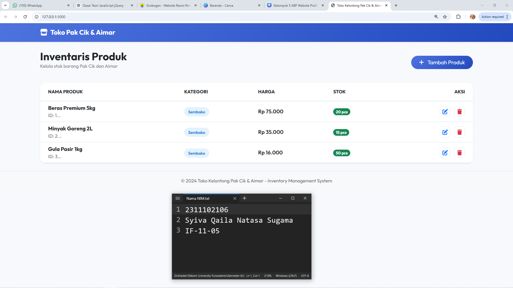
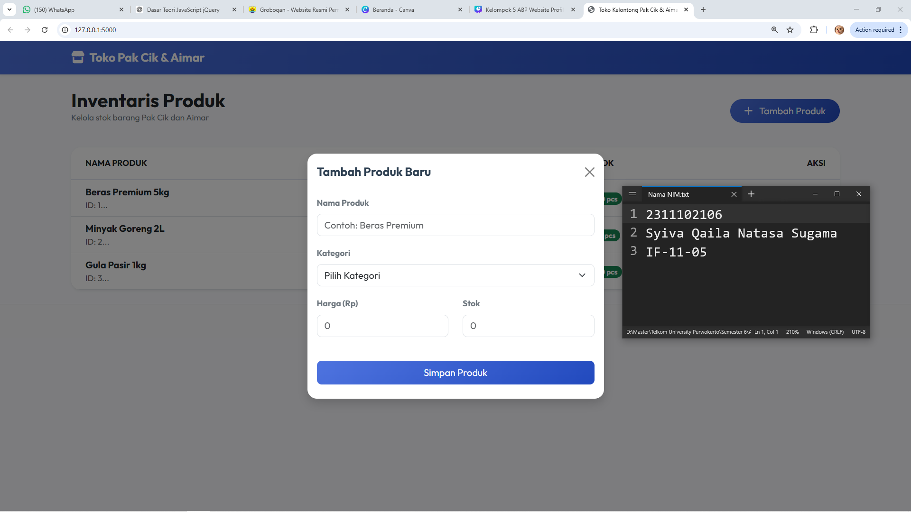

<div align="center">
  <br />
  <h1>LAPORAN PRAKTIKUM <br> APLIKASI BERBASIS PLATFORM </h1>
  <br />
  <h3>MODUL 6 <br> COTS </h3>
  <br />
  
  <br />
  <br />
  <br />
  <h3>Disusun Oleh :</h3>
  <p>
    <strong>Syiva Qaila Natasa Sugama</strong>
    <br>
    <strong>2311102106</strong>
    <br>
    <strong>S1 IF-11-REG05</strong>
  </p>
  <br />
  <h3>Dosen Pengampu :</h3>
  <p>
    <strong>Dedi Agung Prabowo, S.Kom., M.Kom</strong>
  </p>
  <br />
  <br />
  <h4>Asisten Praktikum :</h4>
  <strong>Apri Pandu Wicaksono </strong>
  <br>
  <strong>Hamka Zaenul Ardi</strong>
  <br />
  <h3>LABORATORIUM HIGH PERFORMANCE <br>FAKULTAS INFORMATIKA <br>UNIVERSITAS TELKOM PURWOKERTO <br>2026 </h3>
</div>

<hr>

## Dasar Teori 

Commercial Off-The-Shelf (COTS) merupakan pendekatan dalam pengembangan sistem informasi dengan memanfaatkan produk perangkat lunak yang telah tersedia secara komersial dan siap digunakan. COTS dikembangkan oleh pihak vendor untuk kebutuhan umum sehingga dapat digunakan oleh berbagai organisasi tanpa perlu melakukan pengembangan dari awal. Dalam konteks pengembangan aplikasi, penggunaan COTS sering ditemukan pada pemanfaatan framework, plugin, maupun layanan berbasis cloud yang dapat langsung diintegrasikan ke dalam sistem.

Keunggulan utama dari penggunaan COTS terletak pada kemampuannya untuk mempercepat proses implementasi sistem dan mengurangi kompleksitas pengembangan. Dengan memanfaatkan solusi yang sudah ada, pengembang dapat lebih fokus pada pengembangan fitur inti yang menjadi kebutuhan spesifik aplikasi. Selain itu, produk COTS umumnya telah memiliki standar kualitas tertentu karena telah digunakan secara luas dan terus diperbarui oleh vendor. Meskipun demikian, terdapat beberapa kendala seperti keterbatasan dalam penyesuaian fitur, ketergantungan terhadap pihak ketiga, serta potensi biaya lisensi yang harus diperhatikan dalam jangka panjang.

Dalam penerapannya, penggunaan COTS sebaiknya dilakukan secara selektif dan strategis agar tidak mengganggu fleksibilitas sistem. Integrasi antara COTS dan pengembangan kustom menjadi solusi yang umum digunakan untuk mencapai keseimbangan antara efisiensi dan kebutuhan spesifik. Oleh karena itu, pemahaman yang baik terhadap karakteristik dan batasan COTS sangat penting agar sistem yang dibangun tetap optimal, scalable, dan mudah dikembangkan di masa depan.


### Source code 
```py
# app.py
from flask import Flask, render_template, request, jsonify
import json
import os

app = Flask(__name__)

# Data storage path
DATA_FILE = os.path.join('data', 'products.json')

def load_products():
    """Load products from JSON file."""
    if not os.path.exists(DATA_FILE):
        return []
    with open(DATA_FILE, 'r') as f:
        try:
            return json.load(f)
        except json.JSONDecodeError:
            return []

def save_products(products):
    """Save products to JSON file."""
    with open(DATA_FILE, 'w') as f:
        json.dump(products, f, indent=2)

@app.route('/')
def index():
    return render_template('index.html')

@app.route('/api/products', methods=['GET'])
def get_products():
    return jsonify(load_products())

@app.route('/api/products', methods=['POST'])
def add_product():
    products = load_products()
    data = request.json
    
    # Simple ID increment
    new_id = 1
    if products:
        new_id = max(p['id'] for p in products) + 1
    
    new_product = {
        'id': new_id,
        'name': data.get('name'),
        'price': int(data.get('price')),
        'stock': int(data.get('stock')),
        'category': data.get('category')
    }
    products.append(new_product)
    save_products(products)
    return jsonify(new_product), 201

@app.route('/api/products/<int:id>', methods=['PUT'])
def update_product(id):
    data = request.json
    products = load_products()
    for product in products:
        if product['id'] == id:
            product.update({
                'name': data.get('name'),
                'price': int(data.get('price')),
                'stock': int(data.get('stock')),
                'category': data.get('category')
            })
            save_products(products)
            return jsonify(product)
    return jsonify({'error': 'Product not found'}), 404

# Selebihnya dapat cek pada file "app.py"
```
🔗 [Klik di sini untuk membuka file `app.py`](app.py)

```html



<div class="container">
    <div class="row mb-4 align-items-center">
        <div class="col">
            <h2 class="fw-bold text-dark m-0">Inventaris Produk</h2>
            <p class="text-secondary small">Kelola stok barang Pak Cik dan Aimar</p>
        </div>
        <div class="col-auto">
            <button class="btn btn-primary-premium px-4 py-2 rounded-pill" data-bs-toggle="modal" data-bs-target="#addModal">
                <i class="fas fa-plus me-2"></i> Tambah Produk
            </button>
        </div>
    </div>

    <div class="card border-0 shadow-sm rounded-4 overflow-hidden">
        <div class="card-body p-0">
            <div class="table-responsive">
                <table class="table table-hover align-middle mb-0" id="productTable">
                    <thead class="bg-light text-secondary small text-uppercase fw-semibold">
                        <tr>
                            <th class="ps-4 py-3" style="width: 60px;">No</th>
                            <th class="py-3">Nama Produk</th>
                            <th class="py-3">Kategori</th>
                            <th class="py-3">Harga</th>
                            <th class="py-3">Stok</th>
                            <th class="text-end pe-4 py-3">Aksi</th>
                        </tr>
                    </thead>
                    <tbody id="productTableBody">
                        <!-- Data will be loaded via jQuery -->
                    </tbody>
                </table>
            </div>
        </div>
    </div>
</div>

    <!-- Selebihnya dapat cek pada file "templates/index.html" -->
```
🔗 [Klik di sini untuk membuka file `index.html`](templates/index.html)
```html



<div class="container">
    <div class="row mb-4 align-items-center">
        <div class="col">
            <h2 class="fw-bold text-dark m-0">Inventaris Produk</h2>
            <p class="text-secondary small">Kelola stok barang Pak Cik dan Aimar</p>
        </div>
        <div class="col-auto">
            <button class="btn btn-primary-premium px-4 py-2 rounded-pill" data-bs-toggle="modal" data-bs-target="#addModal">
                <i class="fas fa-plus me-2"></i> Tambah Produk
            </button>
        </div>
    </div>

    <div class="card border-0 shadow-sm rounded-4 overflow-hidden">
        <div class="card-body p-0">
            <div class="table-responsive">
                <table class="table table-hover align-middle mb-0" id="productTable">
                    <thead class="bg-light text-secondary small text-uppercase fw-semibold">
                        <tr>
                            <th class="ps-4 py-3" style="width: 60px;">No</th>
                            <th class="py-3">Nama Produk</th>
                            <th class="py-3">Kategori</th>
                            <th class="py-3">Harga</th>
                            <th class="py-3">Stok</th>
                            <th class="text-end pe-4 py-3">Aksi</th>
                        </tr>
                    </thead>
                    <tbody id="productTableBody">
                        <!-- Data will be loaded via jQuery -->
                    </tbody>
                </table>
            </div>
        </div>
    </div>
</div>

    <!-- Selebihnya dapat cek pada file "templates/base.html" -->
```
🔗 [Klik di sini untuk membuka file `base.html`](templates/base.html)


```js
// static/js/app.js
$(document).ready(function() {
    // Initial Load
    fetchProducts();

    // Helper: Format Rupiah
    function formatRupiah(number) {
        return new Intl.NumberFormat('id-ID', {
            style: 'currency',
            currency: 'IDR',
            maximumFractionDigits: 0
        }).format(number);
    }

    // Load Products Function
    function fetchProducts() {
        $.ajax({
            url: '/api/products',
            method: 'GET',
            success: function(data) {
                renderTable(data);
            }
        });
    }

    function renderTable(products) {
        const tbody = $('#productTableBody');
        tbody.empty();

        if (products.length === 0) {
            tbody.append('<tr><td colspan="6" class="text-center py-5 text-muted">Belum ada produk.</td></tr>');
            return;
        }

        products.forEach((product, index) => {
            const badgeClass = getBadgeClass(product.category);
            const row = `
                <tr>
                    <td class="ps-4 fw-semibold text-muted">${index + 1}</td>
                    <td>
                        <div class="fw-bold text-dark">${product.name}</div>
                        <div class="text-muted small" style="font-size: 0.7rem;">ID: ${product.id}</div>
                    </td>
                    <td>
                        <span class="badge-category ${badgeClass}">${product.category}</span>
                    </td>
                    <td class="fw-semibold text-primary">${formatRupiah(product.price)}</td>
                    <td>
                        <span class="badge ${product.stock > 10 ? 'bg-success' : (product.stock > 0 ? 'bg-warning' : 'bg-danger')} rounded-pill">
                            ${product.stock} pcs
                        </span>
                    </td>
                    <td class="text-end pe-4">
                        <button class="action-btn btn-edit text-primary me-2" 
                                onclick="editProduct(${product.id}, '${product.name}', '${product.category}', ${product.price}, ${product.stock})">
                            <i class="fas fa-edit"></i>
                        </button>
                        <button class="action-btn btn-delete text-danger" 
                                onclick="prepareDelete(${product.id})">
                            <i class="fas fa-trash"></i>
                        </button>
                    </td>
                </tr>
            `;
            tbody.append(row);
        });
    }

    // Selebihnya dapat cek pada file "static/js/app.js"
```
🔗 [Klik di sini untuk membuka file `app.js`](static/js/app.js)

Output:




## Penjelasan
Sistem Inventaris Toko Kelontong Pak Cik & Aimar adalah aplikasi web berbasis Flask yang memungkinkan pengelolaan stok produk secara efisien melalui fitur CRUD interaktif. Website ini menggunakan jQuery dan Bootstrap untuk menghadirkan antarmuka modern yang responsif dan beroperasi secara asinkron tanpa reload halaman.
