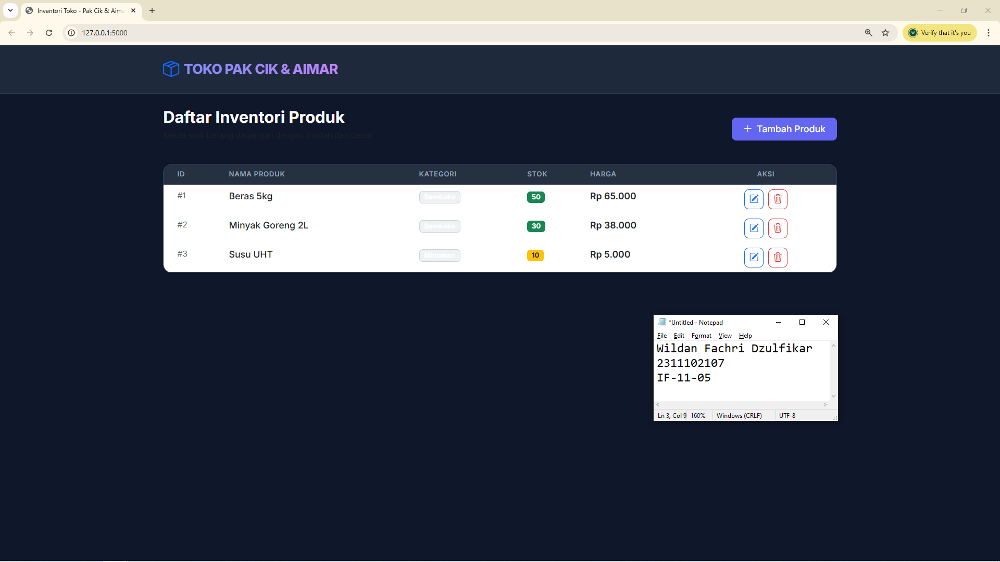
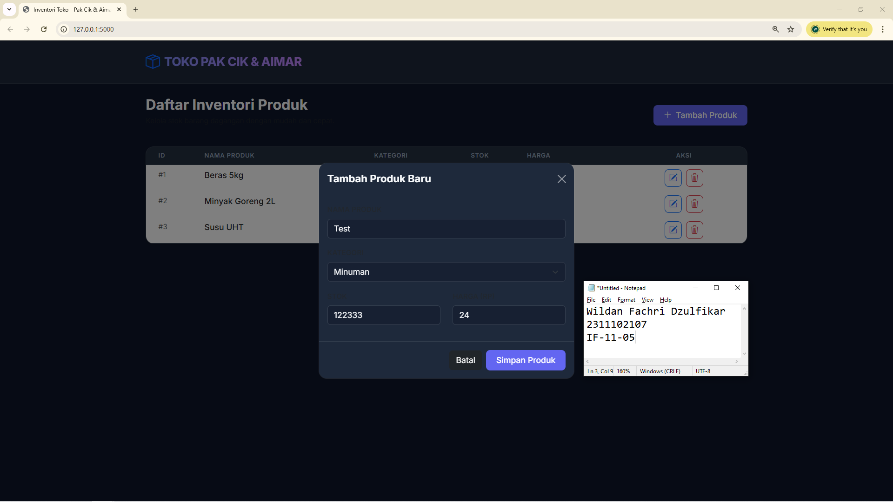

<div align="center">
  <br />
  <h1>LAPORAN PRAKTIKUM <br> APLIKASI BERBASIS PLATFORM </h1>
  <br />
  <h3>MODUL 6 <br> COTS </h3>
  <br />
  
  <br />
  <br />
  <br />
  <h3>Disusun Oleh :</h3>
  <p>
    <strong>Wildan Fachri Dzulfikar</strong>
    <br>
    <strong>2311102107</strong>
    <br>
    <strong>S1 IF-11-REG05</strong>
  </p>
  <br />
  <h3>Dosen Pengampu :</h3>
  <p>
    <strong>Dedi Agung Prabowo, S.Kom., M.Kom</strong>
  </p>
  <br />
  <br />
  <h4>Asisten Praktikum :</h4>
  <strong>Apri Pandu Wicaksono </strong>
  <br>
  <strong>Hamka Zaenul Ardi</strong>
  <br />
  <h3>LABORATORIUM HIGH PERFORMANCE <br>FAKULTAS INFORMATIKA <br>UNIVERSITAS TELKOM PURWOKERTO <br>2026 </h3>
</div>

<hr>

## Dasar Teori COTS

Commercial Off-The-Shelf (COTS) adalah solusi perangkat lunak yang dikembangkan oleh pihak ketiga dan didistribusikan secara umum untuk memenuhi kebutuhan standar pengguna. Dalam pengembangan sistem, COTS digunakan sebagai komponen siap pakai yang dapat langsung diintegrasikan ke dalam aplikasi tanpa melalui proses perancangan dari nol. Pendekatan ini banyak digunakan dalam pengembangan perangkat lunak modern karena mampu mempercepat proses pembangunan sistem dan memanfaatkan teknologi yang sudah matang.

Dari sisi implementasi, penggunaan COTS memberikan efisiensi yang tinggi karena pengembang tidak perlu mengalokasikan sumber daya untuk membangun fitur-fitur dasar yang sudah tersedia. Selain itu, COTS biasanya memiliki dokumentasi lengkap, dukungan teknis, serta pembaruan berkala dari vendor, sehingga membantu menjaga stabilitas sistem. Namun, di balik kelebihannya, terdapat beberapa tantangan seperti keterbatasan dalam modifikasi fitur, risiko ketergantungan pada vendor, serta kemungkinan adanya fitur yang tidak sepenuhnya sesuai dengan kebutuhan pengguna.

Oleh karena itu, dalam pengembangan aplikasi, COTS umumnya digunakan sebagai pelengkap yang dikombinasikan dengan pengembangan kustom. Strategi ini memungkinkan pengembang untuk memanfaatkan keunggulan COTS dalam hal efisiensi dan kecepatan, sekaligus tetap mempertahankan fleksibilitas sistem melalui pengembangan fitur yang spesifik. Dengan pemilihan yang tepat, COTS dapat menjadi solusi yang efektif untuk meningkatkan produktivitas dan kualitas dalam proses pengembangan perangkat lunak.

### Source code 
```py
# app.py
import os

app = Flask(__name__)

# Path to the JSON data file
DATA_FILE = os.path.join(os.path.dirname(__file__), 'data', 'products.json')

def load_products():
    if not os.path.exists(DATA_FILE):
        return []
    with open(DATA_FILE, 'r') as f:
        try:
            return json.load(f)
        except json.JSONDecodeError:
            return []

def save_products(products):
    with open(DATA_FILE, 'w') as f:
        json.dump(products, f, indent=4)

@app.route('/')
def index():
    return render_template('index.html')

@app.route('/api/products', methods=['GET'])
def get_products():
    return jsonify(load_products())

@app.route('/api/products', methods=['POST'])
def add_product():
    data = request.get_json()
    products = load_products()
    
    new_id = 1
    if products:
        new_id = max(p['id'] for p in products) + 1
        
    new_product = {
        'id': new_id,
        'name': data.get('name'),
        'category': data.get('category'),
        'stock': int(data.get('stock')),
        'price': int(data.get('price'))
    }
    
    products.append(new_product)
    save_products(products)
    return jsonify({'success': True, 'product': new_product})

# Selebihnya dapat cek pada file "app.py"
```
🔗 [Klik di sini untuk membuka file `app.py`](app.py)

```html
<!DOCTYPE html>
<html lang="id">
<head>
    <meta charset="UTF-8">
    <meta name="viewport" content="width=device-width, initial-scale=1.0">
    <title>Inventori Toko - Pak Cik & Aimar</title>
    
    <!-- Bootstrap 5 CSS -->
    <link href="https://cdn.jsdelivr.net/npm/bootstrap@5.3.0/dist/css/bootstrap.min.css" rel="stylesheet">
    <!-- Google Fonts: Inter -->
    <link href="https://fonts.googleapis.com/css2?family=Inter:wght@400;500;600;700;800&display=swap" rel="stylesheet">
    <!-- Bootstrap Icons -->
    <link rel="stylesheet" href="https://cdn.jsdelivr.net/npm/bootstrap-icons@1.11.0/font/bootstrap-icons.css">
    <!-- Custom CSS -->
    <link rel="stylesheet" href="{{ url_for('static', filename='css/style.css') }}">
</head>
<body>

    <nav class="navbar navbar-dark mb-4 py-3">
        <div class="container">
            <a class="navbar-brand d-flex align-items-center" href="#">
                <i class="bi bi-box-seam me-2 fs-3 text-primary"></i>
                <span class="brand-text fs-4">TOKO PAK CIK & AIMAR</span>
            </a>
        </div>
    </nav>

    <div class="container pb-5">
        <header class="d-flex justify-content-between align-items-center mb-4">
            <div>
                <h1 class="h3 mb-1 fw-bold">Daftar Inventori Produk</h1>
                <p class="text-muted small">Kelola stok barang dagangan dengan mudah dan cepat.</p>
            </div>
            <button id="addBtn" class="btn btn-primary" data-bs-toggle="modal" data-bs-target="#modalAddProduct">
                <i class="bi bi-plus-lg me-2"></i>Tambah Produk
            </button>
        </header>

        <div class="card overflow-hidden">
            <div class="table-responsive">
                <table class="table table-hover mb-0" id="productTable">
                    <thead>
                        <tr>
                            <th class="ps-4">ID</th>
                            <th>Nama Produk</th>
                            <th>Kategori</th>
                            <th>Stok</th>
                            <th>Harga</th>
                            <th class="text-center pe-4">Aksi</th>
                        </tr>
                    </thead>
                    <tbody id="productTableBody">
                        <!-- Data akan diisi oleh jQuery -->
                    </tbody>
                </table>
            </div>
        </div>
    </div>
    <!-- Selebihnya dapat cek pada file "templates/index.html" -->
```
🔗 [Klik di sini untuk membuka file `index.html`](templates/index.html)


```js
// static/js/main.js
$(document).ready(function() {
    // Initial fetch of products
    fetchProducts();

    // Manual trigger for Add Product modal (fallback)
    $('#addBtn').on('click', function() {
        $('#modalAddProduct').modal('show');
    });

    // Variable to store ID for deletion
    let deleteId = null;

    // --- CRUD: READ ---
    function fetchProducts() {
        $.ajax({
            url: '/api/products',
            method: 'GET',
            success: function(products) {
                renderTable(products);
            },
            error: function(err) {
                console.error('Error fetching products:', err);
                alert('Gagal mengambil data produk.');
            }
        });
    }

    function renderTable(products) {
        const $tbody = $('#productTableBody');
        $tbody.empty();

        if (products.length === 0) {
            $tbody.append('<tr><td colspan="6" class="text-center py-4 text-muted small">Belum ada produk. Klik "Tambah Produk" untuk memulai.</td></tr>');
            return;
        }

        products.forEach(product => {
            const priceFormatted = new Intl.NumberFormat('id-ID', { style: 'currency', currency: 'IDR', minimumFractionDigits: 0 }).format(product.price);
            const stockBadge = product.stock <= 5 ? 'bg-danger' : 
                               product.stock <= 20 ? 'bg-warning text-dark' : 'bg-success';

            const row = `
                <tr data-id="${product.id}">
                    <td class="ps-4 text-muted small">#${product.id}</td>
                    <td class="fw-medium">${product.name}</td>
                    <td><span class="badge bg-secondary bg-opacity-10 text-main border border-secondary border-opacity-25 small">${product.category}</span></td>
                    <td><span class="badge ${stockBadge} badge-stock">${product.stock}</span></td>
                    <td class="fw-semibold">${priceFormatted}</td>
                    <td class="text-center pe-4">
                        <div class="d-flex justify-content-center gap-2">
                            <button class="btn btn-icon btn-outline-primary edit-btn" data-id="${product.id}" title="Edit">
                                <i class="bi bi-pencil-square"></i>
                            </button>
                            <button class="btn btn-icon btn-outline-danger delete-btn" data-id="${product.id}" data-name="${product.name}" title="Hapus">
                                <i class="bi bi-trash3"></i>
                            </button>
                        </div>
                    </td>
                </tr>
            `;
            $tbody.append(row);
        });
    }
        // Selebihnya dapat cek pada file "static/js/main.js"
```
🔗 [Klik di sini untuk membuka file `main.js`](static/js/main.js)

Output:




## Penjelasan
Pak Cik & Aimar yang memungkinkan pengguna mengelola data produk secara real-time melalui fitur CRUD (tambah, lihat, ubah, hapus). Sistem ini mengintegrasikan Flask sebagai backend dengan Bootstrap dan jQuery untuk menciptakan antarmuka yang modern, interaktif, dan responsif.
