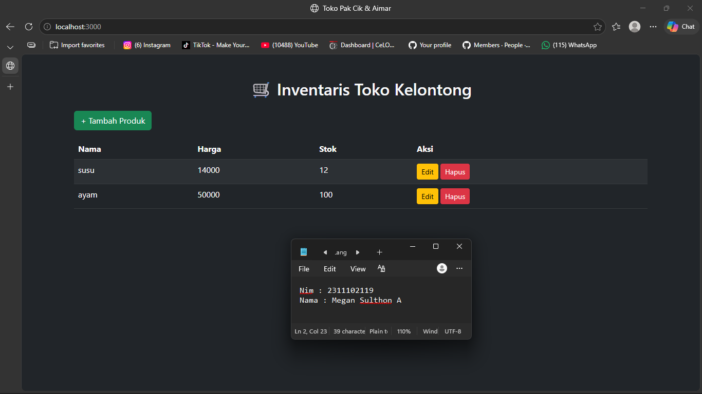

<div align="center">
  <br />
  <h1>LAPORAN PRAKTIKUM <br> APLIKASI BERBASIS PLATFORM </h1>
  <br />
  <h3>MODUL 6 <br> Coding on the Spot 1 </h3>
  <br />
  
  <br />
  <br />
  <br />
  <h3>Disusun Oleh :</h3>
  <p>
    <strong>Megan Sulthon Aryomukti</strong>
    <br>
    <strong>2311102119</strong>
    <br>
    <strong>S1 IF-11-REG05</strong>
  </p>
  <br />
  <h3>Dosen Pengampu :</h3>
  <p>
    <strong>Dedi Agung Prabowo, S.Kom., M.Kom</strong>
  </p>
  <br />
  <br />
  <h4>Asisten Praktikum :</h4>
  <strong>Apri Pandu Wicaksono </strong>
  <br>
  <strong>Hamka Zaenul Ardi</strong>
  <br />
  <h3>LABORATORIUM HIGH PERFORMANCE <br>FAKULTAS INFORMATIKA <br>UNIVERSITAS TELKOM PURWOKERTO <br>2026 </h3>
</div>

<hr>

# Dasar Teori Javascript & JQUERY

1. Pengertian JavaScript  
JavaScript adalah bahasa pemrograman yang digunakan untuk membuat halaman web lebih interaktif dan dinamis. Dalam project ini, JavaScript digunakan bersama Node.js dan Express untuk menangani proses backend serta interaksi data inventori.

2. Fungsi dan Kegunaan JavaScript

JavaScript memiliki beberapa fungsi utama dalam pengembangan web, antara lain:

- Mengelola logika backend menggunakan Node.js
- Menangani request dan response melalui Express.js
- Menghubungkan frontend dengan file data JSON
- Menampilkan data inventori secara dinamis pada browser
- Mendukung fitur CRUD sederhana

3. Pengertian jQuery

Pada modul ini, konsep manipulasi DOM dan interaktivitas frontend diterapkan melalui JavaScript yang ditanam langsung pada halaman HTML. Prinsipnya tetap sama seperti penggunaan jQuery, yaitu mempermudah pengelolaan elemen halaman dan event pengguna.

4. Konsep Dasar Penggunaan

Dalam penggunaannya:

- Backend dijalankan menggunakan `Express.js`
- Data disimpan pada file `data.json`
- Tampilan utama berada pada `public/index.html`
- Output aplikasi menampilkan daftar data inventori berbasis web

### Source code 
```js
// server.js
const express = require('express');
const fs = require('fs');
const path = require('path');

const app = express();
app.use(express.json());
app.use(express.static('public'));

// membaca data dari data.json
// endpoint CRUD inventori
// selebihnya dapat dicek pada file "server.js"
```
🔗 [Klik di sini untuk membuka file `server.js`](server.js)

```html
<!DOCTYPE html>
<html lang="id">
<head>
    <meta charset="UTF-8">
    <meta name="viewport" content="width=device-width, initial-scale=1.0">
    <title>Aplikasi Inventori Barang</title>
</head>
<body>
    <h1>Daftar Inventori Barang</h1>
    <!-- tabel data barang -->
    <!-- form tambah/edit barang -->
    <!-- selebihnya dapat cek pada file "public/index.html" -->
</body>
</html>
```
🔗 [Klik di sini untuk membuka file `index.html`](public/index.html)

```json
[
  {
    "id": 1,
    "nama": "Contoh Barang",
    "stok": 10,
    "harga": 50000
  }
]
```
🔗 [Klik di sini untuk membuka file `data.json`](data.json)

Output:


## Penjelasan
Aplikasi ini merupakan sistem inventori barang berbasis web menggunakan **Node.js, Express, dan JavaScript**. Sistem memungkinkan pengguna melihat dan mengelola data barang melalui antarmuka web sederhana. Data disimpan dalam file JSON sehingga mudah digunakan untuk simulasi CRUD dasar pada praktikum aplikasi berbasis platform.

