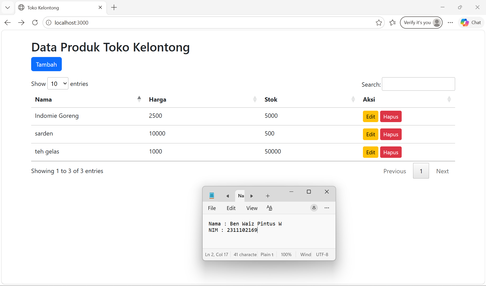
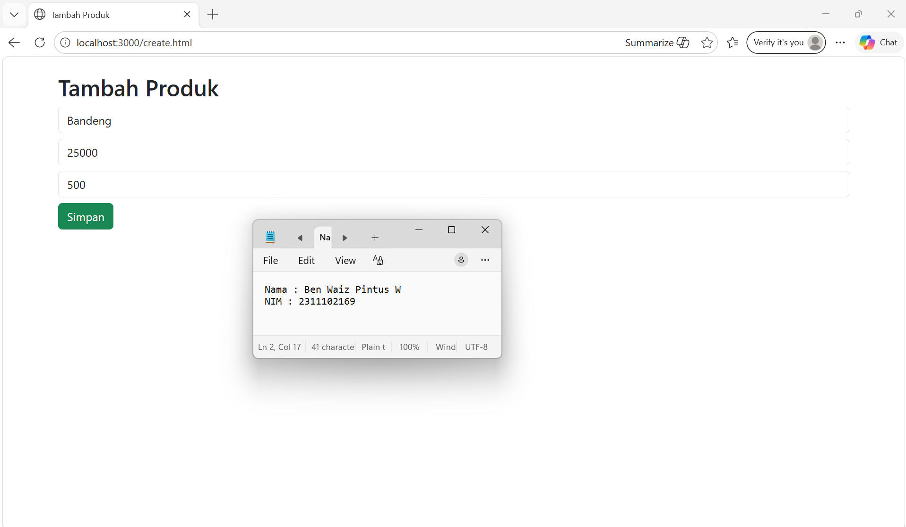
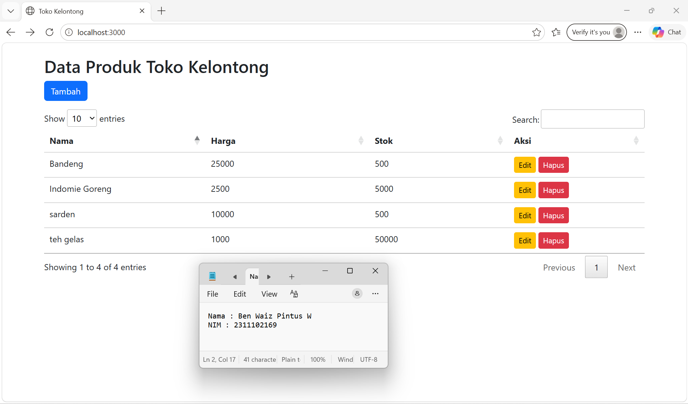
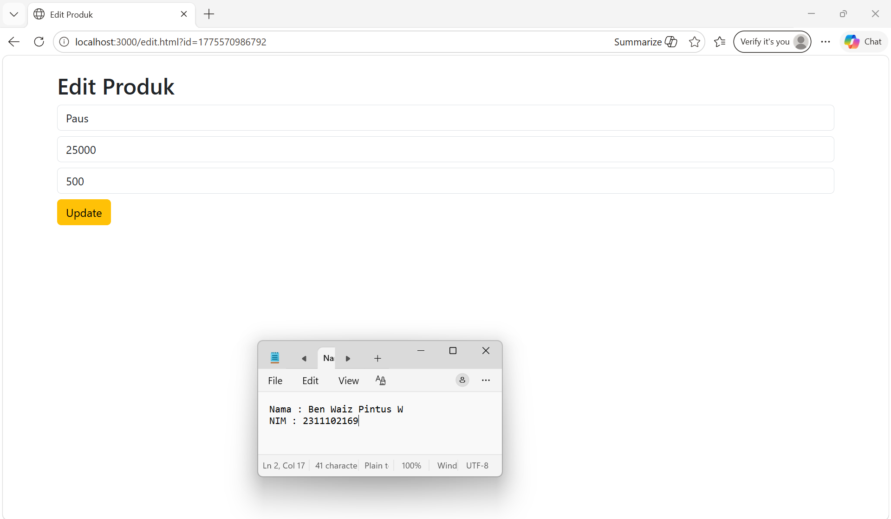
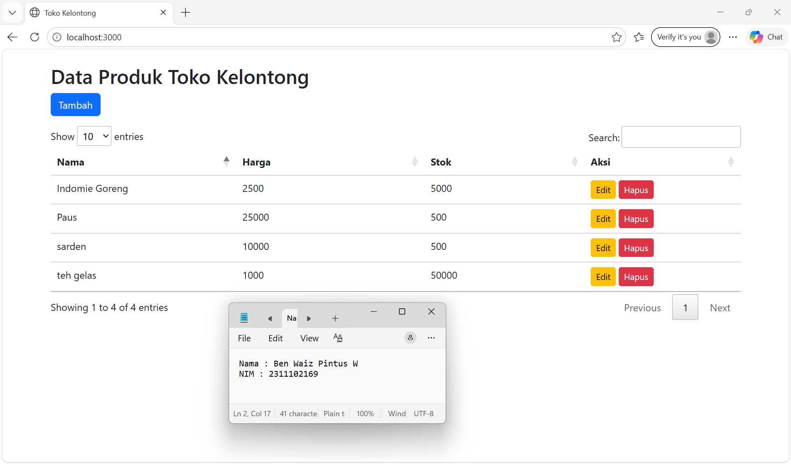
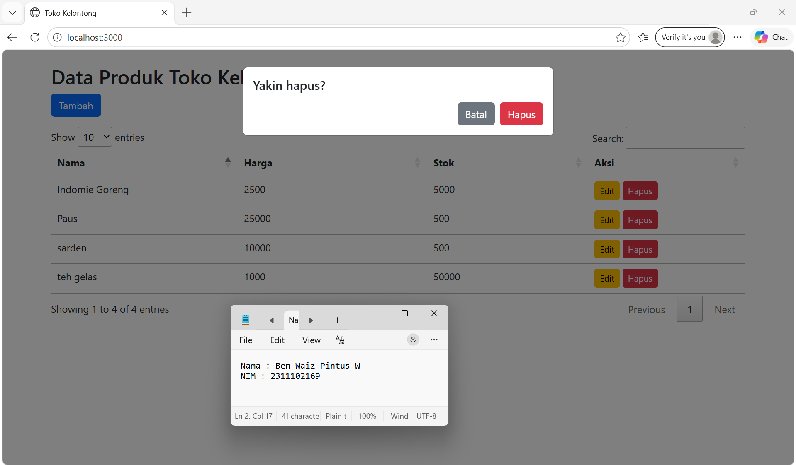
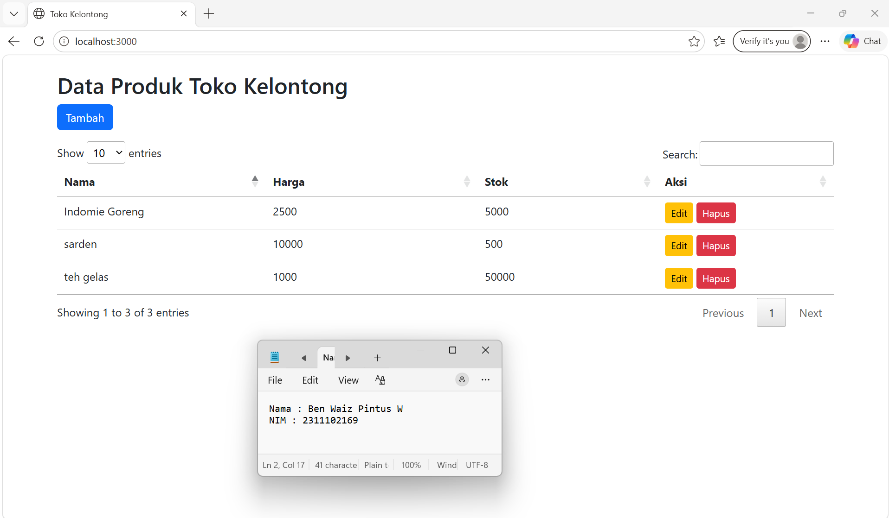

<div align="center">
  <br />
  <h1>LAPORAN PRAKTIKUM <br> APLIKASI BERBASIS PLATFORM </h1>
  <br />
  <h3>MODUL 6 <br> JAVASCRIPT & JQUERY </h3>
  <br />
  
  <br />
  <br />
  <br />
  <h3>Disusun Oleh :</h3>
  <p>
    <strong>Ben Waiz Pintus Widyosaputro</strong>
    <br>
    <strong>2311102169</strong>
    <br>
    <strong>S1 IF-11-REG05</strong>
  </p>
  <br />
  <h3>Dosen Pengampu :</h3>
  <p>
    <strong>Dedi Agung Prabowo, S.Kom., M.Kom</strong>
  </p>
  <br />
  <br />
  <h4>Asisten Praktikum :</h4>
  <strong>Apri Pandu Wicaksono </strong>
  <br>
  <strong>Hamka Zaenul Ardi</strong>
  <br />
  <h3>LABORATORIUM HIGH PERFORMANCE <br>FAKULTAS INFORMATIKA <br>UNIVERSITAS TELKOM PURWOKERTO <br>2026 </h3>
</div>

<hr>

# Dasar Teori
penggunaan JavaScript sebagai bahasa pemrograman utama yang berfungsi untuk membuat halaman web menjadi interaktif dan dinamis. JavaScript digunakan baik di sisi client (browser) maupun server melalui Node.js sebagai runtime environment. Untuk mempermudah pembuatan server dan pengelolaan request, digunakan framework Express.js yang mendukung konsep REST API dalam proses komunikasi antara client dan server melalui metode HTTP seperti GET, POST, PUT, dan DELETE. Data dalam aplikasi disimpan menggunakan format JSON yang ringan dan mudah diproses. Pada sisi antarmuka, digunakan HTML sebagai struktur halaman dan Bootstrap sebagai framework CSS untuk menghasilkan tampilan yang responsif dan menarik. Selain itu, jQuery digunakan untuk menyederhanakan manipulasi DOM, penanganan event, serta implementasi AJAX yang memungkinkan pertukaran data dengan server tanpa perlu memuat ulang halaman. Untuk meningkatkan interaktivitas dalam penyajian data, digunakan plugin DataTables yang menyediakan fitur pencarian, pengurutan, dan pagination pada tabel. Dengan dasar teori tersebut, aplikasi dapat berjalan secara efisien dalam mengelola data berbasis web.

### Source code 
```js
//app.js
const express = require('express');
const fs = require('fs');
const path = require('path');

const app = express();
app.use(express.json());
app.use(express.urlencoded({ extended: true }));

// static folder
app.use(express.static(path.join(__dirname, 'public')));

const FILE = path.join(__dirname, 'products.json');

// fungsi baca file aman
function readData() {
    try {
        const data = fs.readFileSync(FILE);
        return JSON.parse(data);
    } catch (err) {
        return [];
    }
}

// fungsi tulis file
function writeData(data) {
    fs.writeFileSync(FILE, JSON.stringify(data, null, 2));
}

// ================= CRUD =================

// READ
app.get('/api/products', (req, res) => {
    res.json(readData());
});

// CREATE
app.post('/api/products', (req, res) => {
    let data = readData();

    const newItem = {
        id: Date.now(),
        nama: req.body.nama,
        harga: req.body.harga,
        stok: req.body.stok
    };

    data.push(newItem);
    writeData(data);

    res.json({ message: "Berhasil tambah data" });
});

// UPDATE
app.put('/api/products/:id', (req, res) => {
    let data = readData();
    let id = parseInt(req.params.id);

    data = data.map(item =>
        item.id === id
            ? { ...item, ...req.body }
            : item
    );

    writeData(data);
    res.json({ message: "Berhasil update" });
});

// DELETE
app.delete('/api/products/:id', (req, res) => {
    let data = readData();
    let id = parseInt(req.params.id);

    data = data.filter(item => item.id !== id);

    writeData(data);
    res.json({ message: "Berhasil hapus" });
});

// ROOT TEST
app.get('/', (req, res) => {
    res.sendFile(path.join(__dirname, 'public/index.html'));
});

// START SERVER
app.listen(3000, () => {
    console.log("Server jalan di http://localhost:3000");
});

```

```js
//script.js
$(document).ready(function () {

    let table = $('#table').DataTable();
    let deleteId = null;

    function loadData() {
        $.get('/api/products', function(data){

            table.clear();

            data.forEach(item => {
                table.row.add([
                    item.nama,
                    item.harga,
                    item.stok,
                    `
                    <a href="edit.html?id=${item.id}" class="btn btn-warning btn-sm">Edit</a>
                    <button class="btn btn-danger btn-sm btn-delete" data-id="${item.id}">Hapus</button>
                    `
                ]);
            });

            table.draw();
        });
    }

    loadData();

    // DELETE BUTTON
    $(document).on('click', '.btn-delete', function(){
        deleteId = $(this).data('id');
        $('#deleteModal').modal('show');
    });

    // CONFIRM DELETE
    $('#confirmDelete').click(function(){
        $.ajax({
            url: '/api/products/' + deleteId,
            type: 'DELETE',
            success: function(){
                alert('Berhasil hapus');
                loadData(); // reload data TANPA refresh
            }
        });
    });

});
```

```html
<!-- index.html -->
<!DOCTYPE html>
<html>
<head>
    <title>Toko Kelontong</title>

    <link rel="stylesheet" href="https://cdn.jsdelivr.net/npm/bootstrap@5.3.0/dist/css/bootstrap.min.css">
    <link rel="stylesheet" href="https://cdn.datatables.net/1.13.4/css/jquery.dataTables.min.css">
</head>
<body class="container mt-4">

<h2>Data Produk Toko Kelontong</h2>
<a href="create.html" class="btn btn-primary mb-3">Tambah</a>

<table id="table" class="table">
    <thead>
        <tr>
            <th>Nama</th>
            <th>Harga</th>
            <th>Stok</th>
            <th>Aksi</th>
        </tr>
    </thead>
    <tbody></tbody>
</table>

<!-- Modal Delete -->
<div class="modal fade" id="deleteModal" tabindex="-1">
  <div class="modal-dialog">
    <div class="modal-content p-3">

        <h5 class="mb-3">Yakin hapus?</h5>

        <div class="d-flex justify-content-end gap-2">
            <button class="btn btn-secondary" data-bs-dismiss="modal">
                Batal
            </button>
            <button id="confirmDelete" class="btn btn-danger">
                Hapus
            </button>
        </div>

    </div>
  </div>
</div>

<!-- JS -->
<script src="https://code.jquery.com/jquery-3.6.0.min.js"></script>
<script src="https://cdn.datatables.net/1.13.4/js/jquery.dataTables.min.js"></script>

<!-- WAJIB -->
<script src="https://cdn.jsdelivr.net/npm/bootstrap@5.3.0/dist/js/bootstrap.bundle.min.js"></script>

<script src="js/script.js"></script>

</body>
</html>
```
```html
<!-- edit.html -->
<!DOCTYPE html>
<html>
<head>
    <title>Edit Produk</title>
    <link rel="stylesheet" href="https://cdn.jsdelivr.net/npm/bootstrap@5.3.0/dist/css/bootstrap.min.css">
</head>
<body class="container mt-4">

<h2>Edit Produk</h2>

<form id="formEdit">
    <input type="hidden" id="id">
    <input class="form-control mb-2" id="nama">
    <input class="form-control mb-2" id="harga">
    <input class="form-control mb-2" id="stok">

    <button class="btn btn-warning">Update</button>
</form>

<script src="https://code.jquery.com/jquery-3.6.0.min.js"></script>

<script>
const urlParams = new URLSearchParams(window.location.search);
const id = parseInt(urlParams.get('id'));

$.get('/api/products', function(data){
    let item = data.find(i => i.id === id);

    if (!item) {
        alert('Data tidak ditemukan!');
        window.location.href = '/';
        return;
    }

    $('#id').val(item.id);
    $('#nama').val(item.nama);
    $('#harga').val(item.harga);
    $('#stok').val(item.stok);
});

$('#formEdit').submit(function(e){
    e.preventDefault();

    $.ajax({
        url: '/api/products/' + id,
        type: 'PUT',
        data: JSON.stringify({
            nama: $('#nama').val(),
            harga: $('#harga').val(),
            stok: $('#stok').val()
        }),
        contentType: 'application/json',
        success: function(){
            alert('Berhasil update');
            window.location.href = '/';
        },
        error: function(err){
            console.log(err);
            alert('Gagal update');
        }
    });
});
</script>

</body>
</html>
```
```html
<!-- create.html -->
<!DOCTYPE html>
<html>
<head>
    <title>Tambah Produk</title>
    <link rel="stylesheet" href="https://cdn.jsdelivr.net/npm/bootstrap@5.3.0/dist/css/bootstrap.min.css">
</head>
<body class="container mt-4">

<h2>Tambah Produk</h2>

<form id="formCreate">
    <input class="form-control mb-2" name="nama" placeholder="Nama" required>
    <input class="form-control mb-2" name="harga" placeholder="Harga" required>
    <input class="form-control mb-2" name="stok" placeholder="Stok" required>

    <button class="btn btn-success">Simpan</button>
</form>

<script src="https://code.jquery.com/jquery-3.6.0.min.js"></script>

<script>
$('#formCreate').submit(function(e){
    e.preventDefault();

    let data = {
        nama: $('[name=nama]').val(),
        harga: $('[name=harga]').val(),
        stok: $('[name=stok]').val()
    };

    $.ajax({
        url: '/api/products',
        type: 'POST',
        data: JSON.stringify(data),
        contentType: 'application/json',
        success: function(){
            alert('Berhasil tambah');
            window.location.href = '/';
        },
        error: function(err){
            console.log(err);
            alert('Gagal tambah');
        }
    });
});
</script>

</body>
</html>
```
Output:








## Penjelasan
Kode pada aplikasi ini terdiri dari backend dan frontend yang terhubung melalui REST API. Pada backend (app.js), digunakan Express.js untuk membuat server dan menangani request CRUD (GET, POST, PUT, DELETE), sedangkan data disimpan dalam file products.json menggunakan modul fs. Di sisi frontend, halaman HTML seperti index.html, create.html, dan edit.html digunakan untuk menampilkan, menambah, dan mengubah data. jQuery digunakan untuk mengirim dan mengambil data dari server menggunakan AJAX tanpa reload halaman, sementara Bootstrap membantu tampilan menjadi lebih rapi dan responsif, serta DataTables digunakan untuk membuat tabel lebih interaktif. Dengan demikian, aplikasi dapat mengelola data produk secara dinamis dan efisien.