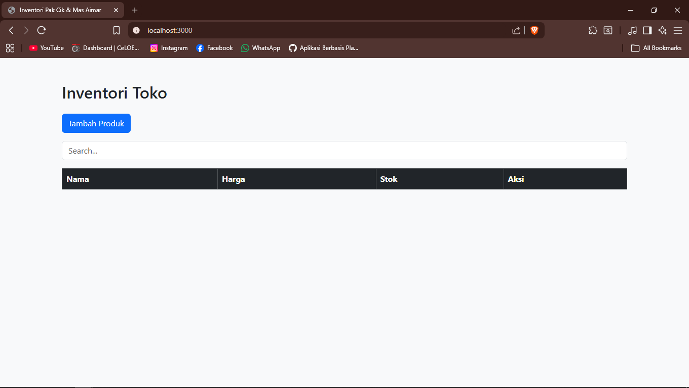
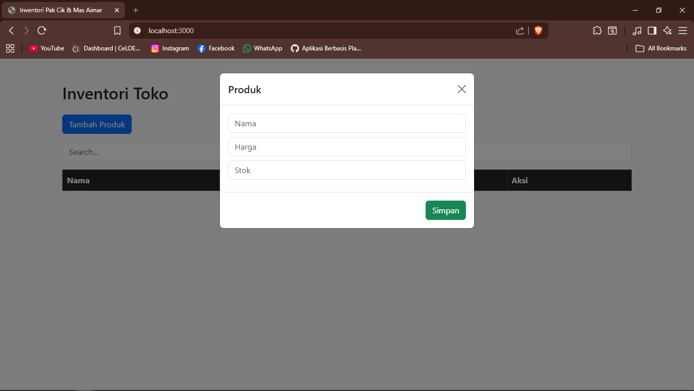
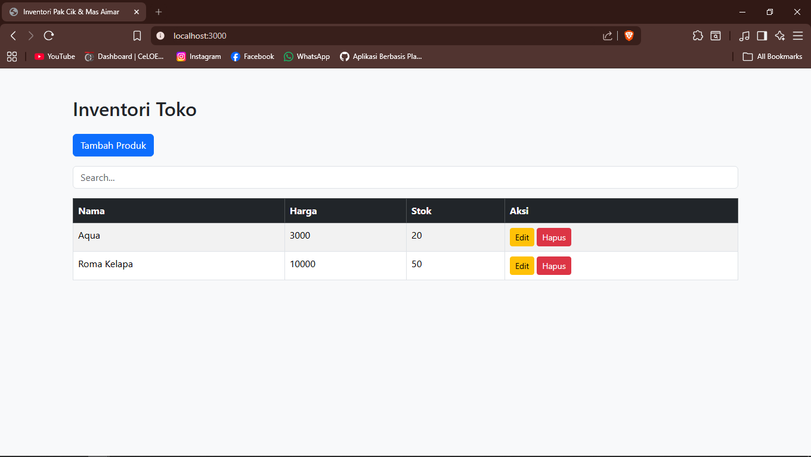
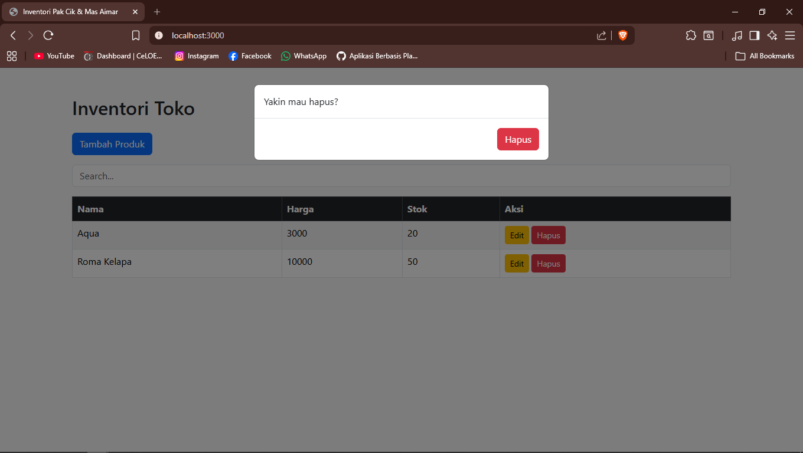

<div align="center">
  <br />
  <h1>LAPORAN PRAKTIKUM <br> APLIKASI BERBASIS PLATFORM </h1>
  <br />
  <h3>MODUL 6 <br> JAVASCRIPT & JQUERY </h3>
  <br />
  
  <br />
  <br />
  <br />
  <h3>Disusun Oleh :</h3>
  <p>
    <strong>Arya Bima</strong>
    <br>
    <strong>2311102257</strong>
    <br>
    <strong>S1 IF-11-REG05</strong>
  </p>
  <br />
  <h3>Dosen Pengampu :</h3>
  <p>
    <strong>Dedi Agung Prabowo, S.Kom., M.Kom</strong>
  </p>
  <br />
  <br />
  <h4>Asisten Praktikum :</h4>
  <strong>Apri Pandu Wicaksono </strong>
  <br>
  <strong>Hamka Zaenul Ardi</strong>
  <br />
  <h3>LABORATORIUM HIGH PERFORMANCE <br>FAKULTAS INFORMATIKA <br>UNIVERSITAS TELKOM PURWOKERTO <br>2026 </h3>
</div>

<hr>

# Dasar Teori

jQuery adalah library JavaScript yang cepat, ringan, dan kaya fitur yang dirancang untuk menyederhanakan pemrograman JavaScript di browser. Dikembangkan oleh John Resig dan pertama kali dirilis pada tahun 2006, jQuery menjadi salah satu library paling populer karena kemampuannya menangani berbagai tugas web development dengan sintaks yang pendek dan mudah dibaca. Moto utamanya adalah “Write Less, Do More”.
Fungsi utama jQuery meliputi:

Seleksi elemen DOM yang mudah menggunakan sintaks CSS-like (`$("#id")`, `$(".class")`, `$("p")`).
Manipulasi DOM (menambah, menghapus, atau mengubah konten elemen).
Penanganan Event (click, hover, submit, dll) dengan cara yang konsisten.
Efek dan Animasi (fade, slide, hide/show) tanpa menulis kode JavaScript panjang.
AJAX untuk mengambil atau mengirim data ke server tanpa me-refresh halaman.

Salah satu keunggulan besar jQuery adalah cross-browser compatibility. Di era awalnya, browser memiliki perbedaan perilaku yang signifikan, dan jQuery menyelesaikan masalah tersebut sehingga kode berjalan sama di berbagai browser. Selain itu, jQuery memiliki ekosistem plugin yang sangat luas.
Pada tahun 2026, jQuery telah merilis versi 4.0.0 — update besar pertama dalam hampir 10 tahun. Versi terbaru ini lebih modern dengan menghapus dukungan browser lama (seperti IE 10 ke bawah), meningkatkan keamanan (support Trusted Types), menggunakan ES modules, dan menjadi lebih ringan (slim build di bawah 20kB). Meskipun banyak proyek baru lebih memilih Vanilla JavaScript atau framework seperti React dan Vue.js, jQuery tetap banyak digunakan untuk memelihara sistem legacy, website sederhana, dan proyek yang membutuhkan DOM manipulation cepat tanpa kompleksitas framework modern.

---

# Tugas 6: Toko Kelontong Pak Cik dan Mas Aimar





Aplikasi web sederhana berbasis Node.js (ExpressJS) untuk mengelola inventaris produk toko.
Aplikasi ini menggunakan:

- ExpressJS sebagai backend
- jQuery untuk manipulasi DOM
- Bootstrap untuk tampilan UI
- JSON file sebagai penyimpanan data (tanpa database)

---

## Fitur Utama

- CRUD Produk (Create, Read, Update, Delete)
- Tabel produk interaktif (dengan fitur pencarian)
- Form tambah & edit produk menggunakan modal
- Konfirmasi hapus menggunakan modal
- Tampilan responsive menggunakan Bootstrap

---

## Struktur Project

```
inventory-app/
│
├── data/
│   └── products.json       # Penyimpanan data produk
│
├── public/
│   ├── js/
│   │   └── app.js          # Logic frontend (jQuery)
│   └── index.html          # Tampilan utama
│
├── routes/
│   └── products.js         # API CRUD produk
│
├── app.js                  # Server utama
└── package.json
```

---

## Penyimpanan Data

Semua data produk disimpan dalam file:

```
data/products.json
```

### Format Data Produk

```json
{
  "id": number,
  "name": string,
  "price": number,
  "stock": number
}
```

---

## API Endpoint

### 1. Ambil Semua Produk

```
GET /api/products
```

### 2. Tambah Produk

```
POST /api/products
```

Body:

```json
{
  "name": "Produk",
  "price": 10000,
  "stock": 5
}
```

---

### 3. Update Produk

```
PUT /api/products/:id
```

---

### 4. Hapus Produk

```
DELETE /api/products/:id
```

---

## Cara Menjalankan Project

### 1. Install dependency

```
npm install
```

### 2. Jalankan server

```
npm start
```

### 3. Buka di browser

```
http://localhost:3000
```

---

## 🖥️ Teknologi yang Digunakan

- Node.js
- ExpressJS
- jQuery
- Bootstrap 5
- JSON File Storage

---

#### 1. app.js

```js
const express = require("express");
const bodyParser = require("body-parser");
const path = require("path");

const app = express();
const PORT = 3000;

app.use(bodyParser.json());
app.use(express.static("public"));

const productRoutes = require("./routes/products");
app.use("/api/products", productRoutes);

app.listen(PORT, () => {
  console.log(`Server jalan di http://localhost:${PORT}`);
});
```

#### 2. data/products.json

```json
[]
```

#### 3. routes/products.js

```js
const express = require("express");
const router = express.Router();
const fs = require("fs-extra");

const FILE = "./data/products.json";

// GET all
router.get("/", async (req, res) => {
  const data = await fs.readJson(FILE);
  res.json(data);
});

// CREATE
router.post("/", async (req, res) => {
  const data = await fs.readJson(FILE);
  const newItem = {
    id: Date.now(),
    ...req.body,
  };

  data.push(newItem);
  await fs.writeJson(FILE, data);
  res.json(newItem);
});

// UPDATE
router.put("/:id", async (req, res) => {
  let data = await fs.readJson(FILE);

  data = data.map((item) =>
    item.id == req.params.id ? { ...item, ...req.body } : item,
  );

  await fs.writeJson(FILE, data);
  res.json({ message: "Updated" });
});

// DELETE
router.delete("/:id", async (req, res) => {
  let data = await fs.readJson(FILE);

  data = data.filter((item) => item.id != req.params.id);

  await fs.writeJson(FILE, data);
  res.json({ message: "Deleted" });
});

module.exports = router;
```

#### 4. public/index.html

```html
<!DOCTYPE html>
<html lang="id">
  <head>
    <meta charset="UTF-8" />
    <title>Inventori Pak Cik & Mas Aimar</title>
    <link
      href="https://cdn.jsdelivr.net/npm/bootstrap@5.3.3/dist/css/bootstrap.min.css"
      rel="stylesheet"
    />
  </head>
  <body class="bg-light">
    <div class="container py-5">
      <h2 class="mb-4">Inventori Toko</h2>

      <button class="btn btn-primary mb-3" id="addBtn">Tambah Produk</button>

      <input
        type="text"
        id="search"
        class="form-control mb-3"
        placeholder="Search..."
      />

      <table class="table table-bordered table-striped">
        <thead class="table-dark">
          <tr>
            <th>Nama</th>
            <th>Harga</th>
            <th>Stok</th>
            <th>Aksi</th>
          </tr>
        </thead>
        <tbody id="productTable"></tbody>
      </table>
    </div>

    <!-- MODAL FORM -->
    <div class="modal fade" id="productModal">
      <div class="modal-dialog">
        <div class="modal-content">
          <div class="modal-header">
            <h5 class="modal-title">Produk</h5>
            <button class="btn-close" data-bs-dismiss="modal"></button>
          </div>

          <div class="modal-body">
            <input type="hidden" id="id" />
            <input
              type="text"
              id="name"
              class="form-control mb-2"
              placeholder="Nama"
            />
            <input
              type="number"
              id="price"
              class="form-control mb-2"
              placeholder="Harga"
            />
            <input
              type="number"
              id="stock"
              class="form-control mb-2"
              placeholder="Stok"
            />
          </div>

          <div class="modal-footer">
            <button class="btn btn-success" id="saveBtn">Simpan</button>
          </div>
        </div>
      </div>
    </div>

    <!-- MODAL DELETE -->
    <div class="modal fade" id="deleteModal">
      <div class="modal-dialog">
        <div class="modal-content">
          <div class="modal-body">Yakin mau hapus?</div>
          <div class="modal-footer">
            <button class="btn btn-danger" id="confirmDelete">Hapus</button>
          </div>
        </div>
      </div>
    </div>

    <script src="https://code.jquery.com/jquery-3.7.1.min.js"></script>
    <script src="https://cdn.jsdelivr.net/npm/bootstrap@5.3.3/dist/js/bootstrap.bundle.min.js"></script>
    <script src="js/app.js"></script>
  </body>
</html>
```

#### 5. public/js/app.js

```js
let selectedId = null;

function loadData() {
  $.get("/api/products", function (data) {
    let html = "";

    data.forEach((p) => {
      html += `
        <tr>
          <td>${p.name}</td>
          <td>${p.price}</td>
          <td>${p.stock}</td>
          <td>
            <button class="btn btn-warning btn-sm edit" data-id="${p.id}">Edit</button>
            <button class="btn btn-danger btn-sm delete" data-id="${p.id}">Hapus</button>
          </td>
        </tr>
      `;
    });

    $("#productTable").html(html);
  });
}

// CREATE / UPDATE
$("#saveBtn").click(function () {
  const id = $("#id").val();

  const data = {
    name: $("#name").val(),
    price: $("#price").val(),
    stock: $("#stock").val(),
  };

  if (id) {
    $.ajax({
      url: `/api/products/${id}`,
      method: "PUT",
      contentType: "application/json",
      data: JSON.stringify(data),
      success: () => location.reload(),
    });
  } else {
    $.ajax({
      url: "/api/products",
      method: "POST",
      contentType: "application/json",
      data: JSON.stringify(data),
      success: () => location.reload(),
    });
  }
});

// OPEN CREATE
$("#addBtn").click(function () {
  $("#id").val("");
  $("#productModal").modal("show");
});

// EDIT
$(document).on("click", ".edit", function () {
  selectedId = $(this).data("id");

  $.get("/api/products", function (data) {
    const item = data.find((p) => p.id == selectedId);

    $("#id").val(item.id);
    $("#name").val(item.name);
    $("#price").val(item.price);
    $("#stock").val(item.stock);

    $("#productModal").modal("show");
  });
});

// DELETE
$(document).on("click", ".delete", function () {
  selectedId = $(this).data("id");
  $("#deleteModal").modal("show");
});

$("#confirmDelete").click(function () {
  $.ajax({
    url: `/api/products/${selectedId}`,
    method: "DELETE",
    success: () => location.reload(),
  });
});

// SEARCH
$("#search").on("keyup", function () {
  const value = $(this).val().toLowerCase();

  $("#productTable tr").filter(function () {
    $(this).toggle($(this).text().toLowerCase().indexOf(value) > -1);
  });
});

// INIT
loadData();
```
