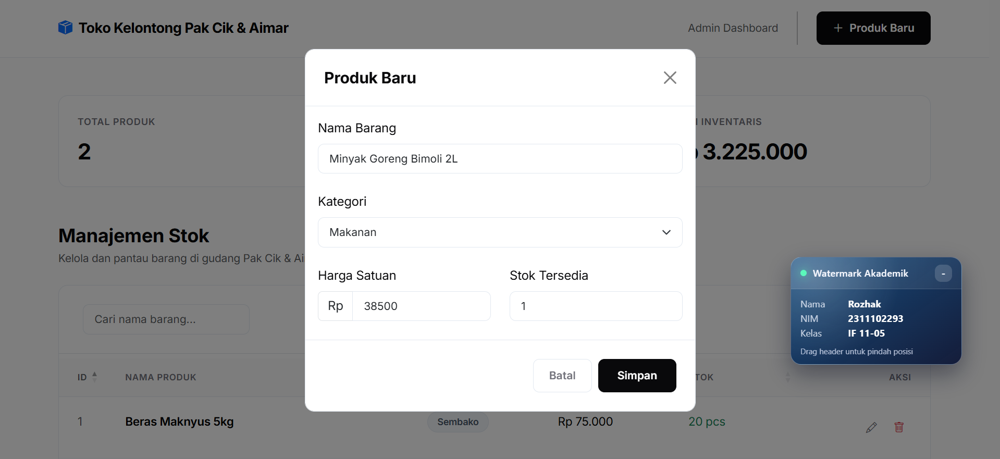
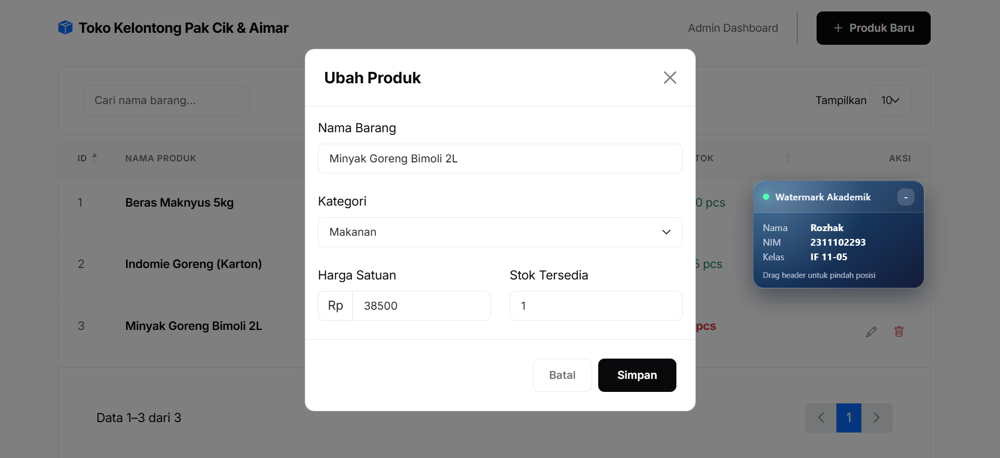
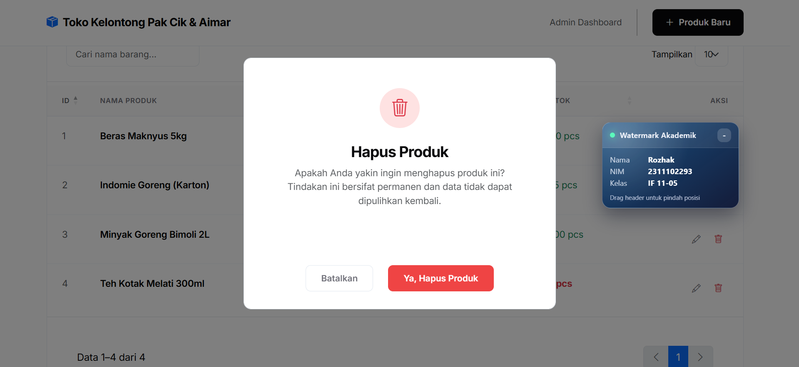

# Toko Kelontong Pak Cik & Aimar

Aplikasi inventaris berbasis web untuk mengelola data produk toko secara sederhana, cepat, dan terstruktur.  
Proyek ini dibangun menggunakan **Express.js**, **jQuery**, **Bootstrap 5**, dan **DataTables**, dengan data disimpan pada file **JSON**.

## Deskripsi Proyek

Proyek ini merupakan implementasi CRUD inventaris untuk kebutuhan praktikum Modul 7.  
Fokus utama aplikasi adalah pengelolaan produk toko melalui antarmuka tabel interaktif, form tambah dan ubah data, serta modal konfirmasi hapus.

## Fitur Utama

- Menampilkan daftar produk dalam bentuk tabel interaktif.
- Menambah data produk baru.
- Mengubah data produk yang sudah ada.
- Menghapus data produk dengan konfirmasi.
- Menampilkan statistik ringkas inventaris.
- Menyimpan data ke file JSON, tanpa database.

## Teknologi yang Digunakan

- **Backend**: Node.js, Express.js, CORS
- **Frontend**: HTML, CSS, Bootstrap 5, jQuery
- **Tabel Interaktif**: DataTables
- **Penyimpanan Data**: JSON file

## Struktur Folder

```text
public/       # Frontend (HTML, CSS, JS)
src/          # Backend (Express, controller, route, config)
data/         # Penyimpanan JSON
package.json
README.md
```

## Instalasi

1. Pastikan seluruh file proyek sudah tersedia di komputer lokal.

2. Install dependency
   
   ```bash
   npm install
   ```

3. Jalankan mode development:
   
   ```bash
   npm run dev
   ```

4. Jalankan mode production:
   
   ```bash
   npm start
   ```

5. Setelah server berjalan, buka aplikasi melalui:
   
   ```text
   http://localhost:3000/
   ```

## REST API

Base URL:

```text
/api/products
```

| Method | Endpoint | Deskripsi                | Body Request                         |
| ------ | -------- | ------------------------ | ------------------------------------ |
| GET    | `/`      | Mengambil seluruh produk | -                                    |
| POST   | `/`      | Menambahkan produk baru  | `name`, `category`, `price`, `stock` |
| PUT    | `/:id`   | Memperbarui data produk  | `name`, `category`, `price`, `stock` |
| DELETE | `/:id`   | Menghapus data produk    | -                                    |

### Contoh Body Request

```json
{
  "name": "Beras Maknyus 5kg",
  "category": "Sembako",
  "price": 75000,
  "stock": 20
}
```

## Format Respons

### Respons sukses

```json
{
  "status": "success",
  "message": "Produk berhasil ditambahkan",
  "data": {}
}
```

### Respons gagal

```json
{
  "status": "error",
  "message": "Produk tidak ditemukan"
}
```

## Catatan Implementasi

- Frontend dan backend berjalan dalam satu server Express.
- Seluruh data CRUD disimpan langsung ke file JSON.
- Tampilan antarmuka menggunakan Bootstrap dan DataTables untuk menjaga pengalaman penggunaan tetap rapi dan konsisten.
- Aplikasi tidak menggunakan database relasional.

## Dokumentasi Gambar

Folder: `docs/screenshots/`

| Preview | Preview |
|---------|------------|
|  |  |
|  |  |

## Keterangan Proyek

- **Nama Proyek**: Toko Kelontong Pak Cik & Aimar
- **Author**: Rozhak
- **NIM**: 2311102293

## Lisensi

Proyek ini menggunakan ketentuan lisensi yang tercantum pada file [`LICENSE`](./LICENSE).