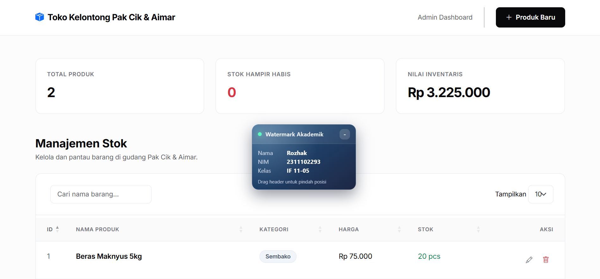

     
    <h1>LAPORAN PRAKTIKUM   APLIKASI BERBASIS PLATFORM </h1>
     
    <h3>MODUL 7   CODING ON THE SPOT 1 </h3>
     
    
     
     
     
    <h3>Disusun Oleh :</h3>
    

        <strong>Rozhak</strong>
         
        <strong>2311102293</strong>
         
        <strong>S1 IF-11-REG05</strong>
    

     
    <h3>Dosen Pengampu :</h3>
    

        <strong>Dedi Agung Prabowo, S.Kom., M.Kom</strong>
    

     
     
    <h4>Asisten Praktikum :</h4>
    <strong>Apri Pandu Wicaksono </strong>
     
    <strong>Hamka Zaenul Ardi</strong>
     
    <h3>LABORATORIUM HIGH PERFORMANCE  FAKULTAS INFORMATIKA  UNIVERSITAS TELKOM PURWOKERTO  2026 </h3>

## Dasar Teori

Pengembangan aplikasi web modern bertumpu pada arsitektur _Client-Server_ yang memisahkan logika antarmuka pengguna (_frontend_) dari sistem pemrosesan data (_backend_). Pada sisi _backend_, Express.js berperan sebagai kerangka kerja web minimalis dan fleksibel untuk Node.js yang sangat ideal dalam membangun antarmuka pemrograman aplikasi (API) berarsitektur _Representational State Transfer_ (REST). Express.js memfasilitasi penanganan rute HTTP dan _middleware_ secara terstruktur. Sebagai media penyimpanan persisten yang ringan, format _JavaScript Object Notion_ (JSON) dimanfaatkan untuk menggantikan sistem basis data relasional. Pendekatan ini sangat efisien untuk tahapan purwarupa atau aplikasi berskala kecil karena operasi _Input/Ouput_ (I/O) dapat langsung dilakukan melalui sistem berkas (_file system_).

Pada sisi _frontend_, kerangka kerja Bootstrap diimplementasikan untuk merancang anrarmuka yang responsif, modular, dan konsisten di berbagai ukuran layar melalui sistem _grid_ dan komponen antarmuka siap pakai seperti formulir dan _modal_. Untuk menciptakan interaktivitas yang dinamis tanpa perlu memuat ulang keseluruhan halaman, pustaka JQuery digunakan untuk memanipulasi _Document Object Model_ (DOM) dan menangani komunikasi data asinkron (AJAX) dengan peladen. Fungsionalitas penyajian data kemudian disempurnakan menggunakan _plugin_ DataTables dari jQuery, yang memberikan fitur bawaan tingkat lanjut langsung di sisi perambanan klien.

## Penjelasan Source Code

Aplikasi inventaris toko kelontong ini diimplementasikan menggunakan pola arsitektur _Model-View-Control_ (MVC) sederhana untuk memisahkan antara logika penyimpanan, pengelolaan bisnis, dan antarmuka interaksi pengguna secara modular.

### 1. Implementasi Backend dan Penyimpanan Data

Sisi peladen dibangun menggunakan Node.js dan Express.js yang dipecah ke dalam beberapa modul spesifik. Operasi penyimpanan data difokuskan pada modul konfigurasi `fileDb.js` yang memanfaatkan modul bawaan `fs` untuk membaca dan menulis berkas `products.json`. Logika pemrosesan bisnis dikelola di dalam `productController.js` yang membuat sekumpulan fungsi untuk menangani operasi penambahan, pembacaan, pembaruan, dan penghapusan data (CRUD).

Ketika fungsi ini menerima data masukan dari klien, sistem akan memvalidasi _payload_ tersebut, melakukan mutasi terhadap struktur larik (_array_) produk, dan menyimpannya kembali ke dalam berkas JSON.

Pemanggilan fungsi-fungsi kontroler ini diatur oleh modul sistem perutean (`productRoutes.js`) yang memetakan setiap aksi HTTP (GET, POST, PUT, DELETE) ke _endpoint_ antarmuka program aplikasi (API) `/api/products`. Seluruh modul tersebut kemudian digabungkan ke dalam konfigurasi utama pada berkas `server.js` yang juga memuat pengaturan _Cross-Origin Resource Sharing_ (CORS) agar API dapat diakses dengan aman oleh sisi klien.

### 2. Implementasi Frontend dan Interaktivitas

Antarmuka pengguna direpresentasikan melalui berkas tunggal HTML yang diintegrasikan dengan _stylesheet_ Bootstrap 5. Konfigurasi ini menghasilkan tata letah halaman yang bersih (_clean design_) dengan komponen interaktif utama berupa tabel data dan formulir _modal_ mengambang. Komunikasi antara perambanan dan peladen diatur sepenuhnya melalui skrip jQuery. Saat halaman pertama kali dimuat, fungsi inisialisasi AJAX mengirimkan permintaan GET ke _endpoint_ API untuk mengambil data JSON produk dan menyuapkannya langsung ke instansi DataTables. Proses penambahan dan pengubahan data ditangani oleh kejadian pendengar (_event listener_) yang akan mencegat perilaku pengiriman bawaan formulir, mengonversi masukan pengguna menjadi format objek, dan mengirimkannya melalui permintaan AJAX (POST/PUT). Jika peladen merespons dengan status keberhasilan, antarmuka akan secara otomatis menutup _modal_, menampilkan notifikasi visual berbasis komponen _Toast_, dan memuat ulang tabel data secara asinkron untuk memastikan status inventaris selalu sinkron dengan basis data.

## Output

## Kesimpulan

Praktikum implementasi _Coding on the Spot_ (COTS) Modul 7 membuktikan bahwa integrasi antara Node.js, Express.js, Bootstrap, dan jQuery mampu menghasilkan arsitektur aplikasi web yang tangguh dan interaktif. Penggunaan kerangka kerja pada sisi peladen menyederhanakan pembuatan layanan REST API, sementara pemanfaatan plugin antarmuka pada sisi klien secara signifikan meningkatkan pengalaman pengguna dalam melakukan operasi CRUD tanpa perlu melakukan konfigurasi basis data relasional yang rumit.