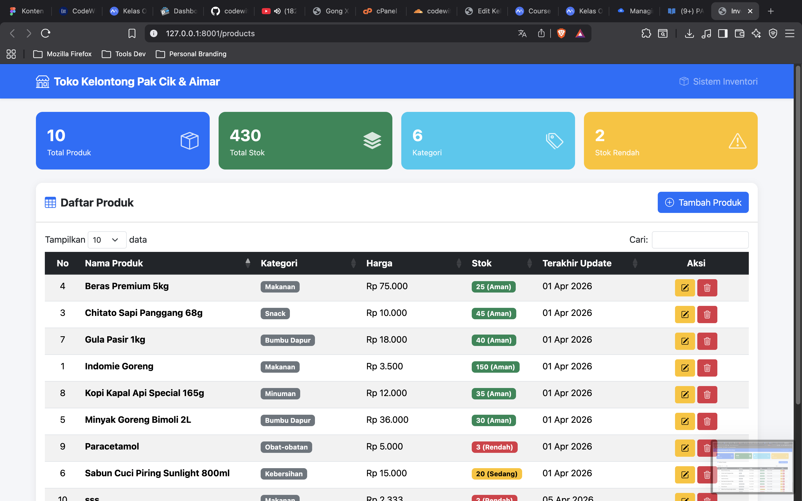

<div align="center">
  <br />
  <h1>LAPORAN PRAKTIKUM <br> APLIKASI BERBASIS PLATFORM </h1>
  <br />
  <h3>MODUL 6 <br> JAVASCRIPT & JQUERY </h3>
  <br />
  
  <br />
  <br />
  <br />
  <h3>Disusun Oleh :</h3>
  <p>
    <strong>Muhamad Rafli Al Farizqi</strong>
    <br>
    <strong>2311102315</strong>
    <br>
    <strong>S1 IF-11-REG05</strong>
  </p>
  <br />
  <h3>Dosen Pengampu :</h3>
  <p>
    <strong>Dedi Agung Prabowo, S.Kom., M.Kom</strong>
  </p>
  <br />
  <br />
  <h4>Asisten Praktikum :</h4>
  <strong>Apri Pandu Wicaksono </strong>
  <br>
  <strong>Hamka Zaenul Ardi</strong>
  <br />
  <h3>LABORATORIUM HIGH PERFORMANCE <br>FAKULTAS INFORMATIKA <br>UNIVERSITAS TELKOM PURWOKERTO <br>2026 </h3>
</div>

<hr>

# Dasar Teori

JavaScript merupakan bahasa pemrograman yang digunakan untuk membuat halaman web menjadi interaktif dan dinamis. Dengan JavaScript, pengguna dapat melakukan manipulasi terhadap elemen halaman melalui DOM (Document Object Model), seperti menampilkan data, menangani input pengguna, serta mengubah tampilan secara langsung tanpa perlu melakukan reload halaman.

jQuery adalah library JavaScript yang mempermudah proses manipulasi DOM, event handling, dan komunikasi dengan server menggunakan AJAX. Dengan sintaks yang lebih sederhana, jQuery memungkinkan pengembangan fitur interaktif seperti pengambilan data, penambahan data, pengeditan, dan penghapusan data (CRUD) secara lebih efisien.

Bootstrap merupakan framework CSS yang digunakan untuk membangun tampilan web yang responsif dan modern. Bootstrap menyediakan berbagai komponen siap pakai seperti tombol, tabel, card, dan modal, sehingga mempermudah pembuatan antarmuka yang rapi tanpa harus menulis CSS secara manual.

Laravel adalah framework PHP yang mengikuti arsitektur MVC (Model-View-Controller) dan menyediakan berbagai fitur bawaan seperti routing, validasi, Blade templating engine, serta manajemen file melalui Storage facade. Dalam praktikum ini, Laravel digunakan sebagai backend untuk menangani request dari client seperti mengambil data (GET), menambah data (POST), mengubah data (PUT), dan menghapus data (DELETE). Data disimpan dalam bentuk file JSON sehingga tidak memerlukan database.

DataTables adalah plugin jQuery yang digunakan untuk membuat tabel HTML menjadi interaktif dengan fitur pencarian, sorting, dan pagination secara otomatis. DataTables dapat terintegrasi dengan Bootstrap untuk menghasilkan tampilan tabel yang modern dan responsif.

Konsep CRUD (Create, Read, Update, Delete) merupakan dasar dalam pengelolaan data pada aplikasi. Pada praktikum ini, CRUD diimplementasikan dengan jQuery sebagai penghubung antara frontend dan backend melalui AJAX, serta Laravel sebagai server yang mengelola data JSON.

# Tugas 6
## 1. Source Kode ProductController.php

```php
<?php

namespace App\Http\Controllers;

use Illuminate\Http\Request;
use Illuminate\Support\Facades\Storage;

class ProductController extends Controller
{
    private string $jsonFile = 'products.json';

    /**
     * Membaca semua data produk dari file JSON.
     */
    private function readProducts(): array
    {
        if (!Storage::exists($this->jsonFile)) {
            Storage::put($this->jsonFile, json_encode([]));
            return [];
        }

        $content = Storage::get($this->jsonFile);
        return json_decode($content, true) ?? [];
    }

    /**
     * Menyimpan data produk ke file JSON.
     */
    private function saveProducts(array $products): void
    {
        Storage::put($this->jsonFile, json_encode(array_values($products), JSON_PRETTY_PRINT));
    }

    /**
     * Generate ID unik untuk produk baru.
     */
    private function generateId(array $products): int
    {
        if (empty($products)) {
            return 1;
        }
        return max(array_column($products, 'id')) + 1;
    }

    /**
     * Halaman utama - menampilkan daftar produk.
     */
    public function index()
    {
        return view('products.index');
    }

    /**
     * API: Mengambil semua data produk (untuk DataTables).
     */
    public function data()
    {
        $products = $this->readProducts();
        return response()->json(['data' => $products]);
    }

    /**
     * API: Menyimpan produk baru.
     */
    public function store(Request $request)
    {
        $request->validate([
            'nama_produk' => 'required|string|max:255',
            'kategori'    => 'required|string|max:100',
            'harga'       => 'required|numeric|min:0',
            'stok'        => 'required|integer|min:0',
        ]);

        $products = $this->readProducts();

        $product = [
            'id'          => $this->generateId($products),
            'nama_produk' => $request->nama_produk,
            'kategori'    => $request->kategori,
            'harga'       => (float) $request->harga,
            'stok'        => (int) $request->stok,
            'created_at'  => now()->toDateTimeString(),
            'updated_at'  => now()->toDateTimeString(),
        ];

        $products[] = $product;
        $this->saveProducts($products);

        return response()->json([
            'success' => true,
            'message' => 'Produk berhasil ditambahkan!',
            'data'    => $product,
        ]);
    }

    /**
     * API: Mengambil data satu produk berdasarkan ID.
     */
    public function show(int $id)
    {
        $products = $this->readProducts();
        $product = collect($products)->firstWhere('id', $id);

        if (!$product) {
            return response()->json(['success' => false, 'message' => 'Produk tidak ditemukan.'], 404);
        }

        return response()->json(['success' => true, 'data' => $product]);
    }

    /**
     * API: Mengupdate data produk.
     */
    public function update(Request $request, int $id)
    {
        $request->validate([
            'nama_produk' => 'required|string|max:255',
            'kategori'    => 'required|string|max:100',
            'harga'       => 'required|numeric|min:0',
            'stok'        => 'required|integer|min:0',
        ]);

        $products = $this->readProducts();
        $index = collect($products)->search(fn($p) => $p['id'] === $id);

        if ($index === false) {
            return response()->json(['success' => false, 'message' => 'Produk tidak ditemukan.'], 404);
        }

        $products[$index] = array_merge($products[$index], [
            'nama_produk' => $request->nama_produk,
            'kategori'    => $request->kategori,
            'harga'       => (float) $request->harga,
            'stok'        => (int) $request->stok,
            'updated_at'  => now()->toDateTimeString(),
        ]);

        $this->saveProducts($products);

        return response()->json([
            'success' => true,
            'message' => 'Produk berhasil diperbarui!',
            'data'    => $products[$index],
        ]);
    }

    /**
     * API: Menghapus produk.
     */
    public function destroy(int $id)
    {
        $products = $this->readProducts();
        $index = collect($products)->search(fn($p) => $p['id'] === $id);

        if ($index === false) {
            return response()->json(['success' => false, 'message' => 'Produk tidak ditemukan.'], 404);
        }

        $deletedProduct = $products[$index];
        unset($products[$index]);
        $this->saveProducts($products);

        return response()->json([
            'success' => true,
            'message' => 'Produk "' . $deletedProduct['nama_produk'] . '" berhasil dihapus!',
        ]);
    }
}
```

## 2. Source Kode index.blade.php

```html
<!DOCTYPE html>
<html lang="id">
<head>
    <meta charset="UTF-8">
    <meta name="viewport" content="width=device-width, initial-scale=1.0">
    <meta name="csrf-token" content="{{ csrf_token() }}">
    <title>Inventori Toko Kelontong - Pak Cik & Aimar</title>

    <!-- Bootstrap 5 CSS -->
    <link href="https://cdn.jsdelivr.net/npm/bootstrap@5.3.3/dist/css/bootstrap.min.css" rel="stylesheet">
    <!-- DataTables CSS -->
    <link href="https://cdn.datatables.net/1.13.8/css/dataTables.bootstrap5.min.css" rel="stylesheet">
    <!-- Bootstrap Icons -->
    <link href="https://cdn.jsdelivr.net/npm/bootstrap-icons@1.11.3/font/bootstrap-icons.min.css" rel="stylesheet">

    <style>
        body {
            background-color: #f4f6f9;
        }
        .navbar-brand img {
            width: 40px;
            height: 40px;
        }
        .card {
            border: none;
            border-radius: 12px;
            box-shadow: 0 2px 12px rgba(0,0,0,0.08);
        }
        .card-header {
            border-radius: 12px 12px 0 0 !important;
        }
        .btn-action {
            padding: 4px 10px;
            font-size: 14px;
        }
        .badge-stok-rendah {
            background-color: #dc3545;
        }
        .badge-stok-sedang {
            background-color: #ffc107;
            color: #000;
        }
        .badge-stok-aman {
            background-color: #198754;
        }
        .stats-card {
            border-radius: 12px;
            padding: 20px;
            color: #fff;
            transition: transform 0.2s;
        }
        .stats-card:hover {
            transform: translateY(-2px);
        }
        .stats-card .stats-icon {
            font-size: 2rem;
            opacity: 0.8;
        }
        .stats-card .stats-value {
            font-size: 1.8rem;
            font-weight: 700;
        }
        .stats-card .stats-label {
            font-size: 0.85rem;
            opacity: 0.9;
        }
        .toast-container {
            z-index: 9999;
        }
    </style>
</head>
<body>

    <!-- Navbar -->
    <nav class="navbar navbar-expand-lg navbar-dark bg-primary shadow-sm">
        <div class="container">
            <a class="navbar-brand fw-bold d-flex align-items-center gap-2" href="#">
                <i class="bi bi-shop fs-4"></i>
                Toko Kelontong Pak Cik & Aimar
            </a>
            <span class="navbar-text text-white-50">
                <i class="bi bi-box-seam me-1"></i> Sistem Inventori
            </span>
        </div>
    </nav>

    <!-- Main Content -->
    <div class="container py-4">

        <!-- Statistics Cards -->
        <div class="row g-3 mb-4" id="stats-row">
            <div class="col-md-3 col-6">
                <div class="stats-card bg-primary">
                    <div class="d-flex justify-content-between align-items-center">
                        <div>
                            <div class="stats-value" id="stat-total">0</div>
                            <div class="stats-label">Total Produk</div>
                        </div>
                        <i class="bi bi-box-seam stats-icon"></i>
                    </div>
                </div>
            </div>
            <div class="col-md-3 col-6">
                <div class="stats-card bg-success">
                    <div class="d-flex justify-content-between align-items-center">
                        <div>
                            <div class="stats-value" id="stat-stok">0</div>
                            <div class="stats-label">Total Stok</div>
                        </div>
                        <i class="bi bi-stack stats-icon"></i>
                    </div>
                </div>
            </div>
            <div class="col-md-3 col-6">
                <div class="stats-card bg-info">
                    <div class="d-flex justify-content-between align-items-center">
                        <div>
                            <div class="stats-value" id="stat-kategori">0</div>
                            <div class="stats-label">Kategori</div>
                        </div>
                        <i class="bi bi-tags stats-icon"></i>
                    </div>
                </div>
            </div>
            <div class="col-md-3 col-6">
                <div class="stats-card bg-warning">
                    <div class="d-flex justify-content-between align-items-center">
                        <div>
                            <div class="stats-value" id="stat-rendah">0</div>
                            <div class="stats-label">Stok Rendah</div>
                        </div>
                        <i class="bi bi-exclamation-triangle stats-icon"></i>
                    </div>
                </div>
            </div>
        </div>

        <!-- Product Table Card -->
        <div class="card">
            <div class="card-header bg-white py-3">
                <div class="d-flex justify-content-between align-items-center flex-wrap gap-2">
                    <h5 class="mb-0 fw-bold">
                        <i class="bi bi-table me-2 text-primary"></i>Daftar Produk
                    </h5>
                    <button class="btn btn-primary" id="btn-tambah">
                        <i class="bi bi-plus-circle me-1"></i> Tambah Produk
                    </button>
                </div>
            </div>
            <div class="card-body">
                <div class="table-responsive">
                    <table id="products-table" class="table table-striped table-hover w-100">
                        <thead class="table-dark">
                            <tr>
                                <th width="5%">No</th>
                                <th width="25%">Nama Produk</th>
                                <th width="15%">Kategori</th>
                                <th width="15%">Harga</th>
                                <th width="10%">Stok</th>
                                <th width="15%">Terakhir Update</th>
                                <th width="15%">Aksi</th>
                            </tr>
                        </thead>
                        <tbody></tbody>
                    </table>
                </div>
            </div>
        </div>
    </div>

    <!-- Modal Tambah/Edit Produk -->
    <div class="modal fade" id="modalProduk" tabindex="-1" aria-labelledby="modalProdukLabel" aria-hidden="true">
        <div class="modal-dialog modal-dialog-centered">
            <div class="modal-content">
                <div class="modal-header bg-primary text-white">
                    <h5 class="modal-title" id="modalProdukLabel">
                        <i class="bi bi-plus-circle me-2"></i>Tambah Produk
                    </h5>
                    <button type="button" class="btn-close btn-close-white" data-bs-dismiss="modal" aria-label="Close"></button>
                </div>
                <form id="form-produk">
                    <div class="modal-body">
                        <input type="hidden" id="product-id">

                        <div class="mb-3">
                            <label for="nama_produk" class="form-label fw-semibold">
                                Nama Produk <span class="text-danger">*</span>
                            </label>
                            <input type="text" class="form-control" id="nama_produk" name="nama_produk"
                                   placeholder="Contoh: Indomie Goreng" required>
                            <div class="invalid-feedback" id="error-nama_produk"></div>
                        </div>

                        <div class="mb-3">
                            <label for="kategori" class="form-label fw-semibold">
                                Kategori <span class="text-danger">*</span>
                            </label>
                            <select class="form-select" id="kategori" name="kategori" required>
                                <option value="">-- Pilih Kategori --</option>
                                <option value="Makanan">Makanan</option>
                                <option value="Minuman">Minuman</option>
                                <option value="Snack">Snack</option>
                                <option value="Bumbu Dapur">Bumbu Dapur</option>
                                <option value="Peralatan Rumah">Peralatan Rumah</option>
                                <option value="Kebersihan">Kebersihan</option>
                                <option value="Rokok">Rokok</option>
                                <option value="Obat-obatan">Obat-obatan</option>
                                <option value="Lainnya">Lainnya</option>
                            </select>
                            <div class="invalid-feedback" id="error-kategori"></div>
                        </div>

                        <div class="row">
                            <div class="col-md-6 mb-3">
                                <label for="harga" class="form-label fw-semibold">
                                    Harga (Rp) <span class="text-danger">*</span>
                                </label>
                                <div class="input-group">
                                    <span class="input-group-text">Rp</span>
                                    <input type="number" class="form-control" id="harga" name="harga"
                                           placeholder="0" min="0" required>
                                </div>
                                <div class="invalid-feedback" id="error-harga"></div>
                            </div>
                            <div class="col-md-6 mb-3">
                                <label for="stok" class="form-label fw-semibold">
                                    Stok <span class="text-danger">*</span>
                                </label>
                                <input type="number" class="form-control" id="stok" name="stok"
                                       placeholder="0" min="0" required>
                                <div class="invalid-feedback" id="error-stok"></div>
                            </div>
                        </div>
                    </div>
                    <div class="modal-footer">
                        <button type="button" class="btn btn-secondary" data-bs-dismiss="modal">
                            <i class="bi bi-x-circle me-1"></i>Batal
                        </button>
                        <button type="submit" class="btn btn-primary" id="btn-simpan">
                            <i class="bi bi-check-circle me-1"></i>Simpan
                        </button>
                    </div>
                </form>
            </div>
        </div>
    </div>

    <!-- Modal Konfirmasi Hapus -->
    <div class="modal fade" id="modalHapus" tabindex="-1" aria-labelledby="modalHapusLabel" aria-hidden="true">
        <div class="modal-dialog modal-dialog-centered">
            <div class="modal-content">
                <div class="modal-header bg-danger text-white">
                    <h5 class="modal-title" id="modalHapusLabel">
                        <i class="bi bi-exclamation-triangle me-2"></i>Konfirmasi Hapus
                    </h5>
                    <button type="button" class="btn-close btn-close-white" data-bs-dismiss="modal" aria-label="Close"></button>
                </div>
                <div class="modal-body">
                    <div class="text-center mb-3">
                        <i class="bi bi-trash3 text-danger" style="font-size: 3rem;"></i>
                    </div>
                    <p class="text-center fs-5">Apakah Anda yakin ingin menghapus produk:</p>
                    <p class="text-center fw-bold fs-5 text-danger" id="hapus-nama-produk"></p>
                    <p class="text-center text-muted">Data yang dihapus tidak dapat dikembalikan.</p>
                    <input type="hidden" id="hapus-product-id">
                </div>
                <div class="modal-footer justify-content-center">
                    <button type="button" class="btn btn-secondary" data-bs-dismiss="modal">
                        <i class="bi bi-x-circle me-1"></i>Batal
                    </button>
                    <button type="button" class="btn btn-danger" id="btn-konfirmasi-hapus">
                        <i class="bi bi-trash3 me-1"></i>Ya, Hapus!
                    </button>
                </div>
            </div>
        </div>
    </div>

    <!-- Toast Notification -->
    <div class="toast-container position-fixed top-0 end-0 p-3">
        <div id="notification-toast" class="toast align-items-center border-0" role="alert" aria-live="assertive" aria-atomic="true">
            <div class="d-flex">
                <div class="toast-body fw-semibold" id="toast-message"></div>
                <button type="button" class="btn-close me-2 m-auto" data-bs-dismiss="toast" aria-label="Close"></button>
            </div>
        </div>
    </div>

    <!-- Footer -->
    <footer class="text-center py-3 text-muted">
        <small>&copy; 2026 Toko Kelontong Pak Cik & Aimar | Muhamad Rafli Al Farizqi - 2311102315</small>
    </footer>

    <!-- jQuery -->
    <script src="https://code.jquery.com/jquery-3.7.1.min.js"></script>
    <!-- Bootstrap 5 JS -->
    <script src="https://cdn.jsdelivr.net/npm/bootstrap@5.3.3/dist/js/bootstrap.bundle.min.js"></script>
    <!-- DataTables JS -->
    <script src="https://cdn.datatables.net/1.13.8/js/jquery.dataTables.min.js"></script>
    <script src="https://cdn.datatables.net/1.13.8/js/dataTables.bootstrap5.min.js"></script>

    <script>
        // Setup CSRF token untuk semua AJAX request
        $.ajaxSetup({
            headers: {
                'X-CSRF-TOKEN': $('meta[name="csrf-token"]').attr('content')
            }
        });

        // Format Rupiah
        function formatRupiah(angka) {
            return new Intl.NumberFormat('id-ID', {
                style: 'currency',
                currency: 'IDR',
                minimumFractionDigits: 0
            }).format(angka);
        }

        // Badge stok berdasarkan jumlah
        function badgeStok(stok) {
            if (stok <= 5) {
                return '<span class="badge badge-stok-rendah">' + stok + ' (Rendah)</span>';
            } else if (stok <= 20) {
                return '<span class="badge badge-stok-sedang">' + stok + ' (Sedang)</span>';
            } else {
                return '<span class="badge badge-stok-aman">' + stok + ' (Aman)</span>';
            }
        }

        // Tampilkan toast notification
        function showToast(message, type) {
            var $toast = $('#notification-toast');
            $toast.removeClass('text-bg-success text-bg-danger text-bg-warning text-bg-info');
            $toast.addClass('text-bg-' + type);
            $('#toast-message').text(message);
            var toast = new bootstrap.Toast($toast[0], { delay: 3000 });
            toast.show();
        }

        // Update statistik
        function updateStats(data) {
            var products = data || [];
            var totalStok = 0;
            var kategoriSet = {};
            var stokRendah = 0;

            $.each(products, function(i, p) {
                totalStok += p.stok;
                kategoriSet[p.kategori] = true;
                if (p.stok <= 5) stokRendah++;
            });

            $('#stat-total').text(products.length);
            $('#stat-stok').text(totalStok.toLocaleString('id-ID'));
            $('#stat-kategori').text(Object.keys(kategoriSet).length);
            $('#stat-rendah').text(stokRendah);
        }

        // Inisialisasi DataTable
        var table = $('#products-table').DataTable({
            processing: true,
            ajax: {
                url: '{{ route("products.data") }}',
                dataSrc: function(json) {
                    updateStats(json.data);
                    return json.data;
                }
            },
            columns: [
                {
                    data: null,
                    orderable: false,
                    searchable: false,
                    className: 'text-center',
                    render: function(data, type, row, meta) {
                        return meta.row + meta.settings._iDisplayStart + 1;
                    }
                },
                {
                    data: 'nama_produk',
                    render: function(data) {
                        return '<strong>' + $('<span>').text(data).html() + '</strong>';
                    }
                },
                {
                    data: 'kategori',
                    render: function(data) {
                        return '<span class="badge bg-secondary">' + $('<span>').text(data).html() + '</span>';
                    }
                },
                {
                    data: 'harga',
                    render: function(data) {
                        return formatRupiah(data);
                    }
                },
                {
                    data: 'stok',
                    render: function(data) {
                        return badgeStok(data);
                    }
                },
                {
                    data: 'updated_at',
                    render: function(data) {
                        if (!data) return '-';
                        var d = new Date(data);
                        return d.toLocaleDateString('id-ID', {
                            day: '2-digit', month: 'short', year: 'numeric'
                        });
                    }
                },
                {
                    data: null,
                    orderable: false,
                    searchable: false,
                    className: 'text-center',
                    render: function(data) {
                        return '<button class="btn btn-sm btn-warning btn-action btn-edit me-1" data-id="' + data.id + '" title="Edit">' +
                               '<i class="bi bi-pencil-square"></i>' +
                               '</button>' +
                               '<button class="btn btn-sm btn-danger btn-action btn-hapus" data-id="' + data.id + '" data-nama="' + $('<span>').text(data.nama_produk).html() + '" title="Hapus">' +
                               '<i class="bi bi-trash3"></i>' +
                               '</button>';
                    }
                }
            ],
            language: {
                search: "Cari:",
                lengthMenu: "Tampilkan _MENU_ data",
                info: "Menampilkan _START_ - _END_ dari _TOTAL_ produk",
                infoEmpty: "Tidak ada data",
                infoFiltered: "(disaring dari _MAX_ total data)",
                zeroRecords: "Tidak ada produk yang cocok",
                paginate: {
                    first: "Pertama",
                    last: "Terakhir",
                    next: "Berikutnya",
                    previous: "Sebelumnya"
                },
                processing: "Memproses..."
            },
            order: [[1, 'asc']]
        });

        // ===================== EVENT HANDLERS (jQuery DOM Manipulation) =====================

        // Tombol Tambah Produk
        $('#btn-tambah').on('click', function() {
            $('#form-produk')[0].reset();
            $('#product-id').val('');
            $('#modalProdukLabel').html('<i class="bi bi-plus-circle me-2"></i>Tambah Produk Baru');
            $('.modal-header', '#modalProduk').removeClass('bg-warning').addClass('bg-primary');
            $('.is-invalid').removeClass('is-invalid');
            $('#modalProduk').modal('show');
        });

        // Submit Form (Tambah & Edit)
        $('#form-produk').on('submit', function(e) {
            e.preventDefault();
            $('.is-invalid').removeClass('is-invalid');

            var id = $('#product-id').val();
            var url = id ? '/products/' + id : '/products';
            var method = id ? 'PUT' : 'POST';

            var formData = {
                nama_produk: $('#nama_produk').val(),
                kategori: $('#kategori').val(),
                harga: $('#harga').val(),
                stok: $('#stok').val()
            };

            $.ajax({
                url: url,
                method: method,
                data: formData,
                success: function(response) {
                    $('#modalProduk').modal('hide');
                    table.ajax.reload(null, false);
                    showToast(response.message, 'success');
                },
                error: function(xhr) {
                    if (xhr.status === 422) {
                        var errors = xhr.responseJSON.errors;
                        $.each(errors, function(field, messages) {
                            $('#' + field).addClass('is-invalid');
                            $('#error-' + field).text(messages[0]);
                        });
                    } else {
                        showToast('Terjadi kesalahan. Silakan coba lagi.', 'danger');
                    }
                }
            });
        });

        // Tombol Edit (delegated event)
        $('#products-table').on('click', '.btn-edit', function() {
            var id = $(this).data('id');

            $.ajax({
                url: '/products/' + id,
                method: 'GET',
                success: function(response) {
                    var product = response.data;
                    $('#product-id').val(product.id);
                    $('#nama_produk').val(product.nama_produk);
                    $('#kategori').val(product.kategori);
                    $('#harga').val(product.harga);
                    $('#stok').val(product.stok);
                    $('#modalProdukLabel').html('<i class="bi bi-pencil-square me-2"></i>Edit Produk');
                    $('.modal-header', '#modalProduk').removeClass('bg-primary').addClass('bg-warning');
                    $('.is-invalid').removeClass('is-invalid');
                    $('#modalProduk').modal('show');
                },
                error: function() {
                    showToast('Gagal mengambil data produk.', 'danger');
                }
            });
        });

        // Tombol Hapus - tampilkan modal konfirmasi
        $('#products-table').on('click', '.btn-hapus', function() {
            var id = $(this).data('id');
            var nama = $(this).data('nama');
            $('#hapus-product-id').val(id);
            $('#hapus-nama-produk').text('"' + nama + '"');
            $('#modalHapus').modal('show');
        });

        // Konfirmasi Hapus
        $('#btn-konfirmasi-hapus').on('click', function() {
            var id = $('#hapus-product-id').val();

            $.ajax({
                url: '/products/' + id,
                method: 'DELETE',
                success: function(response) {
                    $('#modalHapus').modal('hide');
                    table.ajax.reload(null, false);
                    showToast(response.message, 'success');
                },
                error: function() {
                    showToast('Gagal menghapus produk.', 'danger');
                }
            });
        });
    </script>
</body>
</html>
```

## 3. Source Kode web.php

```php
<?php

use App\Http\Controllers\ProductController;
use Illuminate\Support\Facades\Route;

// Halaman utama redirect ke produk
Route::get('/', function () {
    return redirect()->route('products.index');
});

// Halaman daftar produk
Route::get('/products', [ProductController::class, 'index'])->name('products.index');

// API endpoints untuk CRUD (JSON)
Route::get('/products/data', [ProductController::class, 'data'])->name('products.data');
Route::post('/products', [ProductController::class, 'store'])->name('products.store');
Route::get('/products/{id}', [ProductController::class, 'show'])->name('products.show');
Route::put('/products/{id}', [ProductController::class, 'update'])->name('products.update');
Route::delete('/products/{id}', [ProductController::class, 'destroy'])->name('products.destroy');
```

## 4. Source Kode products.json

```json
[
    {
        "id": 1,
        "nama_produk": "Indomie Goreng",
        "kategori": "Makanan",
        "harga": 3500,
        "stok": 150,
        "created_at": "2026-04-01 08:00:00",
        "updated_at": "2026-04-01 08:00:00"
    },
    {
        "id": 2,
        "nama_produk": "Teh Botol Sosro 450ml",
        "kategori": "Minuman",
        "harga": 5000,
        "stok": 80,
        "created_at": "2026-04-01 08:00:00",
        "updated_at": "2026-04-01 08:00:00"
    },
    {
        "id": 3,
        "nama_produk": "Chitato Sapi Panggang 68g",
        "kategori": "Snack",
        "harga": 10000,
        "stok": 45,
        "created_at": "2026-04-01 08:00:00",
        "updated_at": "2026-04-01 08:00:00"
    },
    {
        "id": 4,
        "nama_produk": "Beras Premium 5kg",
        "kategori": "Makanan",
        "harga": 75000,
        "stok": 25,
        "created_at": "2026-04-01 08:00:00",
        "updated_at": "2026-04-01 08:00:00"
    },
    {
        "id": 5,
        "nama_produk": "Minyak Goreng Bimoli 2L",
        "kategori": "Bumbu Dapur",
        "harga": 36000,
        "stok": 30,
        "created_at": "2026-04-01 08:00:00",
        "updated_at": "2026-04-01 08:00:00"
    },
    {
        "id": 6,
        "nama_produk": "Sabun Cuci Piring Sunlight 800ml",
        "kategori": "Kebersihan",
        "harga": 15000,
        "stok": 20,
        "created_at": "2026-04-01 08:00:00",
        "updated_at": "2026-04-01 08:00:00"
    },
    {
        "id": 8,
        "nama_produk": "Gula Pasir 1kg",
        "kategori": "Bumbu Dapur",
        "harga": 18000,
        "stok": 40,
        "created_at": "2026-04-01 08:00:00",
        "updated_at": "2026-04-01 08:00:00"
    },
    {
        "id": 9,
        "nama_produk": "Kopi Kapal Api Special 165g",
        "kategori": "Minuman",
        "harga": 12000,
        "stok": 35,
        "created_at": "2026-04-01 08:00:00",
        "updated_at": "2026-04-01 08:00:00"
    },
    {
        "id": 10,
        "nama_produk": "Paracetamol",
        "kategori": "Obat-obatan",
        "harga": 5000,
        "stok": 3,
        "created_at": "2026-04-01 08:00:00",
        "updated_at": "2026-04-01 08:00:00"
    }
]
```

Output:
<br>


# Penjelasan

Kode pada praktikum ini terdiri dari tiga bagian utama, yaitu server (Laravel), frontend (Blade + Bootstrap), dan interaksi (jQuery + DataTables).

Pada bagian server (`ProductController.php`), digunakan framework Laravel untuk menangani request dari client. Controller ini mengimplementasikan operasi CRUD lengkap: mengambil semua data produk (`data()`), menambahkan produk baru (`store()`), mengambil detail satu produk (`show()`), mengupdate produk (`update()`), dan menghapus produk (`destroy()`). Data disimpan dalam file `products.json` menggunakan Storage facade Laravel sehingga tidak memerlukan database. Setiap request yang masuk juga melalui validasi server-side untuk memastikan data yang dikirim sudah sesuai format.

Pada bagian routing (`web.php`), didefinisikan endpoint-endpoint RESTful untuk menghubungkan URL request dengan method pada controller. Terdapat route untuk halaman utama (`GET /products`), API data (`GET /products/data`), serta endpoint CRUD (`POST`, `GET`, `PUT`, `DELETE`).

Pada bagian frontend (`index.blade.php`), digunakan Bootstrap 5 untuk membangun tampilan yang responsif dan modern, termasuk navbar, kartu statistik dashboard (Total Produk, Total Stok, Kategori, Stok Rendah), tabel data produk, serta modal untuk form tambah/edit dan konfirmasi hapus. Plugin DataTables digunakan untuk membuat tabel menjadi interaktif dengan fitur pencarian, sorting, dan pagination otomatis.

Untuk interaksi, digunakan jQuery untuk melakukan manipulasi DOM dan komunikasi dengan server melalui AJAX. CSRF token di-setup secara global untuk keamanan. Event handler didaftarkan menggunakan delegated events pada tombol tambah, edit, dan hapus. Setiap operasi CRUD yang berhasil akan menampilkan toast notification sebagai feedback visual kepada pengguna, dan tabel akan di-reload secara otomatis tanpa perlu refresh halaman.

Output dari program ini berupa halaman web sistem inventori toko kelontong yang interaktif dan lengkap, dimana pengguna dapat menambahkan, mengedit, menghapus, mencari, dan mengurutkan data produk dengan tampilan dashboard yang modern dan responsif.
