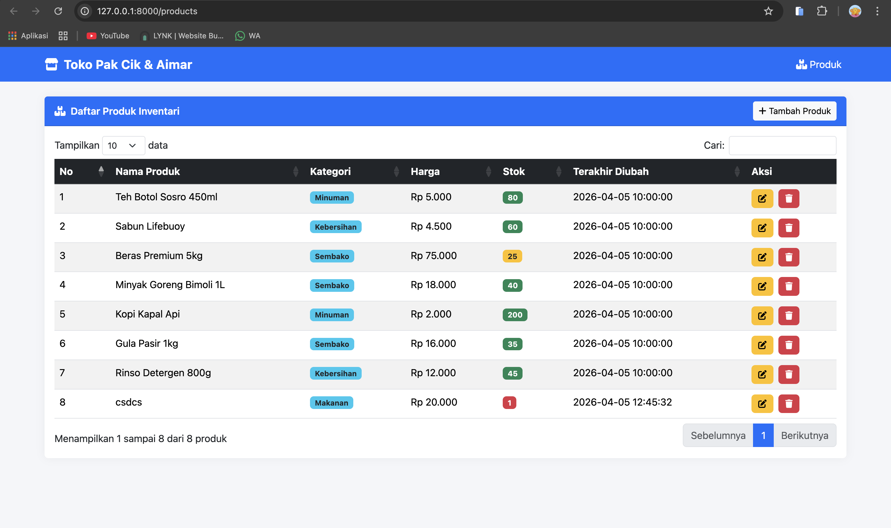

<div align="center">
  <br />
  <h1>LAPORAN PRAKTIKUM <br> APLIKASI BERBASIS PLATFORM </h1>
  <br />
  <h3>MODUL 6 <br> COTS</h3>
  <br />
  
  <br />
  <br />
  <br />
  <h3>Disusun Oleh :</h3>
  <p>
    <strong>Grashela Ayudia Prameswari</strong>
    <br>
    <strong>2311102318</strong>
    <br>
    <strong>S1 IF-11-REG05</strong>
  </p>
  <br />
  <h3>Dosen Pengampu :</h3>
  <p>
    <strong>Dedi Agung Prabowo, S.Kom., M.Kom</strong>
  </p>
  <br />
  <br />
  <h4>Asisten Praktikum :</h4>
  <strong>Apri Pandu Wicaksono </strong>
  <br>
  <strong>Hamka Zaenul Ardi</strong>
  <br />
  <h3>LABORATORIUM HIGH PERFORMANCE <br>FAKULTAS INFORMATIKA <br>UNIVERSITAS TELKOM PURWOKERTO <br>2026 </h3>
</div>

<hr>

# Dasar Teori

Pada Task 6 ini, diberikan studi kasus untuk membuat web inventori Toko Kelontong milik Pak Cik dan Mas Aimar. Project ini dapat dibangun menggunakan framework seperti CodeIgniter, Laravel, ExpressJS, NestJS, dan lainnya. Dalam praktikum ini digunakan **Laravel** sebagai framework backend. Web inventori ini memiliki fitur CRUD (Create, Read, Update, Delete) untuk mengelola data produk toko, dengan tampilan berupa DataTable, form create, form edit, dan konfirmasi modal untuk delete. Project ini **wajib menggunakan jQuery** untuk DOM manipulation serta **Bootstrap** untuk styling CSS. Data produk disimpan dalam bentuk **file JSON** (bukan database).

Laravel adalah framework PHP yang mengikuti arsitektur MVC (Model-View-Controller) dan menyediakan berbagai fitur bawaan seperti routing, validasi, Blade templating engine, serta manajemen file melalui Storage facade. Dalam praktikum ini, Laravel digunakan sebagai backend untuk menangani request dari client seperti mengambil data (GET), menambah data (POST), mengubah data (PUT), dan menghapus data (DELETE). Data disimpan dalam bentuk file JSON menggunakan Storage facade sehingga tidak memerlukan database.

jQuery adalah library JavaScript yang digunakan untuk manipulasi DOM, event handling, dan komunikasi dengan server menggunakan AJAX. jQuery digunakan untuk menangani semua interaksi pengguna seperti menampilkan modal, mengirim data form, serta memperbarui tampilan tabel secara dinamis tanpa reload halaman.

Bootstrap merupakan framework CSS yang digunakan untuk membangun tampilan web yang responsif dan modern. Bootstrap menyediakan berbagai komponen siap pakai seperti tombol, tabel, card, navbar, dan modal, sehingga mempermudah pembuatan antarmuka yang rapi.

DataTables adalah plugin jQuery yang digunakan untuk membuat tabel HTML menjadi interaktif dengan fitur pencarian, sorting, dan pagination secara otomatis. DataTables terintegrasi dengan Bootstrap untuk menghasilkan tampilan tabel yang modern dan responsif.

# Tugas 6
## 1. Source Kode ProductController.php

```php
<?php

namespace App\Http\Controllers;

use Illuminate\Http\Request;

class ProductController extends Controller
{
    private function getJsonPath()
    {
        return storage_path('app/products.json');
    }

    private function readProducts()
    {
        $path = $this->getJsonPath();
        if (!file_exists($path)) {
            return [];
        }
        $json = file_get_contents($path);
        return json_decode($json, true) ?: [];
    }

    private function writeProducts(array $products)
    {
        file_put_contents($this->getJsonPath(), json_encode(array_values($products), JSON_PRETTY_PRINT));
    }

    public function index()
    {
        $products = $this->readProducts();
        return view('products.index', compact('products'));
    }

    public function create()
    {
        return view('products.create');
    }

    public function store(Request $request)
    {
        $request->validate([
            'nama' => 'required|string|max:255',
            'kategori' => 'required|string|max:255',
            'harga' => 'required|numeric|min:0',
            'stok' => 'required|integer|min:0',
        ]);

        $products = $this->readProducts();

        $id = count($products) > 0 ? max(array_column($products, 'id')) + 1 : 1;

        $products[] = [
            'id' => $id,
            'nama' => $request->nama,
            'kategori' => $request->kategori,
            'harga' => (float) $request->harga,
            'stok' => (int) $request->stok,
            'created_at' => now()->toDateTimeString(),
            'updated_at' => now()->toDateTimeString(),
        ];

        $this->writeProducts($products);

        return redirect()->route('products.index')->with('success', 'Produk berhasil ditambahkan!');
    }

    public function edit($id)
    {
        $products = $this->readProducts();
        $product = collect($products)->firstWhere('id', (int) $id);

        if (!$product) {
            return redirect()->route('products.index')->with('error', 'Produk tidak ditemukan!');
        }

        return view('products.edit', compact('product'));
    }

    public function update(Request $request, $id)
    {
        $request->validate([
            'nama' => 'required|string|max:255',
            'kategori' => 'required|string|max:255',
            'harga' => 'required|numeric|min:0',
            'stok' => 'required|integer|min:0',
        ]);

        $products = $this->readProducts();

        foreach ($products as &$product) {
            if ($product['id'] == (int) $id) {
                $product['nama'] = $request->nama;
                $product['kategori'] = $request->kategori;
                $product['harga'] = (float) $request->harga;
                $product['stok'] = (int) $request->stok;
                $product['updated_at'] = now()->toDateTimeString();
                break;
            }
        }

        $this->writeProducts($products);

        return redirect()->route('products.index')->with('success', 'Produk berhasil diperbarui!');
    }

    public function destroy($id)
    {
        $products = $this->readProducts();
        $products = array_filter($products, fn($p) => $p['id'] != (int) $id);
        $this->writeProducts($products);

        return redirect()->route('products.index')->with('success', 'Produk berhasil dihapus!');
    }
}
```

## 2. Source Kode app.blade.php (Layout Utama)

```html
<!DOCTYPE html>
<html lang="id">
<head>
    <meta charset="UTF-8">
    <meta name="viewport" content="width=device-width, initial-scale=1.0">
    <meta name="csrf-token" content="{{ csrf_token() }}">
    <title>@yield('title', 'Inventari Toko Pak Cik & Aimar')</title>

    <!-- Bootstrap 5 CSS -->
    <link href="https://cdn.jsdelivr.net/npm/bootstrap@5.3.3/dist/css/bootstrap.min.css" rel="stylesheet">
    <!-- DataTables CSS -->
    <link href="https://cdn.datatables.net/1.13.8/css/dataTables.bootstrap5.min.css" rel="stylesheet">
    <!-- Font Awesome -->
    <link href="https://cdnjs.cloudflare.com/ajax/libs/font-awesome/6.5.1/css/all.min.css" rel="stylesheet">

    <style>
        body {
            background-color: #f4f6f9;
        }
        .navbar-brand {
            font-weight: 700;
            letter-spacing: 0.5px;
        }
        .card {
            border: none;
            box-shadow: 0 0 15px rgba(0,0,0,0.05);
        }
        .card-header {
            font-weight: 600;
        }
        .btn-action {
            padding: 4px 10px;
            font-size: 0.85rem;
        }
    </style>
    @stack('styles')
</head>
<body>
    <nav class="navbar navbar-expand-lg navbar-dark bg-primary mb-4">
        <div class="container">
            <a class="navbar-brand" href="{{ route('products.index') }}">
                <i class="fas fa-store me-2"></i>Toko Pak Cik & Aimar
            </a>
            <button class="navbar-toggler" type="button" data-bs-toggle="collapse" data-bs-target="#navbarNav">
                <span class="navbar-toggler-icon"></span>
            </button>
            <div class="collapse navbar-collapse" id="navbarNav">
                <ul class="navbar-nav ms-auto">
                    <li class="nav-item">
                        <a class="nav-link active" href="{{ route('products.index') }}">
                            <i class="fas fa-boxes-stacked me-1"></i>Produk
                        </a>
                    </li>
                </ul>
            </div>
        </div>
    </nav>

    <div class="container mb-5">
        @yield('content')
    </div>

    <!-- jQuery -->
    <script src="https://code.jquery.com/jquery-3.7.1.min.js"></script>
    <!-- Bootstrap 5 JS -->
    <script src="https://cdn.jsdelivr.net/npm/bootstrap@5.3.3/dist/js/bootstrap.bundle.min.js"></script>
    <!-- DataTables JS -->
    <script src="https://cdn.datatables.net/1.13.8/js/jquery.dataTables.min.js"></script>
    <script src="https://cdn.datatables.net/1.13.8/js/dataTables.bootstrap5.min.js"></script>

    @stack('scripts')
</body>
</html>
```

## 3. Source Kode index.blade.php

```html
@extends('layouts.app')

@section('title', 'Daftar Produk - Toko Pak Cik & Aimar')

@section('content')
<div class="row">
    <div class="col-12">
        {{-- Flash Messages --}}
        @if(session('success'))
        <div class="alert alert-success alert-dismissible fade show" role="alert" id="flash-alert">
            <i class="fas fa-check-circle me-2"></i>{{ session('success') }}
            <button type="button" class="btn-close" data-bs-dismiss="alert"></button>
        </div>
        @endif

        @if(session('error'))
        <div class="alert alert-danger alert-dismissible fade show" role="alert" id="flash-alert">
            <i class="fas fa-exclamation-circle me-2"></i>{{ session('error') }}
            <button type="button" class="btn-close" data-bs-dismiss="alert"></button>
        </div>
        @endif

        <div class="card">
            <div class="card-header bg-primary text-white d-flex justify-content-between align-items-center">
                <span><i class="fas fa-boxes-stacked me-2"></i>Daftar Produk Inventari</span>
                <a href="{{ route('products.create') }}" class="btn btn-light btn-sm">
                    <i class="fas fa-plus me-1"></i>Tambah Produk
                </a>
            </div>
            <div class="card-body">
                <div class="table-responsive">
                    <table id="productsTable" class="table table-striped table-hover" style="width:100%">
                        <thead class="table-dark">
                            <tr>
                                <th>No</th>
                                <th>Nama Produk</th>
                                <th>Kategori</th>
                                <th>Harga</th>
                                <th>Stok</th>
                                <th>Terakhir Diubah</th>
                                <th>Aksi</th>
                            </tr>
                        </thead>
                        <tbody>
                            @forelse($products as $index => $product)
                            <tr>
                                <td>{{ $index + 1 }}</td>
                                <td>{{ $product['nama'] }}</td>
                                <td>
                                    <span class="badge bg-info text-dark">{{ $product['kategori'] }}</span>
                                </td>
                                <td>Rp {{ number_format($product['harga'], 0, ',', '.') }}</td>
                                <td>
                                    @if($product['stok'] <= 10)
                                        <span class="badge bg-danger">{{ $product['stok'] }}</span>
                                    @elseif($product['stok'] <= 30)
                                        <span class="badge bg-warning text-dark">{{ $product['stok'] }}</span>
                                    @else
                                        <span class="badge bg-success">{{ $product['stok'] }}</span>
                                    @endif
                                </td>
                                <td>{{ $product['updated_at'] }}</td>
                                <td>
                                    <a href="{{ route('products.edit', $product['id']) }}" class="btn btn-warning btn-action me-1">
                                        <i class="fas fa-edit"></i>
                                    </a>
                                    <button type="button" class="btn btn-danger btn-action btn-delete"
                                        data-id="{{ $product['id'] }}"
                                        data-nama="{{ $product['nama'] }}">
                                        <i class="fas fa-trash"></i>
                                    </button>
                                </td>
                            </tr>
                            @empty
                            <tr>
                                <td colspan="7" class="text-center text-muted">Belum ada produk.</td>
                            </tr>
                            @endforelse
                        </tbody>
                    </table>
                </div>
            </div>
        </div>
    </div>
</div>

{{-- Delete Confirmation Modal --}}
<div class="modal fade" id="deleteModal" tabindex="-1" aria-labelledby="deleteModalLabel" aria-hidden="true">
    <div class="modal-dialog modal-dialog-centered">
        <div class="modal-content">
            <div class="modal-header bg-danger text-white">
                <h5 class="modal-title" id="deleteModalLabel">
                    <i class="fas fa-exclamation-triangle me-2"></i>Konfirmasi Hapus
                </h5>
                <button type="button" class="btn-close btn-close-white" data-bs-dismiss="modal"></button>
            </div>
            <div class="modal-body">
                <p>Apakah Anda yakin ingin menghapus produk <strong id="deleteProductName"></strong>?</p>
                <p class="text-muted mb-0">Tindakan ini tidak dapat dibatalkan.</p>
            </div>
            <div class="modal-footer">
                <button type="button" class="btn btn-secondary" data-bs-dismiss="modal">
                    <i class="fas fa-times me-1"></i>Batal
                </button>
                <form id="deleteForm" method="POST" style="display:inline;">
                    @csrf
                    @method('DELETE')
                    <button type="submit" class="btn btn-danger">
                        <i class="fas fa-trash me-1"></i>Hapus
                    </button>
                </form>
            </div>
        </div>
    </div>
</div>
@endsection

@push('scripts')
<script>
$(document).ready(function() {
    // Inisialisasi DataTable dengan jQuery
    $('#productsTable').DataTable({
        language: {
            search: "Cari:",
            lengthMenu: "Tampilkan _MENU_ data",
            info: "Menampilkan _START_ sampai _END_ dari _TOTAL_ produk",
            infoEmpty: "Tidak ada data",
            infoFiltered: "(disaring dari _MAX_ total data)",
            zeroRecords: "Tidak ada produk yang cocok",
            paginate: {
                first: "Pertama",
                last: "Terakhir",
                next: "Berikutnya",
                previous: "Sebelumnya"
            }
        },
        order: [[0, 'asc']],
        columnDefs: [
            { orderable: false, targets: 6 }
        ]
    });

    // Auto-dismiss flash alert setelah 3 detik menggunakan jQuery
    setTimeout(function() {
        $('#flash-alert').fadeOut('slow');
    }, 3000);

    // jQuery event handler untuk tombol delete - menampilkan modal konfirmasi
    $('.btn-delete').on('click', function() {
        var productId = $(this).data('id');
        var productName = $(this).data('nama');

        // Manipulasi DOM dengan jQuery
        $('#deleteProductName').text(productName);
        $('#deleteForm').attr('action', '/products/' + productId);

        // Tampilkan modal menggunakan Bootstrap via jQuery
        var deleteModal = new bootstrap.Modal($('#deleteModal')[0]);
        deleteModal.show();
    });
});
</script>
@endpush
```

## 4. Source Kode create.blade.php

```html
@extends('layouts.app')

@section('title', 'Tambah Produk - Toko Pak Cik & Aimar')

@section('content')
<div class="row justify-content-center">
    <div class="col-md-8">
        <div class="card">
            <div class="card-header bg-primary text-white">
                <i class="fas fa-plus-circle me-2"></i>Tambah Produk Baru
            </div>
            <div class="card-body">
                {{-- Tampilkan error validasi --}}
                @if($errors->any())
                <div class="alert alert-danger" id="validation-alert">
                    <i class="fas fa-exclamation-circle me-2"></i><strong>Terjadi Kesalahan:</strong>
                    <ul class="mb-0 mt-2">
                        @foreach($errors->all() as $error)
                        <li>{{ $error }}</li>
                        @endforeach
                    </ul>
                </div>
                @endif

                <form action="{{ route('products.store') }}" method="POST" id="createForm">
                    @csrf

                    <div class="mb-3">
                        <label for="nama" class="form-label">Nama Produk <span class="text-danger">*</span></label>
                        <input type="text" class="form-control @error('nama') is-invalid @enderror"
                            id="nama" name="nama" value="{{ old('nama') }}"
                            placeholder="Masukkan nama produk" required>
                        @error('nama')
                        <div class="invalid-feedback">{{ $message }}</div>
                        @enderror
                    </div>

                    <div class="mb-3">
                        <label for="kategori" class="form-label">Kategori <span class="text-danger">*</span></label>
                        <select class="form-select @error('kategori') is-invalid @enderror"
                            id="kategori" name="kategori" required>
                            <option value="">-- Pilih Kategori --</option>
                            <option value="Makanan" {{ old('kategori') == 'Makanan' ? 'selected' : '' }}>Makanan</option>
                            <option value="Minuman" {{ old('kategori') == 'Minuman' ? 'selected' : '' }}>Minuman</option>
                            <option value="Sembako" {{ old('kategori') == 'Sembako' ? 'selected' : '' }}>Sembako</option>
                            <option value="Kebersihan" {{ old('kategori') == 'Kebersihan' ? 'selected' : '' }}>Kebersihan</option>
                            <option value="Peralatan" {{ old('kategori') == 'Peralatan' ? 'selected' : '' }}>Peralatan</option>
                            <option value="Lainnya" {{ old('kategori') == 'Lainnya' ? 'selected' : '' }}>Lainnya</option>
                        </select>
                        @error('kategori')
                        <div class="invalid-feedback">{{ $message }}</div>
                        @enderror
                    </div>

                    <div class="row">
                        <div class="col-md-6 mb-3">
                            <label for="harga" class="form-label">Harga (Rp) <span class="text-danger">*</span></label>
                            <input type="number" class="form-control @error('harga') is-invalid @enderror"
                                id="harga" name="harga" value="{{ old('harga') }}"
                                placeholder="0" min="0" required>
                            @error('harga')
                            <div class="invalid-feedback">{{ $message }}</div>
                            @enderror
                        </div>

                        <div class="col-md-6 mb-3">
                            <label for="stok" class="form-label">Stok <span class="text-danger">*</span></label>
                            <input type="number" class="form-control @error('stok') is-invalid @enderror"
                                id="stok" name="stok" value="{{ old('stok') }}"
                                placeholder="0" min="0" required>
                            @error('stok')
                            <div class="invalid-feedback">{{ $message }}</div>
                            @enderror
                        </div>
                    </div>

                    {{-- Preview harga yang diformat --}}
                    <div class="mb-3" id="hargaPreview" style="display:none;">
                        <small class="text-muted">Harga: <strong id="hargaFormatted"></strong></small>
                    </div>

                    <div class="d-flex justify-content-between">
                        <a href="{{ route('products.index') }}" class="btn btn-secondary">
                            <i class="fas fa-arrow-left me-1"></i>Kembali
                        </a>
                        <button type="submit" class="btn btn-primary">
                            <i class="fas fa-save me-1"></i>Simpan Produk
                        </button>
                    </div>
                </form>
            </div>
        </div>
    </div>
</div>
@endsection

@push('scripts')
<script>
$(document).ready(function() {
    // jQuery: Format preview harga saat user mengetik
    $('#harga').on('input', function() {
        var val = $(this).val();
        if (val && val > 0) {
            var formatted = new Intl.NumberFormat('id-ID', {
                style: 'currency',
                currency: 'IDR',
                minimumFractionDigits: 0
            }).format(val);
            $('#hargaFormatted').text(formatted);
            $('#hargaPreview').fadeIn();
        } else {
            $('#hargaPreview').fadeOut();
        }
    });

    // jQuery: Validasi form sebelum submit
    $('#createForm').on('submit', function(e) {
        var isValid = true;

        // Cek field yang required
        $(this).find('[required]').each(function() {
            if (!$(this).val()) {
                $(this).addClass('is-invalid');
                isValid = false;
            } else {
                $(this).removeClass('is-invalid');
            }
        });

        if (!isValid) {
            e.preventDefault();
        }
    });

    // jQuery: Hapus class is-invalid saat user mengetik
    $('input, select').on('input change', function() {
        $(this).removeClass('is-invalid');
    });
});
</script>
@endpush
```

## 5. Source Kode edit.blade.php

```html
@extends('layouts.app')

@section('title', 'Edit Produk - Toko Pak Cik & Aimar')

@section('content')
<div class="row justify-content-center">
    <div class="col-md-8">
        <div class="card">
            <div class="card-header bg-warning text-dark">
                <i class="fas fa-edit me-2"></i>Edit Produk: {{ $product['nama'] }}
            </div>
            <div class="card-body">
                {{-- Tampilkan error validasi --}}
                @if($errors->any())
                <div class="alert alert-danger" id="validation-alert">
                    <i class="fas fa-exclamation-circle me-2"></i><strong>Terjadi Kesalahan:</strong>
                    <ul class="mb-0 mt-2">
                        @foreach($errors->all() as $error)
                        <li>{{ $error }}</li>
                        @endforeach
                    </ul>
                </div>
                @endif

                <form action="{{ route('products.update', $product['id']) }}" method="POST" id="editForm">
                    @csrf
                    @method('PUT')

                    <div class="mb-3">
                        <label for="nama" class="form-label">Nama Produk <span class="text-danger">*</span></label>
                        <input type="text" class="form-control @error('nama') is-invalid @enderror"
                            id="nama" name="nama" value="{{ old('nama', $product['nama']) }}"
                            placeholder="Masukkan nama produk" required>
                        @error('nama')
                        <div class="invalid-feedback">{{ $message }}</div>
                        @enderror
                    </div>

                    <div class="mb-3">
                        <label for="kategori" class="form-label">Kategori <span class="text-danger">*</span></label>
                        <select class="form-select @error('kategori') is-invalid @enderror"
                            id="kategori" name="kategori" required>
                            <option value="">-- Pilih Kategori --</option>
                            @php $kat = old('kategori', $product['kategori']); @endphp
                            <option value="Makanan" {{ $kat == 'Makanan' ? 'selected' : '' }}>Makanan</option>
                            <option value="Minuman" {{ $kat == 'Minuman' ? 'selected' : '' }}>Minuman</option>
                            <option value="Sembako" {{ $kat == 'Sembako' ? 'selected' : '' }}>Sembako</option>
                            <option value="Kebersihan" {{ $kat == 'Kebersihan' ? 'selected' : '' }}>Kebersihan</option>
                            <option value="Peralatan" {{ $kat == 'Peralatan' ? 'selected' : '' }}>Peralatan</option>
                            <option value="Lainnya" {{ $kat == 'Lainnya' ? 'selected' : '' }}>Lainnya</option>
                        </select>
                        @error('kategori')
                        <div class="invalid-feedback">{{ $message }}</div>
                        @enderror
                    </div>

                    <div class="row">
                        <div class="col-md-6 mb-3">
                            <label for="harga" class="form-label">Harga (Rp) <span class="text-danger">*</span></label>
                            <input type="number" class="form-control @error('harga') is-invalid @enderror"
                                id="harga" name="harga" value="{{ old('harga', $product['harga']) }}"
                                placeholder="0" min="0" required>
                            @error('harga')
                            <div class="invalid-feedback">{{ $message }}</div>
                            @enderror
                        </div>

                        <div class="col-md-6 mb-3">
                            <label for="stok" class="form-label">Stok <span class="text-danger">*</span></label>
                            <input type="number" class="form-control @error('stok') is-invalid @enderror"
                                id="stok" name="stok" value="{{ old('stok', $product['stok']) }}"
                                placeholder="0" min="0" required>
                            @error('stok')
                            <div class="invalid-feedback">{{ $message }}</div>
                            @enderror
                        </div>
                    </div>

                    {{-- Preview harga yang diformat --}}
                    <div class="mb-3" id="hargaPreview">
                        <small class="text-muted">Harga: <strong id="hargaFormatted"></strong></small>
                    </div>

                    <div class="d-flex justify-content-between">
                        <a href="{{ route('products.index') }}" class="btn btn-secondary">
                            <i class="fas fa-arrow-left me-1"></i>Kembali
                        </a>
                        <button type="submit" class="btn btn-warning">
                            <i class="fas fa-save me-1"></i>Update Produk
                        </button>
                    </div>
                </form>
            </div>
        </div>
    </div>
</div>
@endsection

@push('scripts')
<script>
$(document).ready(function() {
    // jQuery: Format harga function
    function formatHarga(val) {
        return new Intl.NumberFormat('id-ID', {
            style: 'currency',
            currency: 'IDR',
            minimumFractionDigits: 0
        }).format(val);
    }

    // Tampilkan preview harga saat halaman dimuat
    var initialHarga = $('#harga').val();
    if (initialHarga && initialHarga > 0) {
        $('#hargaFormatted').text(formatHarga(initialHarga));
    }

    // jQuery: Format preview harga saat user mengetik
    $('#harga').on('input', function() {
        var val = $(this).val();
        if (val && val > 0) {
            $('#hargaFormatted').text(formatHarga(val));
            $('#hargaPreview').fadeIn();
        } else {
            $('#hargaPreview').fadeOut();
        }
    });

    // jQuery: Validasi form sebelum submit
    $('#editForm').on('submit', function(e) {
        var isValid = true;

        $(this).find('[required]').each(function() {
            if (!$(this).val()) {
                $(this).addClass('is-invalid');
                isValid = false;
            } else {
                $(this).removeClass('is-invalid');
            }
        });

        if (!isValid) {
            e.preventDefault();
        }
    });

    // jQuery: Hapus class is-invalid saat user mengetik
    $('input, select').on('input change', function() {
        $(this).removeClass('is-invalid');
    });
});
</script>
@endpush
```

## 6. Source Kode web.php

```php
<?php

use App\Http\Controllers\ProductController;
use Illuminate\Support\Facades\Route;

// Halaman utama redirect ke produk
Route::get('/', function () {
    return redirect()->route('products.index');
});

// Resource route untuk CRUD produk
Route::resource('products', ProductController::class)->except(['show']);
```

## 7. Source Kode products.json

```json
[
    {
        "id": 2,
        "nama": "Teh Botol Sosro 450ml",
        "kategori": "Minuman",
        "harga": 5000,
        "stok": 80,
        "created_at": "2026-04-05 10:00:00",
        "updated_at": "2026-04-05 10:00:00"
    },
    {
        "id": 3,
        "nama": "Sabun Lifebuoy",
        "kategori": "Kebersihan",
        "harga": 4500,
        "stok": 60,
        "created_at": "2026-04-05 10:00:00",
        "updated_at": "2026-04-05 10:00:00"
    },
    {
        "id": 4,
        "nama": "Beras Premium 5kg",
        "kategori": "Sembako",
        "harga": 75000,
        "stok": 25,
        "created_at": "2026-04-05 10:00:00",
        "updated_at": "2026-04-05 10:00:00"
    },
    {
        "id": 5,
        "nama": "Minyak Goreng Bimoli 1L",
        "kategori": "Sembako",
        "harga": 18000,
        "stok": 40,
        "created_at": "2026-04-05 10:00:00",
        "updated_at": "2026-04-05 10:00:00"
    },
    {
        "id": 6,
        "nama": "Kopi Kapal Api",
        "kategori": "Minuman",
        "harga": 2000,
        "stok": 200,
        "created_at": "2026-04-05 10:00:00",
        "updated_at": "2026-04-05 10:00:00"
    },
    {
        "id": 7,
        "nama": "Gula Pasir 1kg",
        "kategori": "Sembako",
        "harga": 16000,
        "stok": 35,
        "created_at": "2026-04-05 10:00:00",
        "updated_at": "2026-04-05 10:00:00"
    },
    {
        "id": 8,
        "nama": "Rinso Detergen 800g",
        "kategori": "Kebersihan",
        "harga": 12000,
        "stok": 45,
        "created_at": "2026-04-05 10:00:00",
        "updated_at": "2026-04-05 10:00:00"
    }
]
```

Output:
<br>


# Penjelasan

Kode pada praktikum ini terdiri dari tiga bagian utama, yaitu server (Laravel), frontend (Blade + Bootstrap), dan interaksi (jQuery + DataTables).

Pada bagian server (`ProductController.php`), digunakan framework Laravel untuk menangani request dari client. Controller ini mengimplementasikan operasi CRUD lengkap: menampilkan daftar produk (`index()`), menampilkan form tambah (`create()`), menyimpan produk baru (`store()`), menampilkan form edit (`edit()`), mengupdate produk (`update()`), dan menghapus produk (`destroy()`). Data disimpan dalam file `products.json` menggunakan fungsi `file_get_contents()` dan `file_put_contents()` sehingga tidak memerlukan database. Setiap request yang masuk juga melalui validasi server-side untuk memastikan data yang dikirim sudah sesuai format.

Pada bagian routing (`web.php`), digunakan `Route::resource()` untuk secara otomatis mendefinisikan endpoint-endpoint RESTful yang menghubungkan URL request dengan method pada controller. Terdapat route untuk halaman utama (`GET /products`), form tambah (`GET /products/create`), simpan produk (`POST /products`), form edit (`GET /products/{id}/edit`), update produk (`PUT /products/{id}`), dan hapus produk (`DELETE /products/{id}`).

Pada bagian frontend, digunakan sistem layout Blade (`app.blade.php`) sebagai template utama yang memuat Bootstrap 5, jQuery, DataTables, dan Font Awesome. Halaman daftar produk (`index.blade.php`) menampilkan tabel data produk dengan fitur pencarian, sorting, dan pagination melalui plugin DataTables. Terdapat juga indikator stok berwarna (merah untuk stok rendah, kuning untuk stok sedang, hijau untuk stok aman) serta modal konfirmasi sebelum menghapus produk. Halaman form tambah (`create.blade.php`) dan edit (`edit.blade.php`) menyediakan form input dengan validasi server-side dan client-side, dropdown kategori, serta preview harga real-time dalam format Rupiah.

Untuk interaksi, digunakan jQuery untuk melakukan manipulasi DOM dan event handling. DataTable diinisialisasi menggunakan `$('#productsTable').DataTable()` dengan konfigurasi bahasa Indonesia. Event handler didaftarkan menggunakan `$('.btn-delete').on('click', ...)` untuk menampilkan modal konfirmasi hapus, serta `$('#harga').on('input', ...)` untuk menampilkan preview harga secara real-time. Flash alert otomatis hilang setelah 3 detik menggunakan `$('#flash-alert').fadeOut('slow')`. Validasi form client-side juga diterapkan menggunakan jQuery untuk memvalidasi field yang required sebelum form di-submit.

Output dari program ini berupa halaman web sistem inventari toko kelontong yang interaktif dan lengkap, dimana pengguna dapat menambahkan, mengedit, menghapus, mencari, dan mengurutkan data produk dengan tampilan yang modern dan responsif.
